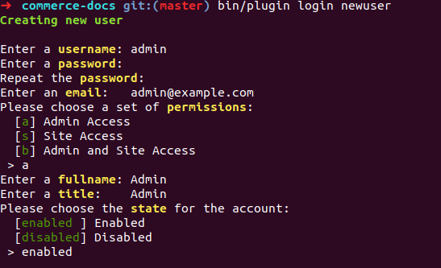

# Drupal Commerce Documentation

**Contents:**
- [How to contribute to this documentation](#how-to-contribute-to-this-documentation)
  - [Before your first contribution](#before-your-first-contribution)
  - [Fast online contribution](#fast-online-contribution)
  - [Local setup](#local-setup)

## How to contribute to this documentation

### Before your first contribution

**Before contributing**, you should consider the following:
- The documentation is written using [reStructuredText](http://docutils.sourceforge.net/rst.html) markup language. If you are not familiar with this format, read [this article](https://symfony.com/doc/current/contributing/documentation/format.html) for a quick overview of its basic features.
- The documentation is hosted on [GitHub](https://github.com). You'll need a free GitHub user account to contribute to the documentation.
- The documentation is published under a [Creative Commons BY-SA 4.0 License](https://github.com/drupalcommerce/commerce-docs/blob/master/LICENSE) and all your contributions will implicitly adhere to that license.

### Fast online contribution

If you're making a relatively small change - like fixing a typo or rewording something - the easiest way to contribute is directly on GitHub! You can do this while you're reading this documentation.

1. Click on the **Edit on GitHub** button on the upper right corner and you'll be redirected to GitHub: 
2. Click the **edit icon** to edit the documentation: 
3. You will be asked to fork the repo, click **Fork this repository and propose changes**: 
4. Edit the contents, describe your changes and click on the **Propose file change** button: 
5. GitHub will now create a branch and a commit for your changes (forking the repository first if this is your first contribution) and it will also display a preview of your changes: If everything is correct, click on the **Create pull request** button.
6. GitHub will display a new page where you can do some last-minute changes to your pull request before creating it. For simple contributions, you can safely ignore these options and just click on the **Create pull request** button again.

**Congratulations!** You just created a pull request to the official Drupal Commerce documentation! The community will now review your pull request and (possibly) suggest tweaks.

But if you want to contribute heavily, we recommend you doing a local setup of the documentation.

### Local setup
1. Run composer install 
7. In the terminal generate user for admin panel `bin/plugin login newuser`
8. Add credentials 

9. Login `php -S localhost:8000 system/router.php`

### Edit using Visual Code Studio
You can download Visual Code Studio and add the [reStructured Text](https://marketplace.visualstudio.com/items?itemName=lextudio.restructuredtext) plugin to have an editor with built in previews available.

### Edit and review manually
1. Execute `./build.sh`, this will generate documentation HTML inside `_build/html`.
2. Now you can view the documentation locally, execute `php -S localhost:8000 -t _build/html` , and visit [http://localhost:8000/](http://localhost:8000/) from your browser.

That's it!
/grav
   $ bin/grav install
   ```

Check out the [install procedures](https://learn.getgrav.org/basics/installation) for more information.

# Adding Functionality

You can download [plugins](https://getgrav.org/downloads/plugins) or [themes](https://getgrav.org/downloads/themes) manually from the appropriate tab on the [Downloads page on https://getgrav.org](https://getgrav.org/downloads), but the preferred solution is to use the [Grav Package Manager](https://learn.getgrav.org/advanced/grav-gpm) or `GPM`:

```
$ bin/gpm index
```

This will display all the available plugins and then you can install one or more with:

```
$ bin/gpm install <plugin/theme>
```

# Updating

To update Grav you should use the [Grav Package Manager](https://learn.getgrav.org/advanced/grav-gpm) or `GPM`:

```
$ bin/gpm selfupgrade
```

To update plugins and themes:

```
$ bin/gpm update
```


# Contributing
We appreciate any contribution to Grav, whether it is related to bugs, grammar, or simply a suggestion or improvement! Please refer to the [Contributing guide](CONTRIBUTING.md) for more guidance on this topic.

## Security issues
If you discover a possible security issue related to Grav or one of its plugins, please email the core team at contact@getgrav.org and we'll address it as soon as possible.

# Getting Started

* [What is Grav?](https://learn.getgrav.org/basics/what-is-grav)
* [Install](https://learn.getgrav.org/basics/installation) Grav in few seconds
* Understand the [Configuration](https://learn.getgrav.org/basics/grav-configuration)
* Take a peek at our available free [Skeletons](https://getgrav.org/downloads/skeletons)
* If you have questions, jump on our [Discord Chat Server](https://chat.getgrav.org)!
* Have fun!

# Exploring More

* Have a look at our [Basic Tutorial](https://learn.getgrav.org/basics/basic-tutorial)
* Dive into more [advanced](https://learn.getgrav.org/advanced) functions
* Learn about the [Grav CLI](https://learn.getgrav.org/cli-console/grav-cli)
* Review examples in the [Grav Cookbook](https://learn.getgrav.org/cookbook)
* More [Awesome Grav Stuff](https://github.com/getgrav/awesome-grav)

# Backers
Support Grav with a monthly donation to help us continue development. [[Become a backer](https://opencollective.com/grav#backer)]


# Sponsors
Become a sponsor and get your logo on our README on Github with a link to your site. [[Become a sponsor](https://opencollective.com/grav#sponsor)]


# License

See [LICENSE](LICENSE.txt)


[gitflow-model]: http://nvie.com/posts/a-successful-git-branching-model/
[gitflow-extensions]: https://github.com/nvie/gitflow

# Running Tests

First install the dev dependencies by running `composer update` from the Grav root.
Then `composer test` will run the Unit Tests, which should be always executed successfully on any site.
Windows users should use the `composer test-windows` command.
You can also run a single unit test file, e.g. `composer test tests/unit/Grav/Common/AssetsTest.php`
