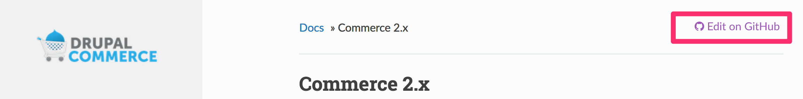
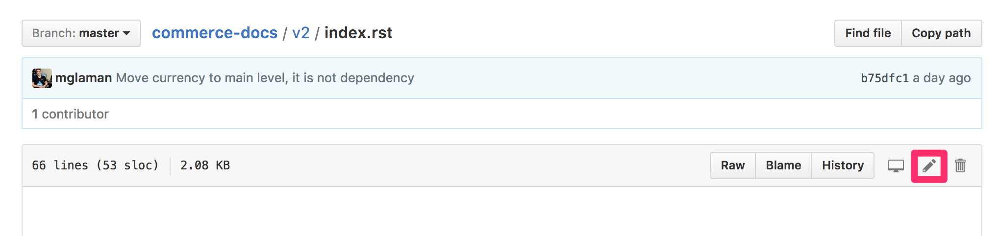
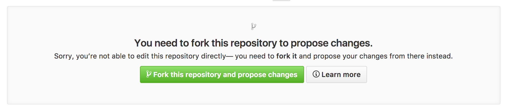
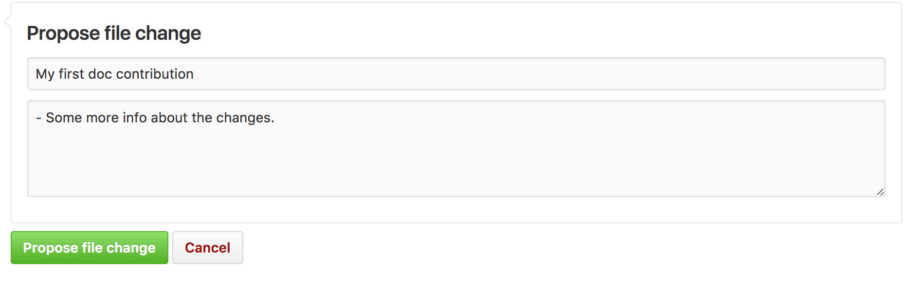
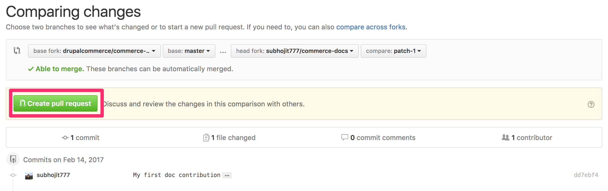

# Drupal Commerce Documentation

**Contents:**
- [How to contribute to this documentation](#how-to-contribute-to-this-documentation)
  - [Before your first contribution](#before-your-first-contribution)
  - [Fast online contribution](#fast-online-contribution)
  - [Local setup](#local-setup)

## How to contribute to this documentation

### Before your first contribution

**Before contributing**, you should consider the following:
- The documentation is written using [reStructuredText](http://docutils.sourceforge.net/rst.html) markup language. If you are not familiar with this format, read [this article](https://symfony.com/doc/current/contributing/documentation/format.html) for a quick overview of its basic features.
- The documentation is hosted on [GitHub](https://github.com). You'll need a free GitHub user account to contribute to the documentation.
- The documentation is published under a [Creative Commons BY-SA 4.0 License](https://github.com/drupalcommerce/commerce-docs/blob/master/LICENSE) and all your contributions will implicitly adhere to that license.

### Fast online contribution

If you're making a relatively small change - like fixing a typo or rewording something - the easiest way to contribute is directly on GitHub! You can do this while you're reading this documentation.

1. Click on the **Edit on GitHub** button on the upper right corner and you'll be redirected to GitHub: 
2. Click the **edit icon** to edit the documentation: 
3. You will be asked to fork the repo, click **Fork this repository and propose changes**: 
4. Edit the contents, describe your changes and click on the **Propose file change** button: 
5. GitHub will now create a branch and a commit for your changes (forking the repository first if this is your first contribution) and it will also display a preview of your changes: If everything is correct, click on the **Create pull request** button.
6. GitHub will display a new page where you can do some last-minute changes to your pull request before creating it. For simple contributions, you can safely ignore these options and just click on the **Create pull request** button again.

**Congratulations!** You just created a pull request to the official Drupal Commerce documentation! The community will now review your pull request and (possibly) suggest tweaks.

But if you want to contribute heavily, we recommend you doing a local setup of the documentation.

### Local setup
1. Install [Python](https://www.python.org/downloads/).
2. If `pip` is not installed by default, install it from [here](https://pip.pypa.io/en/stable/installing/).
3. Fork this [documentation repository](https://github.com/drupalcommerce/commerce-docs).
4. Clone the forked repository.
5. `cd <forked-repository>`.
6. Execute `pip install -r requirements.txt`, you might need to execute this command with `sudo`.

### Edit using Visual Code Studio
You can download Visual Code Studio and add the [reStructured Text](https://marketplace.visualstudio.com/items?itemName=lextudio.restructuredtext) plugin to have an editor with built in previews available.

### Edit and review manually
1. Execute `./build.sh`, this will generate documentation HTML inside `_build/html`.
2. Now you can view the documentation locally, execute `php -S localhost:8000 -t _build/html` , and visit [http://localhost:8000/](http://localhost:8000/) from your browser.

That's it!
