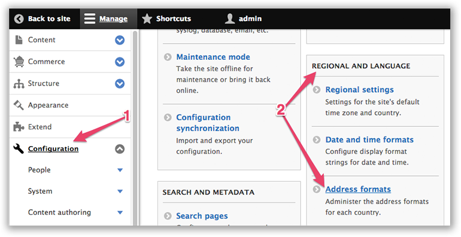
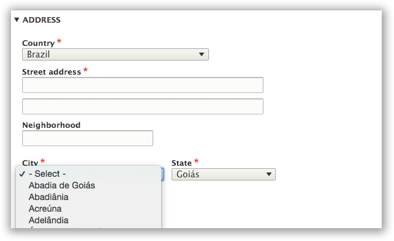

# Address Module

See Also: [Address Drupal Module](https://www.drupal.org/project/address) &nbsp; | &nbsp; [Addressing library](https://github.com/commerceguys/addressing) &nbsp; | &nbsp; [Address Commerce 2.x Story](https://drupalcommerce.org/blog/16864/commerce-2x-stories-addressing)

For the addressing needs of Commerce 1.x the [addressfield module](https://drupal.org/project/addressfield) was created. It stores addresses using the xNAL standard, accommodates both name and address data, and provides per-country address forms.

It was a good first try, but we can do better.

Commerce 2.x will depend on the [Address 1.x module](https://www.drupal.org/project/address), which will pull in the [commerceguys/addressing](https://github.com/commerceguys/addressing) library, store the address formats and subdivisions as configuration entities, and use them to generate and validate Drupal forms.

We gain a much richer dataset and greatly improved support for countries such as China, Korea, Brazil, and others. Best of all, our efforts benefit the whole wider PHP community.

## Install

This is a dependency and once you have successfully installed commerce, you will have the address module available. See [Installation Instructions for Commerce 2.x](../../install.md).

## Configure and Customize



To configure or customize address formats, navigate to the Configuration page (1) and click on (2) "Address Formats" under "Regional and Language".

```
admin/config/regional/address-formats
```


The landing page for the address module shows all the default configurations by country. You can edit the postal formatting (order of fields, locality dependencies, and many many other things) just by clicking "Edit." 


The default values are based on opensource 3rd party that has the best coverage of all regions in the world. The formatting of the addresses is for both the form and the display.

## More information on Address formats



Each country has a different address format that tells us:

* Which fields are used in which order (Is there a state field? Does the zip code come before the city? After the state?)
* Which fields are required
* Which fields need to be uppercased for the actual mailing to facilitate automated sorting of mail
* The labels for the administrative area (state, province, parish, etc.), and the postal code (Postal code or ZIP code)
* Validation rules for postal codes, usually in the form of a regular expression.

In countries using a non-latin script (such as China, Taiwan, Korea), the order of fields varies based on the language/script used. Addresses written in latin script follow the minor-to-major order (start with the street, end with the country) while addresses written in the chinese script follow the major-to-minor order (start with the country, end with the street).

All this needs to be taken into account when generating and validating an address form. Selecting a different country requires re-rendering the address form using a different format.

The address format is usually described on the site of the national post office, but collecting the data still requires a lot of manual browsing, translation, and research.