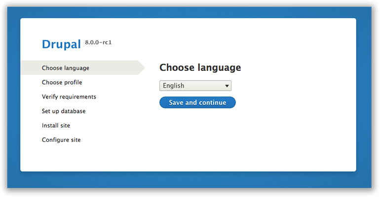

# Installing Drupal Commerce 2.x
[Composer Manager Module](https://drupal.org/project/composer_manager) &nbsp; | &nbsp; [Composer on Drupal Intro](https://bojanz.wordpress.com/2015/09/18/d8-composer-definitive-intro/) &nbsp; | &nbsp; [Community Docs](https://www.drupal.org/node/2405811)

## Install Commerce 2

_Note: Command-line examples use [Drupal Console](#installing-drupal-console) with the common alias "drupal", not Drush._

1. You must have composer installed in your system. ([Why?](https://bojanz.wordpress.com/2015/09/18/d8-composer-definitive-intro/) [How?](#installing-composer))

2. Download and install Drupal 8 ([How to install Drupal 8](#installing-drupal-8))

 ```sh
 # Using Drupal Console can make this super easy
 drupal site:new commerce2
 
 # Sad panda, you have to install Drupal using the UI for now
 ```

3. Download (and extract) the _**-dev**_ version of [composer_manager](https://drupal.org/project/composer_manager) into your `modules` directory.

3. From the Drupal root directory, initialize composer_manager,* and run it for the first time:

 ```sh
   php modules/composer_manager/scripts/init.php
   composer drupal-update
 ```

4. Enable the Commerce modules, e.g.:

 ```sh
   drupal module:install commerce commerce_order commerce_product commerce_tax
 ```


## Installing Drupal Console

You can go to [Drupal Console's website](http://drupalconsole.com/) for more documentation and support.

```sh
# Run this in your terminal to get the latest Console version:
curl -LSs http://drupalconsole.com/installer | php

# Or if you don't have curl:
php -r "readfile('http://drupalconsole.com/installer');" | php

# You can place this file anywhere you wish.
# If you put it in your PATH, you can access it globally.
# For example: move console.phar and rename it, 'drupal':
mv console.phar /usr/local/bin/drupal

# Show all available Drupal Console commands.
drupal
```

## Installing Composer

You can go to [GetComposer.com](https://getcomposer.org/doc/00-intro.md) for more documentation and support.

```sh
curl -sS https://getcomposer.org/installer | php
```

## Installing Drupal 8

Unforunately, Drupal 8 has to be installed manually. Feel free to pull request update this page with any drush or drupal console commands that have been recently added.



There is a big long list of requirements and steps including downloading the project, setting up a server, and making sure you have a database. Currently, the best place for accurate installation notes is the [INSTALL.txt file that comes with Drupal 8](https://api.drupal.org/api/drupal/core!INSTALL.txt/8). We expect drupal.org will have a much nicer step-by-step screenshot installation process posted soon.