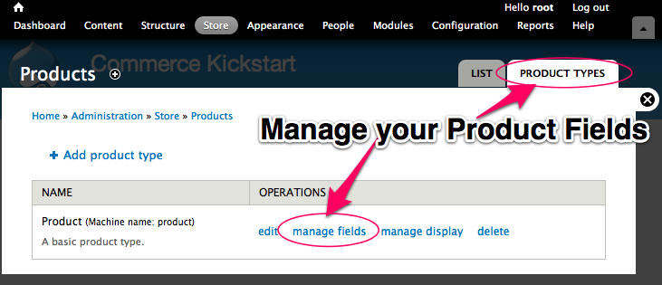

Product attributes are the descriptors we use to define kinds of products. For example, we could describe a tshirt by the color and size. These attributes mean that in the real physical world your store may only carry one red shirt, but you have three sizes or three "variations." Commerce software must deal with product variations in a flexible way. Here's how Drupal Commerce abstracts it:

<ol>
    <li><strong>Product Types.</strong> A product type is a specific bundle based on a custom product entity. Each bundle can have fields attached to it, including pictures and other kinds of information.</li>
    <li><strong>Product "Informational" Fields.</strong> Any field on a product can be a simple "informational" field. Typical informational fields include an image of that specific configuration of a product. For example, if you sell a tshirt with a cool print in multiple colors, each product with a different color could have an image field that, when displayed on the product display node, will change when you select different attributes (like color).</li>
    <li><strong>Product "Attribute" Fields.</strong> Any field on a product type with a defined list of options (list of text options, list of taxonomy terms, list of colors). The attribute fields are special because of the way they turn into selection widgets on a product display. Often you will pair an attribute field (like a color dropdown) with an information field (like an image field) to let the user "select" the blue tshirt and the Drupal Commerce system will quickly load the picture associated with the blue product.</li>
    <li><strong>Product Displays.</strong> If needed at all, these are groupings of products. You can reference any type and number of products on a product display. In order to make use of product displays, we recommend only showing one type of product per product display. The product display is where you typically see the product with drop downs to "configure" or "order" the right kind of product.</li>
</ol>

<H2>Example attribute configuration</H2>

Lets walk through setting up an attribute field on a product type and see how it interacts with the product fields injected on the product display. For this example, we are using Commerce Kickstart 1.x

    

        
    

        
Product Types

        
Navigate to your Store page and click on "Products" and then "Product
        Types" and then "Manage Fields." This is the standard way to find,
        create, and edit different types of product. You can add as many types
        of products as you want, but make sure you understand the difference
        between product types and product displays.

    

<ul class="screenshot_breadcrumbs">
        <li class="first">Administration</li>
        <li>Store</li>
        <li>Products</li>
        <li class="last">Product Types</li>
    </ul>

    

        
    

        
Add Product Field

        
When you navigate to the manage field screen, if you are a Drupal
        native, you'll notice that the field screen is just like a manage field
        screen for content types. We'll need a List (text) using a select list.
        This could also be a taxonomy term reference, or any kind of simple list
        field.

    

<ul class="screenshot_breadcrumbs">
        <li class="first">Administration</li>
        <li>Store</li>
        <li>Products</li>
        <li>Product Type</li>
        <li class="last">Manage Fields</li>
    </ul>

    

        
    

        
Add Field Choices

        
This can be any simple list, one for each new line. Let your imagination run wild!

        
Click "Save."

    

<ul class="screenshot_breadcrumbs">
        <li class="first">Administration</li>
        <li>Store</li>
        <li>Products</li>
        <li>Product Type</li>
        <li>Manage Fields</li>
        <li class="last">Add Field</li>
    </ul>

    

        
    

        
Enable Attribute Field

        
This is the most important step as it is what turns a normal field
        into an attribute field that can change the Add to Cart form on
        update.

    

<ul class="screenshot_breadcrumbs">
        <li class="first">Administration</li>
        <li>Store</li>
        <li>Products</li>
        <li>Product Type</li>
        <li>Manage Fields</li>
        <li class="last">Configure Field</li>
    </ul>

    

        
    

        
Modify Products

        
Here is the edit screen of PROD-01 that comes with the standard
        Commerce Kickstart 1.x. Notice we have a new "Color" field that you have
        just added to the Product Type.

        
Repeat this for all three products. Add a picture and choose a
        color.

    

<ul class="screenshot_breadcrumbs">
        <li class="first">Administration</li>
        <li>Store</li>
        <li>Products</li>
        <li class="last">Edit PROD-01</li>
    </ul>

    

        
    

        
Add Product Display

        
Navigate to the Content List screen and click "Add Content." This
        will then list all of the content types on your site. Our Product
        Display content type is the third one after a Commerce Kickstart
        install. Select it to create a new Product Display to attach our three
        products on.

    

<ul class="screenshot_breadcrumbs">
        <li class="first">Administration</li>
        <li>Content</li>
        <li class="last">Add Content</li>
    </ul>

    

        
    

        
Attach Products

        
This is the Product Reference Field that is included on Commerce
        Kickstart's Product Display Content Type. Any content type that has this
        kind of field is able to connect products and display an "Add to Cart"
        button. 

        
This field will take the three products that we have updated with our
        new information and create an interactive drop down list of our color
        field options.

    

<ul class="screenshot_breadcrumbs">
        <li class="first">Administration</li>
        <li>Content</li>
        <li>Add Content</li>
        <li class="last">Add Product Display</li>
    </ul>

    

        
    

        
Final Result

        
The color drop down now updates the price and picture.

    

