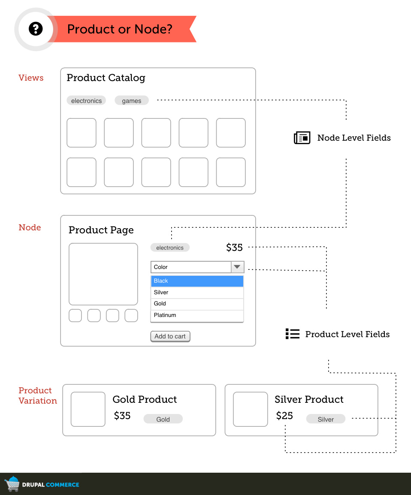
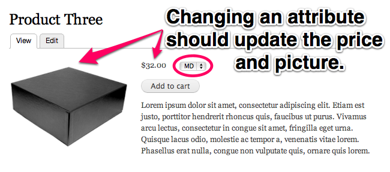

<iframe src="https://drupalize.me/ajax/drupalizeme_embed/693" height="293" width="520" frameborder="0" scrolling="no" allowfullscreen></iframe>

Think of nodes as a way of grouping like products together. The most obvious grouping is one product that has variations in size, color, etc. In Drupal Commerce every variation is a product and to group them properly, we use Product Displays.

"Product Display" is the default content type that Commerce Kickstart 1.x creates and it has a product reference field. Technically, any entity that has a product reference field could be considered a product display. Nodes are the obvious product display entity type, and they're privileged because they're the default and standard entity type to use for the front-end display of content. But you could use taxonomy vocabularies, or even users as product displays.

        
Page or Variation?

        
This illustration explains the differences between product pages (nodes) and product variations (products).

    

<h2>Advantages of Separating Product & Product Display</h2>

A product in Drupal Commerce can represent one of several things:

<ul>
  <li>A single item for sale on the site</li>
  <li>A variation in a group of items for sale on the site (e.g. one size of a t-shirt)</li>
  <li>A non-tangible product reserved through the site (e.g. event registration)</li>
  <li>An item that is not purchased but which represents the purpose of payment for a particular order (e.g. donation account or campaign)</li>
</ul>

Depending on the product and the site’s needs, products may be displayed on unique pages, on pages grouping multiple products together (e.g. all the sizes of a t-shirt), on multiple different pages or Views, or not at all. For this reason, Drupal Commerce enforces a separation between the definition of a product and the product display.

This separation allows you to:

<ul>
  <li>Track stock for a single product regardless of what display it’s purchased through (especially important for multilingual / multi-domain sites).</li>
  <li>Use a different display strategy to fit the site (e.g. a node per product, a single View listing all available products, etc.).</li>
  <li>Easily manage the import and update of particular product data without worrying about updating related display settings.</li>
</ul>
<h2>Attribute Fields</h2>

        
Attribute Fields

        
Fields attached to products can be exposed on Add to Cart forms as
        attribute fields. These are common fields among a group of products
        whose allowed values may be used to select a particular product from the
        group to add to the cart.

    

The settings for attribute fields are built into the field edit form. These are typically List fields and Taxonomy term reference fields, because they have a discrete number of options. Attribute fields can use select list or radio button widgets on the Add to Cart form.

