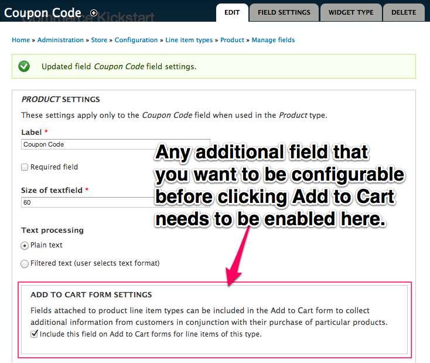

The core product pricing system is great for flat / percentage discounts of products on the site and for alternate price lists. Special offers, such as "Buy one get one free," are not supported in Drupal Commerce core. They depend on the creation and management of alternate line items (e.g. one line item for the paid product and another for the free product).

Drupal Commerce's sell price pre-calculation mechanism limits what types of data you can access in the conditions and actions of product pricing rules. Very few sites actually make use of this functionality, but the gist of it is your conditions cannot use data specific to the product (i.e. product type or SKU) and your actions can only use data specific to the product (i.e. not the day of the week or user roles).

Even with those limitations, it is still possible to create quite complex pricing scenarios. One Drupal Commerce site currently uses approximately 1500+ Rules!

<strong>Note about Coupons.</strong> Using Drupal Commerce Core, it is very possible to allow users to add coupons via line item (when someone clicks an add to cart link) or via Checkout. To do the checkout method, you can follow the same principles as outlined in our "Simple Coupon" exercise, however you will need to add the field to your Order type via code and expose it on the checkout pane using <a href="http://drupal.org/project/commerce_fieldgroup_panes">Commerce Fieldgroup Panes</a>.

<h2>Administrator's Special</h2>

    
    <ul class="screenshot_breadcrumbs">
        <li class="first">Administration</li>
        <li>Store</li>
        <li>Products</li>
        <li>Product Types</li>
        <li>Manage Display</li>
        <li class="last">Edit Price</li>
    </ul>

In the <a href="Price-Calc.html">Price Calculations article</a>, we went over how to create a conditional discount for a user role.

<h2 id="simplecoupon">Simple Coupon Code per Line Item</h2>

Add a coupon code textfield to the product line item type. Create a Rule that looks for this value and applies a discount based on the code entered.

    

        
     

        
Store Configuration

        
To start with, we will navigate to the Store Configuration Screen and click "Line Item Types." In order to add a discount to our line items, we need to add a field.

    

<ul class="screenshot_breadcrumbs">
        <li class="first">Administration</li>
        <li>Store</li>
        <li class="last">Configuration</li>
    </ul>

    

        
     

        
Line Item Types

        
Add field to Line Item

    

<ul class="screenshot_breadcrumbs">
        <li class="first">Administration</li>
        <li>Store</li>
        <li>Configuration</li>
        <li class="last">Line Item Types</li>
    </ul>

    

        
     

        
Add Field

        
We're adding a text field in the manage fields screen for our custom line type. If you want to be able to create unique line item types, there is a great contributed module for that called: <a href="http://drupal.org/project/commerce_custom_product">Commerce Customizable Products</a>.

    

<ul class="screenshot_breadcrumbs">
        <li class="first">Administration</li>
        <li>Store</li>
        <li>Configuration</li>
        <li>Line Item Types</li>
        <li class="last">Manage Fields</li>
    </ul>

    

        
Field Configuration

        
This is the screen you will see after clicking "Continue" when you've "Added" a field. Make sure you configure the "Add to Cart" settings correctly, or you will not be able to edit this field before adding the product to cart.

        
Any additional field that you want to be configurable before clicking Add to Cart needs to be enabled here.

        
The idea is that the customer would add a coupon before checkout.

    

    <ul class="screenshot_breadcrumbs">
        <li class="first">Administration</li>
        <li>Store</li>
        <li>Configuration</li>
        <li>Line Item Types</li>
        <li>Manage Fields</li>
        <li class="last">Field Configuration</li>
    </ul>

    

        
    

        
Add to Cart Preview

        
This is what the Coupon Code field should look like on an add to cart form.

    

<ul class="screenshot_breadcrumbs">
        <li class="first">Commerce Kickstart</li>
        <li>Add a Product to your cart</li>
        <li class="last">Add to Cart Preview</li>
    </ul>

    

        
    

        
Edit View

        
Go ahead and add a product to your cart, then click View Cart and then click edit view as shown here.

    

<ul class="screenshot_breadcrumbs">
        <li class="first">Commerce Kickstart</li>
        <li>Add a Product to your cart</li>
        <li>Click "View Cart"</li>
        <li class="last">Click "Edit View"</li>
    </ul>

    

        
     

        
Add Field

        
In order to view our coupon on the shopping cart, we will add the field. Same could be done with the checkout views and/or Shopping Cart block.

    

<ul class="screenshot_breadcrumbs">
        <li class="first">Administration</li>
        <li>Structure</li>
        <li>Views</li>
        <li>Edit Shopping Cart</li>
        <li class="last">Click "Add" next to Fields</li>
    </ul>

    

        
     

    

        
     

    

        
     

        
Product Price Rule

        
Adding a new Product Pricing Rule.

    

<ul class="screenshot_breadcrumbs">
        <li class="first">Administration</li>
        <li>Store</li>
        <li>Configuration</li>
        <li class="last">Product Pricing Rules</li>
    </ul>

    

        
     

        
Add Price Rule

        
Make up a pricing rule name on this form. Mostly showing this screen so people don't get too confused with all of this jumping around.

    

<ul class="screenshot_breadcrumbs">
        <li class="first">Administration</li>
        <li>Store</li>
        <li>Configuration</li>
        <li>Product Pricing Rules</li>
        <li class="last">Add Price Rule</li>
    </ul>

    

        
     

        
Editing Rule

        
This is where we will be spending the next few minutes. The plan is to add two conditions, separated by an "And" and finally add an action that applies the discount.

    

<ul class="screenshot_breadcrumbs">
        <li class="first">Administration</li>
        <li>Store</li>
        <li>Configuration</li>
        <li>Product Pricing Rules</li>
        <li class="last">Rule Overview</li>
    </ul>

    

        
     

        
Add Condition

        
First, add a condition for our new field called "Entity has field." This is a critical step to making that field available in our next condition. Do not skip this step.

    

<ul class="screenshot_breadcrumbs">
        <li class="first">Administration</li>
        <li>Store</li>
        <li>Configuration</li>
        <li>Product Pricing Rules</li>
        <li>Edit Rule</li>
        <li class="last">Add Condition</li>
    </ul>

    

        
     

        
Configure Condition

        
For this condition, we need the commerce-line-item data selector and our new field.

    

<ul class="screenshot_breadcrumbs">
        <li class="first">Administration</li>
        <li>Store</li>
        <li>Configuration</li>
        <li>Product Pricing Rules</li>
        <li>Edit Rule</li>
        <li class="last">Configure Condition</li>
    </ul>

    

        
     

        
Add And Condition

        
Next, add and to require our final data comparison condition. This is required to force both conditions.

    

<ul class="screenshot_breadcrumbs">
        <li class="first">Administration</li>
        <li>Store</li>
        <li>Configuration</li>
        <li>Product Pricing Rules</li>
        <li>Edit Rule</li>
        <li class="last">Add "And" Condition</li>
    </ul>

    

        
     

        
Add Data Comparison

        
For our final condition, click "Add condition" and select "Data comparison."

    

<ul class="screenshot_breadcrumbs">
        <li class="first">Administration</li>
        <li>Store</li>
        <li>Configuration</li>
        <li>Product Pricing Rules</li>
        <li>Edit Rule</li>
        <li class="last">Add Data Compairson</li>
    </ul>

    

        
     

        
Configure Condition

        
Find our new field, called something like "commerce-line-item:field-xxx."

    

<ul class="screenshot_breadcrumbs">
        <li class="first">Administration</li>
        <li>Store</li>
        <li>Configuration</li>
        <li>Product Pricing Rules</li>
        <li>Edit Rule</li>
        <li class="last">Configure Condition</li>
    </ul>

    

        
     

        
Configure Condition

        
This is part of the magic. I'm setting my coupon code to be an arbitrary four digit number, but you could set it to just about anything that a person could type into their field. You could even potentially be a bit more creative here. This could be a role that a user has or perhaps a previously visited page.

    

<ul class="screenshot_breadcrumbs">
        <li class="first">Administration</li>
        <li>Store</li>
        <li>Configuration</li>
        <li>Product Pricing Rules</li>
        <li>Edit Rule</li>
        <li class="last">Configure Condition</li>
    </ul>

    

        
     

        
Add Action

        
Add discount action. For this action, we chose the "Multiply the unit price by some amount" underneath the "Commerce Line Item." Next screen is configuration settings.

    

<ul class="screenshot_breadcrumbs">
        <li class="first">Administration</li>
        <li>Store</li>
        <li>Configuration</li>
        <li>Product Pricing Rules</li>
        <li>Edit Rule</li>
        <li class="last">Add Action</li>
    </ul>

    

    

        
     

        
Configure Action

        
Be sure to set multiply value and change component type to discount. There is a lot to learn about <a href="Price-Components.html">Price Component Types</a> if you are interested.

    

<ul class="screenshot_breadcrumbs">
        <li class="first">Administration</li>
        <li>Store</li>
        <li>Configuration</li>
        <li>Product Pricing Rules</li>
        <li>Edit Rule</li>
        <li class="last">Configure Action</li>
    </ul>

    

        
     

        
Final Cart

        
Final Shopping Cart using our new coupon rule.

    

<ul class="screenshot_breadcrumbs">
        <li class="first">Commerce Kickstart</li>
        <li>View /cart</li>
        <li class="last">Final Cart</li>
    </ul>

