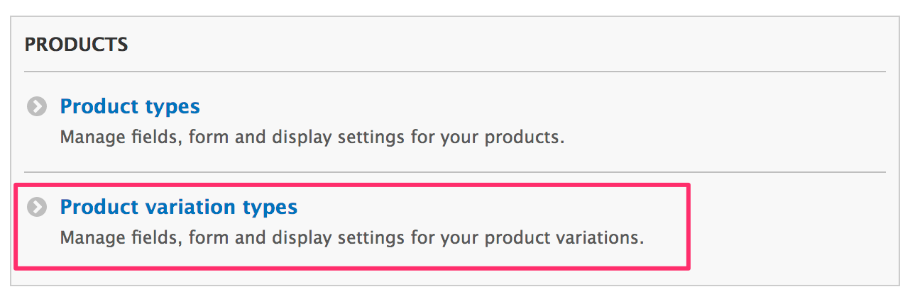
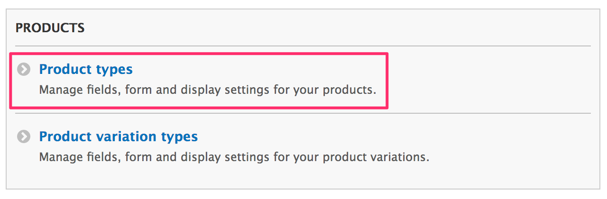

This guide assumes you have created your product attributes, or understan how they are used after reading how to [configure product attributes](../02.configure-product-attributes)

! Currently you must create the product variation type first, then your product type. There is an open issue to streamline and simplify this process: [https://www.drupal.org/node/2911346](https://www.drupal.org/node/2911346)

## Create a product variation type

Following the example of having a t-shirt, the first step is to create a new product variation type for our t-shirt. Go to ``admin/commerce/config/product-variation-types``

Click **Add product variation type**

This will open a form.

Now we will add image field to our product variation.

Click on **Manage fields** and then click on **Add field**

Now select field type Image under *Reference*.

Then click on **Save and continue**. Then save the settings for image field.

In these steps we added an image field to the variation. This allows us to upload a picture of the t-shirt based on its color. As the customer chooses a color to purchase, it will show that image.

## Create a product type

Next, we need to create our product type for our t-shirts. Go to `admin/commerce/config/product-types`.

Click on **Add product type**

This will open a form.

Save settings and this will create our T-shirt product type.