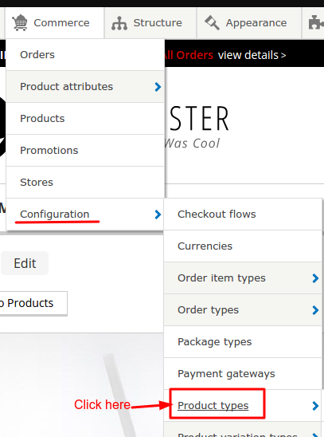
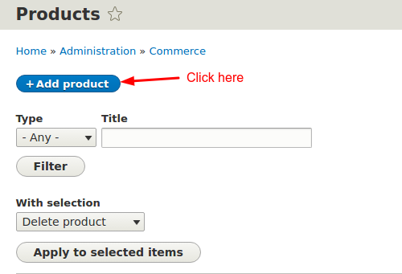

! We need help filling out this section! Feel free to follow the *edit this page* link and contribute.

Discuss product types, product variation types. How to attach attributes to variation types.

Imagine a new product arrives in your store, let's say T-shirt. You have never sold t-shirt in your store and now you have to sell it in your store. So for this new product, you will need to create a new product type in your drupal commerce site. This is not a hard process, below is a step by step guide.

Product attribute
------------------
Not all products have attributes. For our example product type, we're creating t-shirts. T-shirts usually come in colors and sizes. One type of t-shirt may have a few sizes that it comes in. Those sizes are what we call attributes. And those attributes can be created like this:

We will create two product attributes -

* Size
* Color

Goto ``admin/commerce/product-attributes``

OR

Click **Add product attribute**

This will open a form.

After saving this form, we are required to fill *attribute values*.

Now save this form.

Do the same for Color attribute.

Create Product variation
--------------------------

Now we need a product variation for the image for t-shirts.

Goto ``admin/commerce/config/product-variation-types``

OR

Click **Add product variation type**

This will open a form.

Now we will add image field to our product variation.

Click on **Manage fields** and then click on **Add field**

Now select field type Image under *Reference*.

Then click on **Save and continue**. Then save the settings for image field.

In the above steps we could have skipped adding image field in product variation and instead we could have added this field to our new product type which we are going to create in next step. But that way image will be same for every variation. We don't want that. We want our image to change when we change product variation. In easier words, we want yellow t-shirt image to appear when we select yellow color in select list. And for that we added image field in product variation and not in new product type.

Create Product Type
--------------------

By default drupal commerce comes with a *default* product type. But in our case, our requirements are different and our product have different attributes than what ``default`` product type come preloaded with. Therefore, we need a new product type for our T-shirts. So lets create our T-shirt product type.

Goto ``admin/commerce/config/product-types``

OR

Click on **Add product type**

This will open a form.

Save settings and this will create our T-shirt product type.

Create a test product
----------------------

Goto ``admin/commerce/products``.

OR

Then click on *Add product*.

Now click on new product type that you created, in my case its *T-shirt*

Fill new product form and create different variations for different size and color, and click on **Save and publish** button below **Create variation** button.

Product view
-------------

You can view all your added product by click on **Products** under ``Commerce`` menu link.

