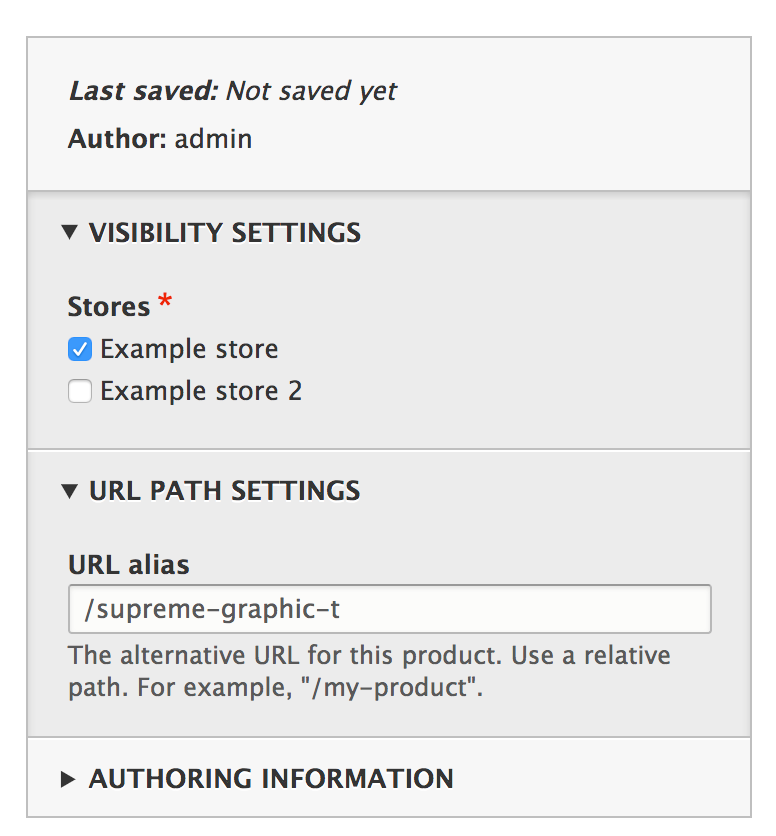
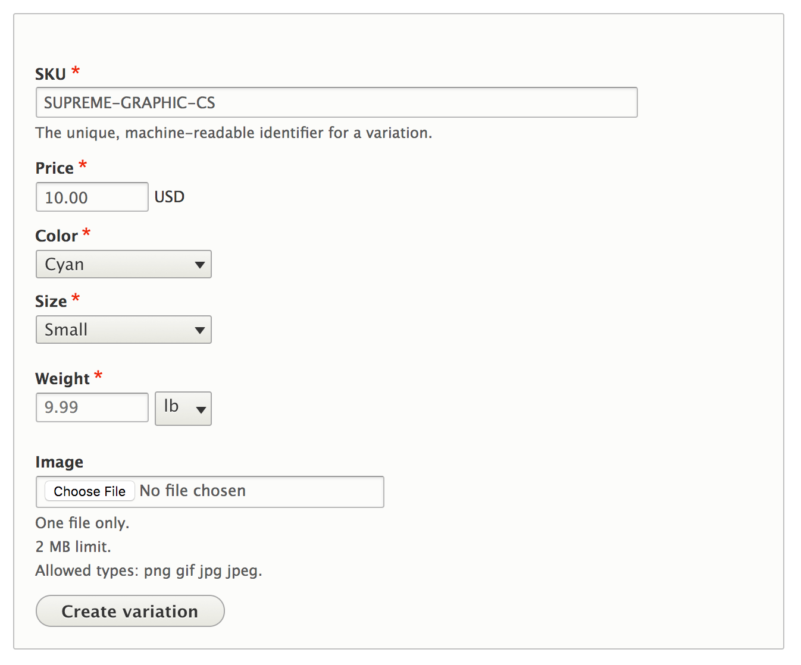
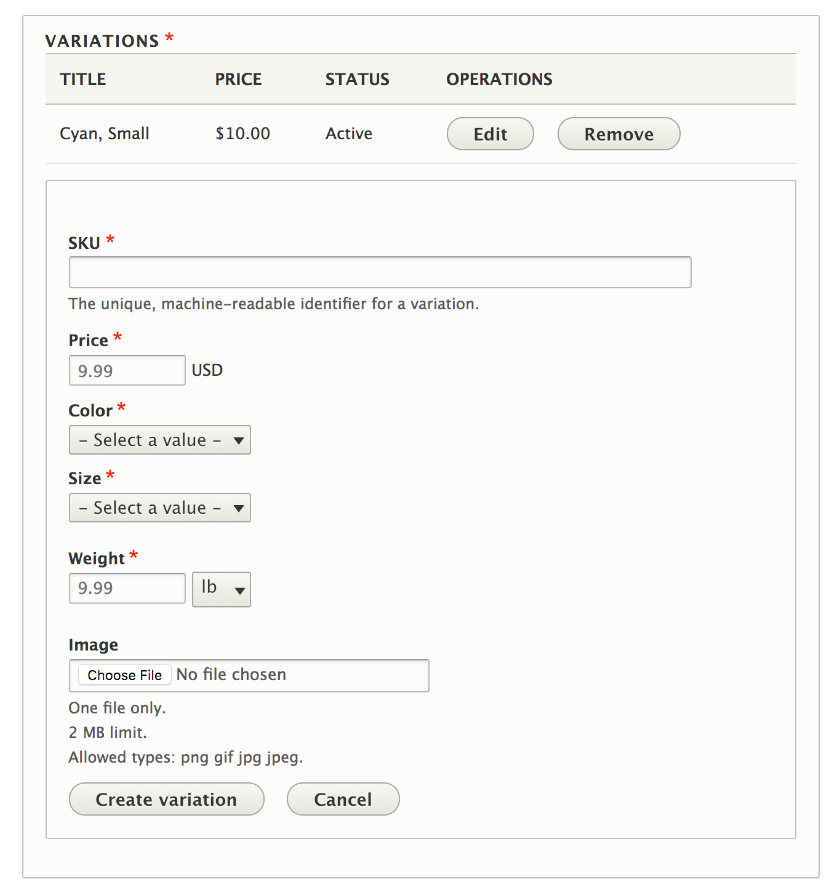

To create a product go to the **Products** management page from the **Commerce** item in the administrative menu. Click on "Add Product." If you have multiple product types, you will need to select the type of product that you are creating.

The form will provide various sections for providing information about the product. First we will provide a **Title**, the product's name, and then a description about the product in the **Body** field. 

On the right side of the form we can control additional information about the product. 

* The stores the product is available to be purchased in. If there is only one store, you will not see the store visibility setting. 
* The path alias (URL) to use for accessing the product. 

By setting the URL alias to `/supreme-graphic-t` the product can be visited at `www.example.com/supreme-graphic-t` rather than `www.example.com/product/1234`

Next we create our variations for the product. The variations are the options available for purchase. Provide a **SKU**, **Price**, and other required fields. When done, click on **Create variation**

Click **Add new variation** to add a new variation. Follow the previous process and repeat until satisified that all purchasable options are displayed.

Finally, click **Save** to create the product.

