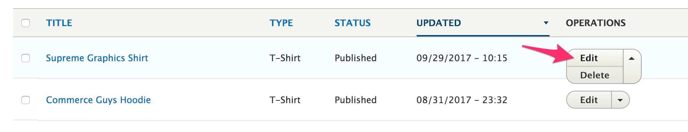
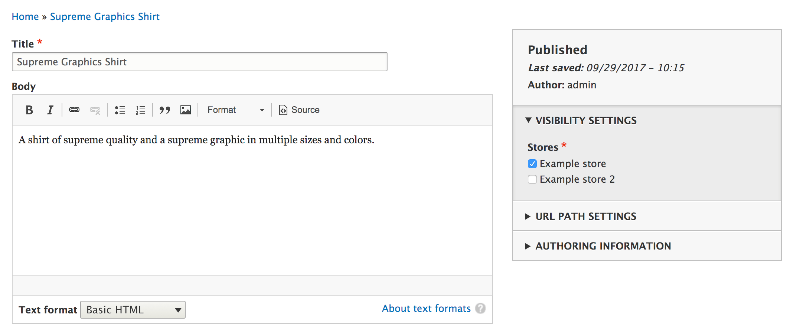

Products can be edited by going to the products overview page and selecting to edit an existing product. When the products are in the table there will be operation links which allow you to edit the product.

The form will allow you to modify the existing information for the product.

To manage variations, you just need to click **Edit** for its entry.

