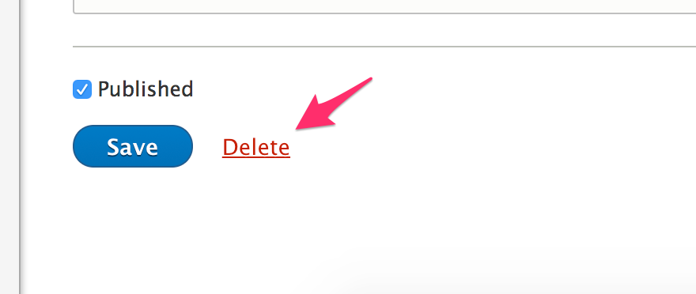

Sometimes you may wish to delete a product or one of its variations. Before deleting a product or variation, consider unpublishing the product or disabling the variation.

! @todo the unpublish process is just a checkbox, review. No way to disable variations by default.

## Deleting a product variation

A product's variation is deleted while editing the product. Click on the variation's **Remove** button. A confirmation form will display. Click **Remove** once more to confirm.

## Deleting entire product

A product can be deleted by editing it. At the bottom of the form there is a **Delete** link, which will display a confirmation form. Click **Delete** once more to confirm deletion. All variations will also be deleted.

