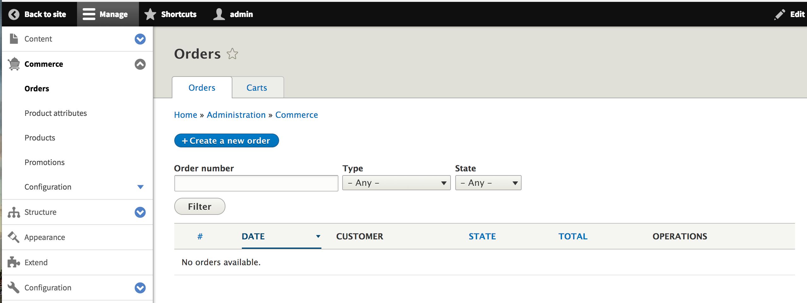
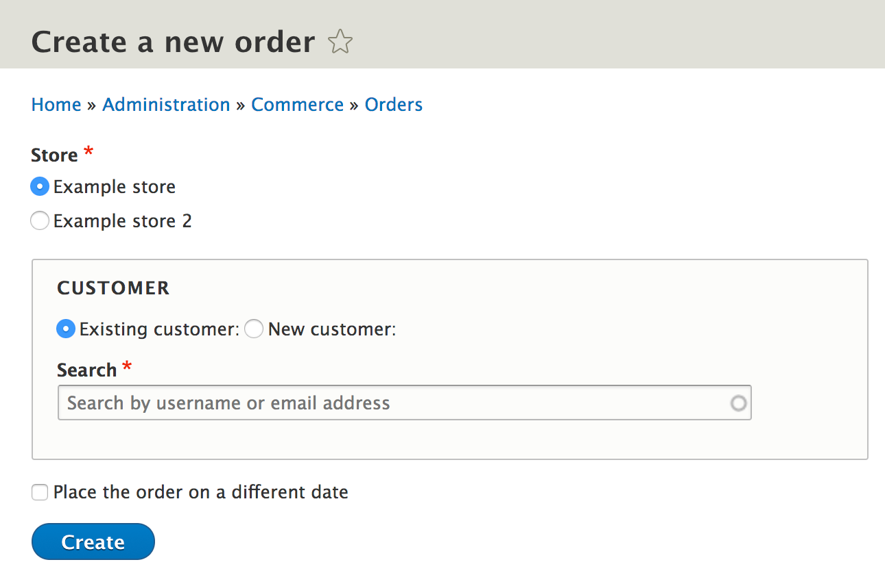
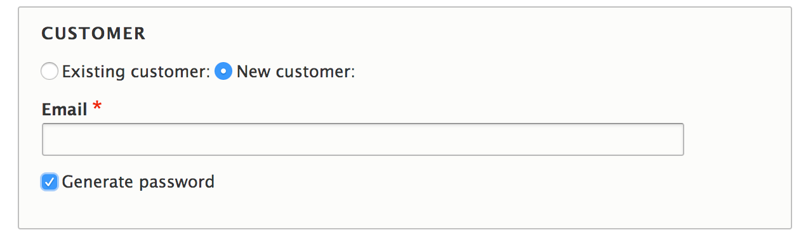
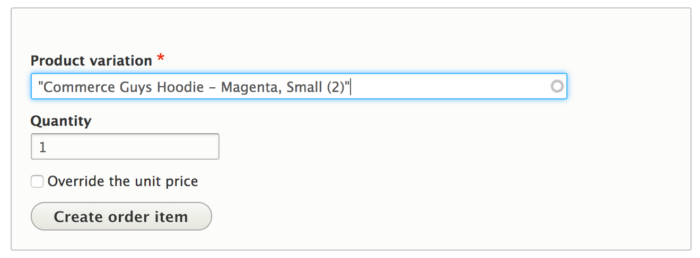

Orders can be created for customers in the administrative areas. This can be done by going to the **Orders** management page from the **Commerce** page from the administrative toolnar. Click on **Create  a new order**.

When creating an order you select the store it is for and specify a customer.

Instead of re-using a customer, a new one can be created.

Click **Create**. You will then be able to provide information about the order. The first items will allow you to provide billing information for the order. You can also specify if the order is a cart or not. By marking the order as a cart, the customer will able to review the cart and go through the checkout with it.

Next, order items can be created. The order items are the products the customer is purchasing.

Once satisfied, click **Save**

! Need to add documentation for adjustments and coupons.