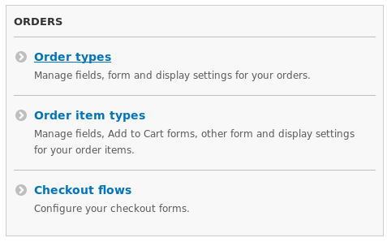
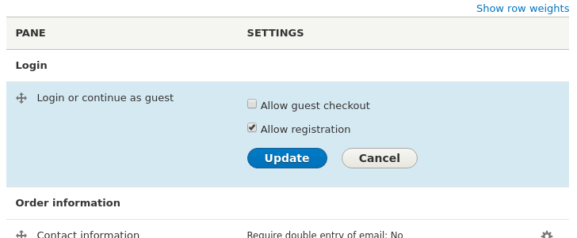
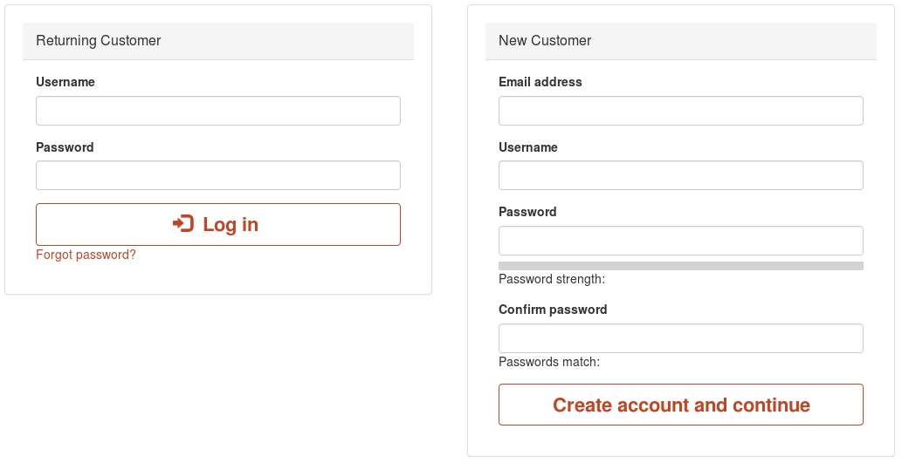

## Overview
You can restrict checkout to just users with accounts. You can then either completely deny checkout access to users without accounts or require them to create an account before they can checkout.

You can change this setting on a per Checkout Flow basis, so you can deny guest checkouts for some flows and not others as you need.

## Enable / Disable Account Registration at Checkout

Visit the Commerce configuration page and go to the **Checkout Flows** section.

Click **Edit** on the Checkout Flow you want to configure.

To **Allow Registration at Checkout**
 - Click the cog icon in the **Login or continue as guest**
 - Uncheck the **Allow guest checkout** box
 - Check the **Allow registration** box
 - click **Update** and then **Save** at the bottom of the page.
 

With a Boostrap theme your page will look something like the below:

To **Deny Registraion at Checkout**
 - Click the cog icon in the **Login or continue as guest**
 - Uncheck the **Allow guest checkout** box
 - Uncheck the **Allow registration** box
 - click **Update** and then **Save** at the bottom of the page.

With a Boostrap theme your page will look something like the below.

## Allow guests to create an account during the checkout process

To give your customers the ease of creating an account at the end of their checkout you need to enable the "Guest Registration after checkout" pane in your checkout flow.

! At the time of writing your site will not have this feature by default. You need to apply the latest good [patch from this issue]. The below instructions will then apply to your site.

### Enable / Disable Account Registration at Checkout
You need to enable / disable registration for each Checkout Flow you are using.

Visit the Commerce configuration page and go to the **Checkout Flows** section.

Click **Edit** on the Checkout Flow you want to configure.

To **Enable** Guest Registration
 - Locate the "Disabled" section and drag the **Guest registration after checkout** into the "Complete" section and click **Save**.

To **Disable** Guest Registration
 - Locate the "Complete" section and drag the **Guest registration after checkout** into the "Disabled" section and click **Save**.

[patch from this issue]: https://www.drupal.org/node/2857157

