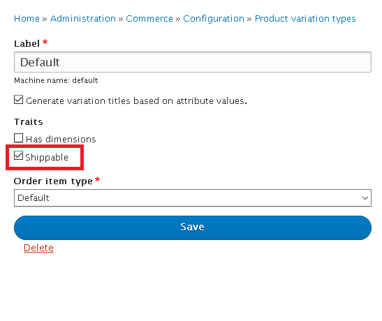

! We need help filling out this section! Feel free to follow the *edit this page* link and contribute.

Whatever shipping method you are using, you will need to set any shippable
product variation types as shippable. Go to `/admin/commerce/config/product-variation-types/`
and edit each variation type that you want to enable shipping for.

Depending on your shipping plugin, you may also need to enable dimensions there.
