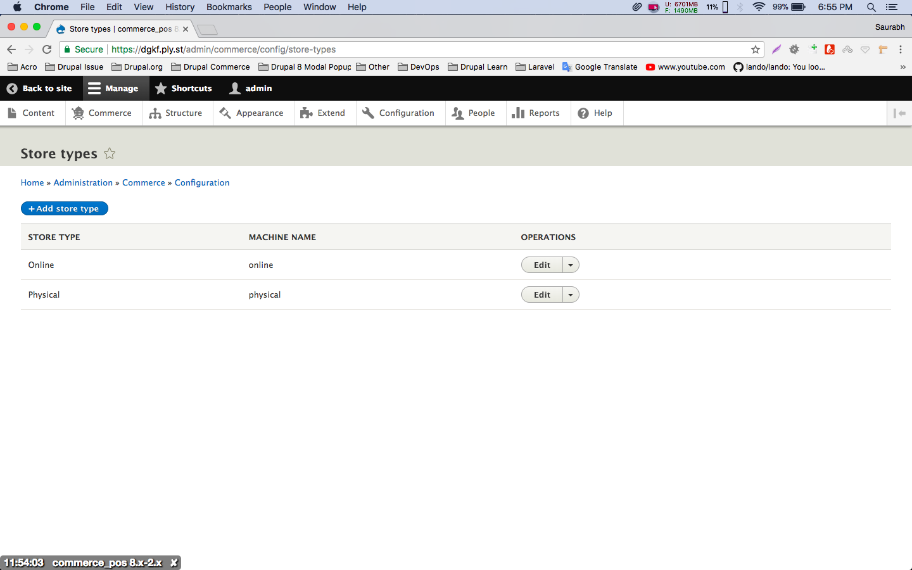
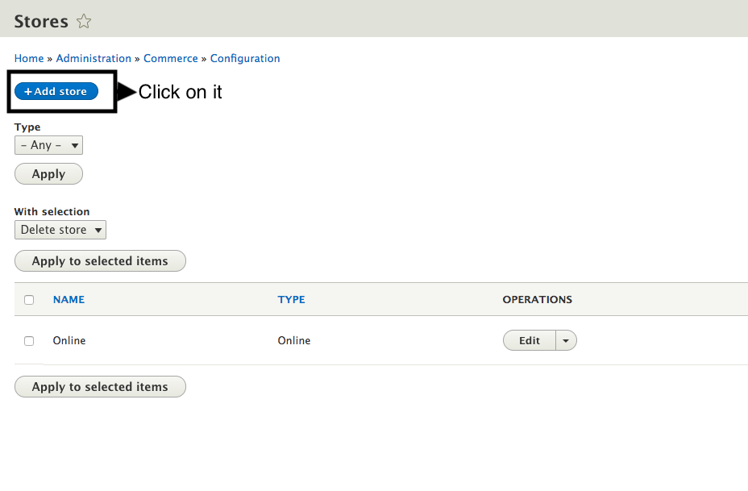
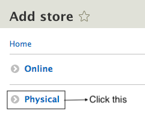

! We need help filling out this section! Feel free to follow the *edit this page* link and contribute.

After we enable commerce pos module there is a new store type created i.e. Physical. You can see this new store type at `admin/commerce/config/store-types`

Lets create a new store for POS using this new store type. Go to `admin/commerce/config/stores` and click **+Add store** button.

Now click on **Physical**.

Now you will see a form. Fill this form and click **Save** button in the bottom. You will see the newly created store on the page.