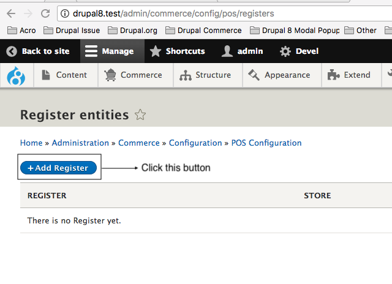
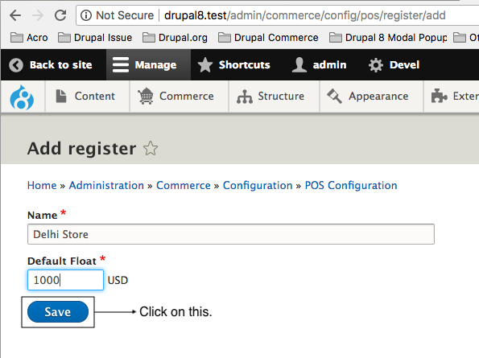
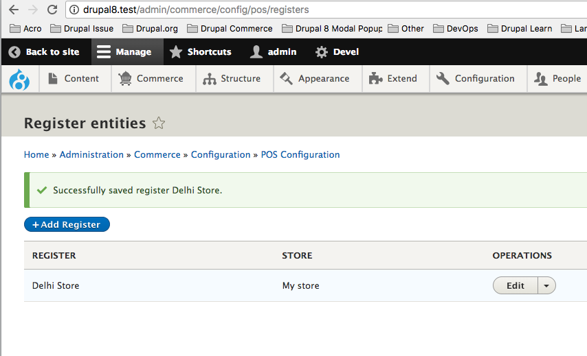

! We need help filling out this section! Feel free to follow the *edit this page* link and contribute.

We can add register by going to `/admin/commerce/config/pos/registers` and click **+Add Register** button.

Enter the name of the register and default cash amount for the register.

And click on **Save**.

You will see a success message and the new register shows up in the page. That's it, you have now added a new register for your POS.

