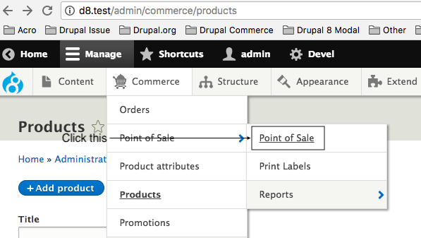
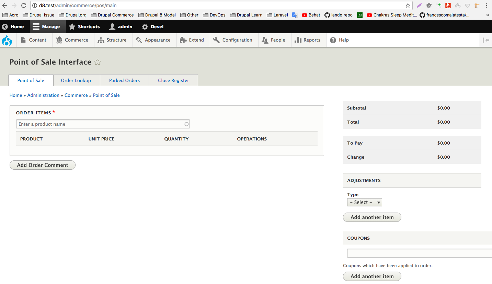
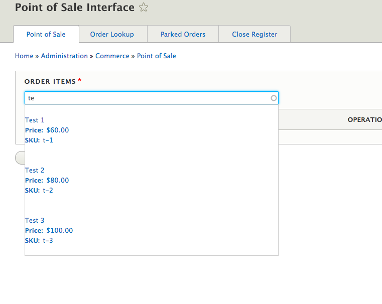
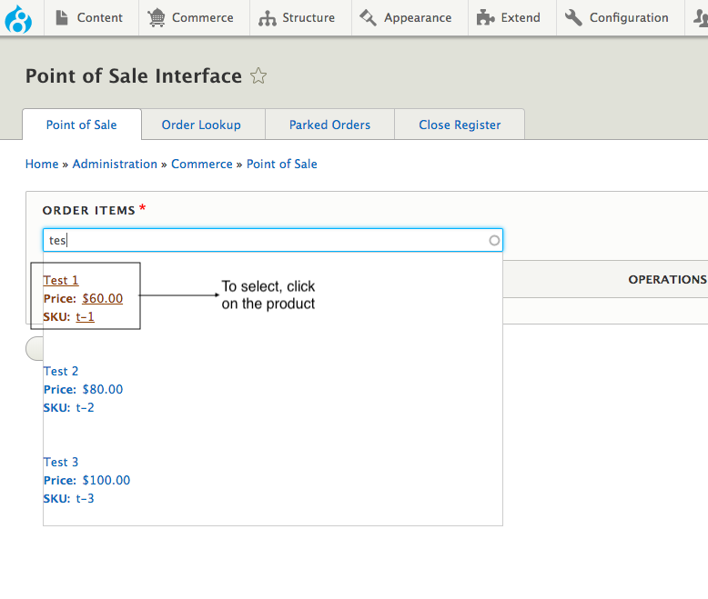
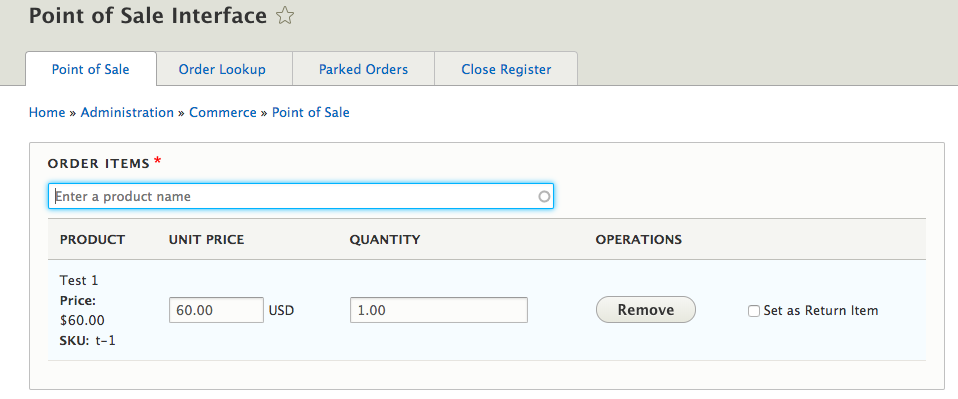
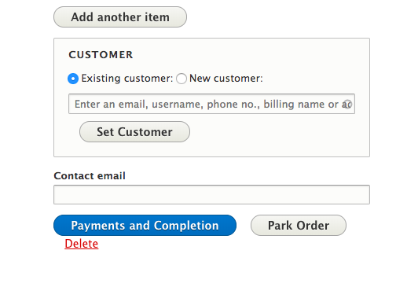
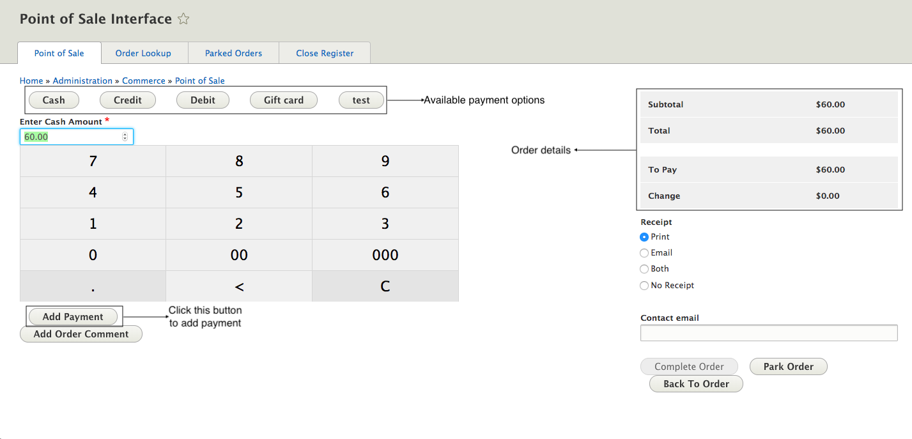
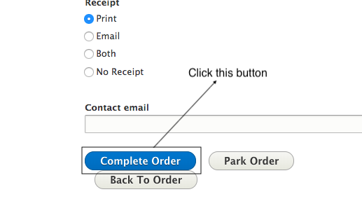
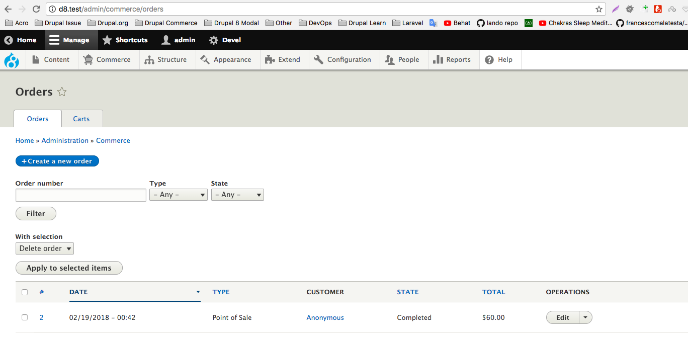

! We need help filling out this section! Feel free to follow the **edit this page** link and contribute.

In order to create a POS order, go to `admin/commerce/pos/main` or you can click the **Point of Sale** link also as shown in image -

You will see **Point of Sale** screen.

In the order item textfield, start typing the name of the product which you want to add to order. You will see a list of matching product variations.

Click on the product variation which you want to add to order.

Now we have added a product variation to the order.

You can add other product variations using the previous mentioned steps. Now to make payment, click on the **Payments and Completion** button located at the bottom right of the page as shown in the image -

You will be redirected to payment page. You will see the order details and the payment options, lets use cash payment for the purpose of this example, you can use other payment methods as well. The order amount is prepopulated into the amount textfield, you can change the amount using the keypad buttons shown in the image. Finally when everything if fine you can add the payment for this order by clicking on **Add payment** button.

After adding the payment, **Complete Order** button will be enabled in the bottom right of the screen and you need to click this button to complete the order.

That's all, you have now created an order using Commerce Point of Sale module. The created order can be view on the orders overview page at `admin/commerce/orders`.

