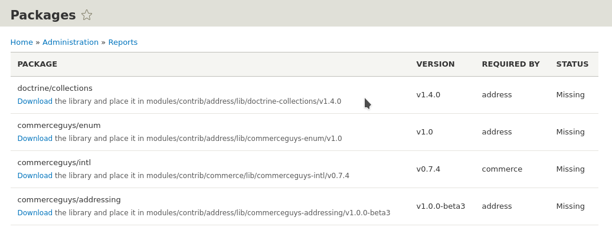

**Installing Commerce to contribute back?** Check out our [Getting ready for development](../../01.contributing/01.setup-local-environment) guide.

Be sure to [review requirements](../01.requirements) before starting the installation process.


## New site

 The following command will download Drupal 8 + Commerce 2.x with all
 dependencies to the `mystore` folder:

 ```bash
 composer create-project drupalcommerce/project-base mystore --stability dev
 ```

 Install it just like a regular Drupal site. Commerce will be
 automatically enabled for you.

 Tips:

 - The `bin` folder contains any library binaries, such as [Drupal Console], [PHPUnit], [Behat], etc.
 - The `web` folder represents the document root.
   - If you host your site on Acquia Cloud or another service that requires Drupal in a subdirectory other than `web`, [these instructions] describe how you can relocate the docroot.
 - Composer commands are always run from the site root (`mystore` in this case).
 - See the [Composer template for Drupal projects README] for more details.


## Existing site

 Run these commands in the root of your website:

 #### Download Commerce

 This will also download the required libraries and modules (Address, Entity, State Machine, Inline Entity Form, Profile).

 ```bash
 cd /path/to/drupal8
 composer require "drupal/commerce"
 ```

 #### Enable Commerce

 The instructions below use [Drupal Console]

 ```bash
 drupal module:install commerce_product commerce_checkout commerce_cart
 ```

## Alternative installation instructions for Ludwig users
> Composer is the recommended way to install and maintain a site. Site administrators using Ludwig need to be careful when combining modules that depend on external libraries, since there are no safeguards against incompatible library versions or overlapping requirements.

These instructions assume you are working with an existing site.

1. Download and install the [Ludwig module].

2. Download Commerce and the 6 required modules. You will need -dev versions of Commerce and Address for this to work. Other modules (such as payment gateways) haven't been updated with ludwig.json files yet.
- [Address]
- [Entity API]
- [Entity Reference Revisions]
- [Inline Entity Form]
- [Profile]
- [State Machine]

3. Use Ludwig to download libraries required by those modules. Go to `admin/reports/packages` to see the listing of required packages. The Packages page provides a download link for each missing library along with the paths where they should be placed. Download the libraries, then clear the cache to make them available.


4. Install Commerce and the 6 required modules.

> Whenever Commerce needs to be updated, all 7 modules need to be downloaded again, and then all of their libraries need to be downloaded again as well.

---
In subsequent sections of the [Installation and updates documentation](../), it is assumed that you are using Composer to manage your site.

 [Drupal Console]: https://drupalconsole.com
 [project-base README]: https://github.com/drupalcommerce/project-base/blob/8.x/README.md
 [PHPUnit]: https://www.drupal.org/docs/8/phpunit/running-phpunit-tests
 [Behat]: http://docs.behat.org/en/latest/
 [these instructions]: https://github.com/drupal-composer/drupal-project/issues/64#issuecomment-206455356
 [Composer template for Drupal projects README]: https://github.com/drupal-composer/drupal-project/blob/8.x/README.md
 [Ludwig module]: https://www.drupal.org/project/ludwig
 [Address]: https://www.drupal.org/project/address
 [Entity API]: https://www.drupal.org/project/entity
 [Entity Reference Revisions]: https://www.drupal.org/project/entity_reference_revisions
 [Inline Entity Form]: https://www.drupal.org/project/inline_entity_form
 [Profile]: https://www.drupal.org/project/profile
 [State Machine]: https://www.drupal.org/project/state_machine
