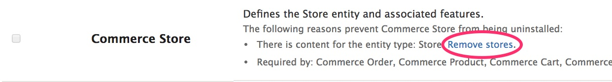
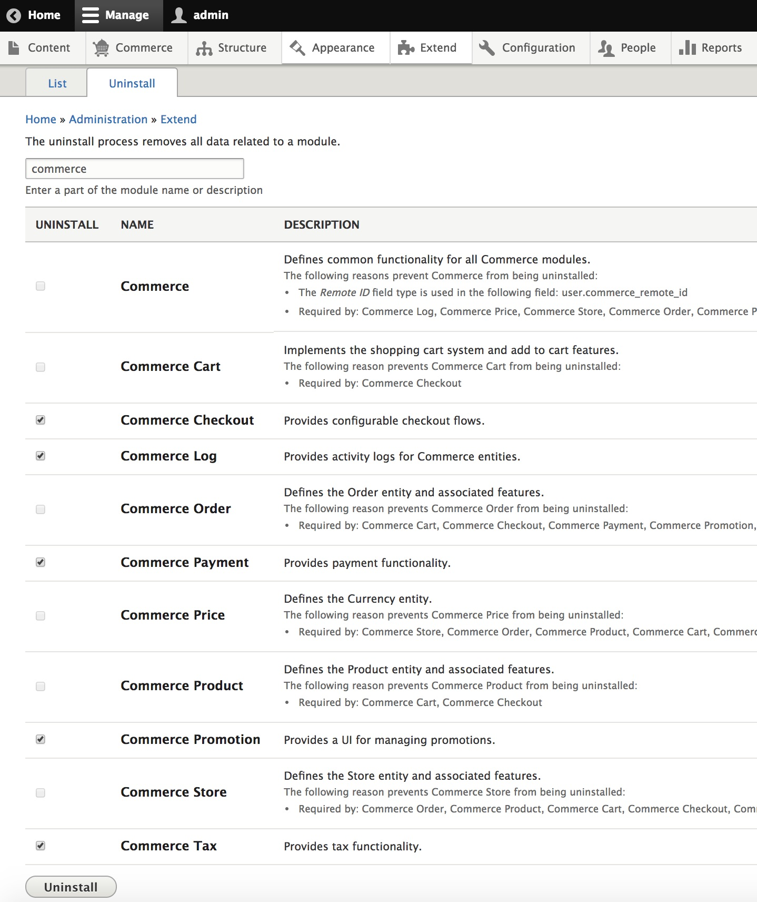

In order to completely remove Commerce from your Drupal site, you will first
need to delete all existing data. You can do this through the Admin UI using
the `Extend` toolbar item and then clicking on the `Uninstall` tab.

Type 'commerce' into the text box at the top of the page to filter the list by
Commerce modules.

Scan through the list for items that say:
```bash
There is content for the entity type:
```

Click the provided link to permanently remove the content for each entity type.


For example, if you have created a Store for your site, you will see:



Click the `Remove stores` link.


Once all content has been removed, you can start uninstalling the commerce
modules. You will only be able to uninstall a few at a time because of
dependencies. For example, you will not be able to uninstall the base Commerce
module until all other commerce modules are uninstalled. Note: if you have
extended your Drupal Commerce site with any modules that are dependent upon
Commerce, those modules will also need to be uninstalled before you are able
to uninstall Commerce.

Here you can see boxes checked for 5 of the Commerce modules which can be
uninstalled. After clicking the `Uninstall` button, it will be possible to
uninstall additional modules.



Since the Commerce base module provides a field type, it cannot be uninstalled together with the other modules. This is a known Drupal limitation. You will be blocked from uninstalling Commerce and see a "Fields pending deletion" message. You can delete the field in question by running Cron. You can run Cron through the Admin UI by navigating to Configuration > System > Cron.

Once all Commerce modules have been uninstalled, use Composer to remove the
Commerce dependency from your project.

```bash
composer remove drupal/commerce
```

At this point, Commerce and all its data have been uninstalled from your Drupal
site.
