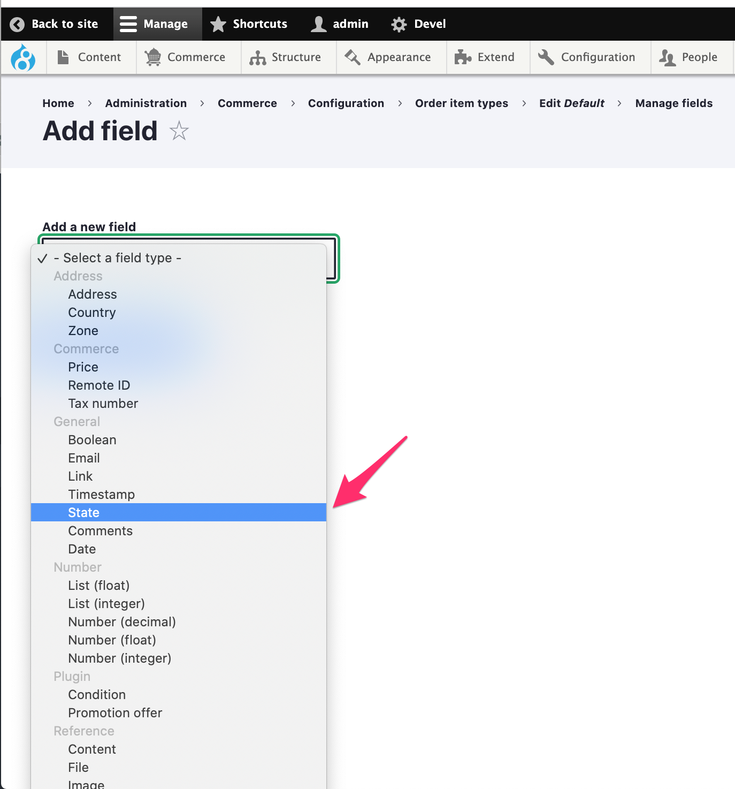
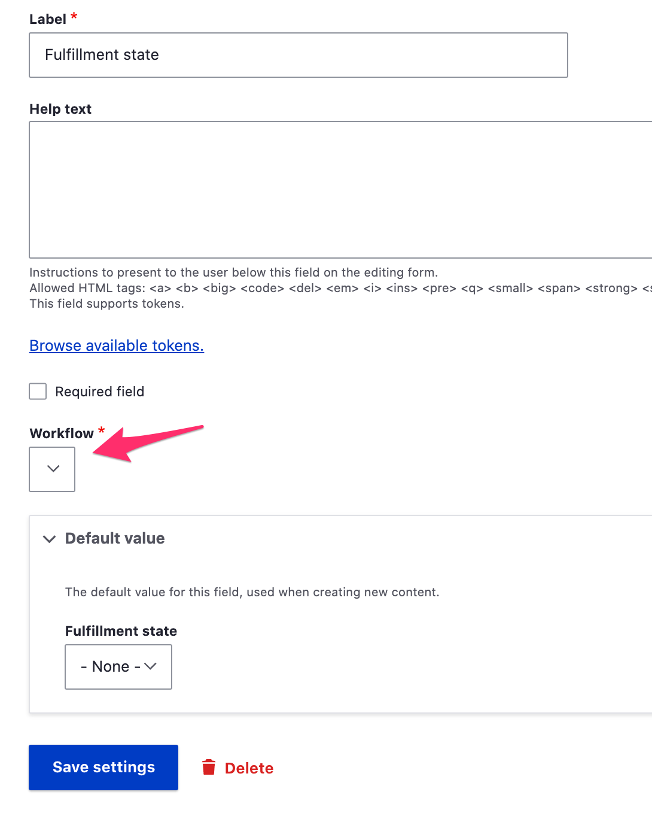
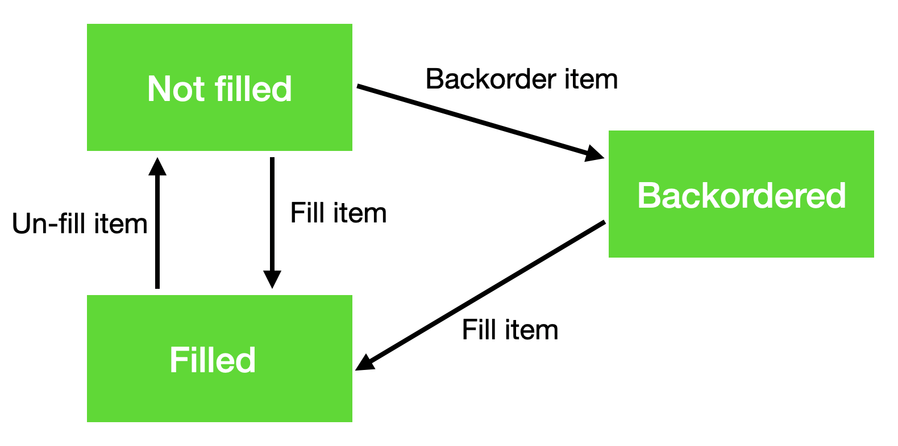
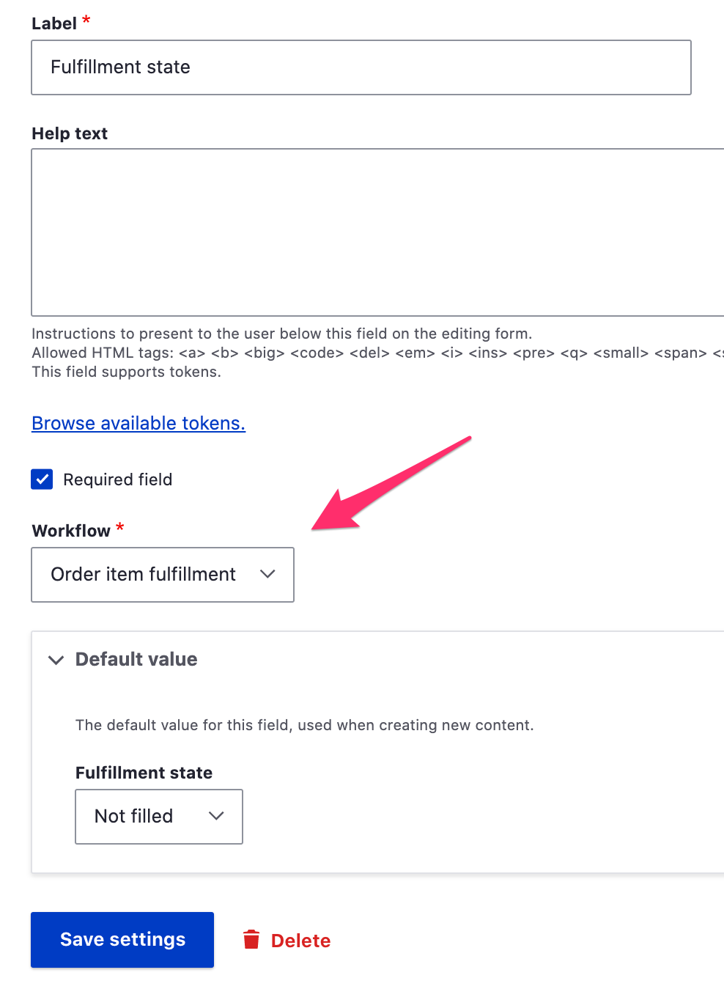
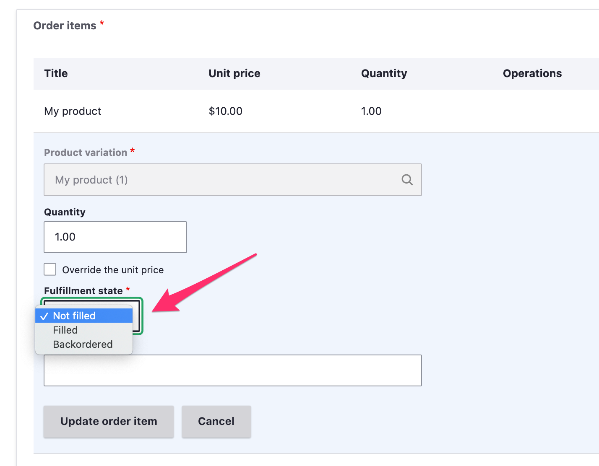

Drupal Commerce uses State fields for two of its entities: Orders and Payments. You can learn more about [Order workflows](../../../../orders/workflows) in the Orders documentation section. The [Payments information structure](../../../../payments/payments-information-structure) documentation describes the states of *Default* and *Manual* Payment workflows. There are also examples of altering Payment workflows in the [Payments code recipes](../../../../payments/code-recipes) and the [State machine code recipes](../code-recipes).

In this documentation section, we will go through an example of creating a custom State field, workflow, and workflow group and continue to build out the example in the next two sections on Guards and Transition event subscribers.

Our custom state field will be added to Order item entities, and we'll use it to track order fulfillment on a per-item basis. We are assuming that order items will be "filled" from inventory manually by administrative users. We'll also add in an option to "backorder" an item, if inventory is not currently available for that item. An order will not be complete until each of its items has either been filled or backordered.

A custom "State" field can be created through the admin UI like any other custom field. Navigate to the "Manage fields" page for the "Default" order type at `admin/commerce/config/order-item-types/default/edit/fields` and click the "Add field" button to add a new "State" field. We'll name our new field "Fulfillment state" with machine ID: `field_fulfillment_state`. The number of allowed values for a State field should always be set to 1.



All that is fairly straightforward, but we have a problem. We cannot set a "Workflow" for the field since none are available for this entity type. If we were adding the custom field to a Payment type or Order type, we could use the workflows defined for those entities. But since we are creating a State field on an Order item type, we need to create a new custom workflow.



It is not possible to create a workflow through the admin UI, so we need to add its definition using a custom module. See the Drupal.org [Creating custom modules] documentation if you need help getting started. In this example, we'll assume we've created and installed a custom module named `mymodule`.

We need to create both a custom workflow and a workflow group for our order item State field. [Workflow] and [WorkflowGroup] are plugins defined in YAML, similar to [menu links].

Our workflow group is defined in `mymodule.workflow_groups.yml`, a YAML file which should exist in the root folder of our custom module. We provide an ID for the workflow group on the first line and then define its Label and the entity type.

```yaml
mymodule_order_item:
  label: 'Order item'
  entity_type: commerce_order_item
```

Now that we have a workflow group for Order item entities, we can create one or more workflows in `mymodule.workflows.yml`. Here is the definition for our order item fulfillment workflow. Notice that we reference the ID of the workflow group we just defined as the `group`. The `label` is what administrative users will see when selecting a workflow for a State field.

```yaml
mymodule_order_item_fulfillment:
  id: mymodule_order_item_fulfillment
  group: mymodule_order_item
  label: 'Order item fulfillment'
  states:
    unfilled:
      label: 'Not filled'
    filled:
      label: Filled
    backordered:
      label: Backordered
  transitions:
    fill:
      label: 'Fill item'
      from: [unfilled, backordered]
      to: filled
    unfill:
      label: 'Un-fill item'
      from: [filled]
      to:   unfilled
    backorder:
      label: 'Backorder item'
      from: [unfilled]
      to: backordered
```

Following `id`, `group`, and `label`, we have two sections which define our workflow: `states` and `transitions`. 

For each state, we simply define a label for each of the state IDs. The state IDs (`unfilled`, `filled`, `backordered`) will be used whenever we want to work with the workflow programatically. The state labels ("Not filled", "Filled", "Backordered") will be used when displaying state values through the admin UI.

Defining the transitions can be trickier, if your workflow has any complex logic. Sketching out the states and transitions on paper with boxes and arrows can be helpful. For example, here is a diagram for our order item fulfillment workflow:



Notice that there are two separate arrows for the "Un-fill" and "Fill" transtions between the "Not filled" and "Filled" states. State transitions are always one-way, so we need a separate transition for each direction. Also, for any transition, there can only be exactly one "to" state. Since any transition can have multiple "from" states, those state IDs are defined with square brackets.

After creating the workflow group and workflow YAML files, we just need to clear caches so that the configuration can be discovered. Now we can set the workgroup value for our custom Order item state field through the admin UI:



To see the new State field in action, create a new order and then edit it through the admin UI. We now have a Fulfillment state field on the order item with State options matching the ones defined for its workflow. If you update its state to "Filled" and then save, you will see that the options change the next time you edit the order item. Only "Un-fill" will be available as an option.



[Creating custom modules]: https://www.drupal.org/docs/creating-custom-modules
[Workflow]: https://git.drupalcode.org/project/state_machine/blob/8.x-1.x/src/Plugin/Workflow/WorkflowInterface.php
[WorkflowGroup]: https://git.drupalcode.org/project/state_machine/blob/8.x-1.x/src/Plugin/WorkflowGroup/WorkflowGroupInterface.php
[menu links]: https://www.drupal.org/docs/drupal-apis/menu-api/providing-module-defined-menu-links
