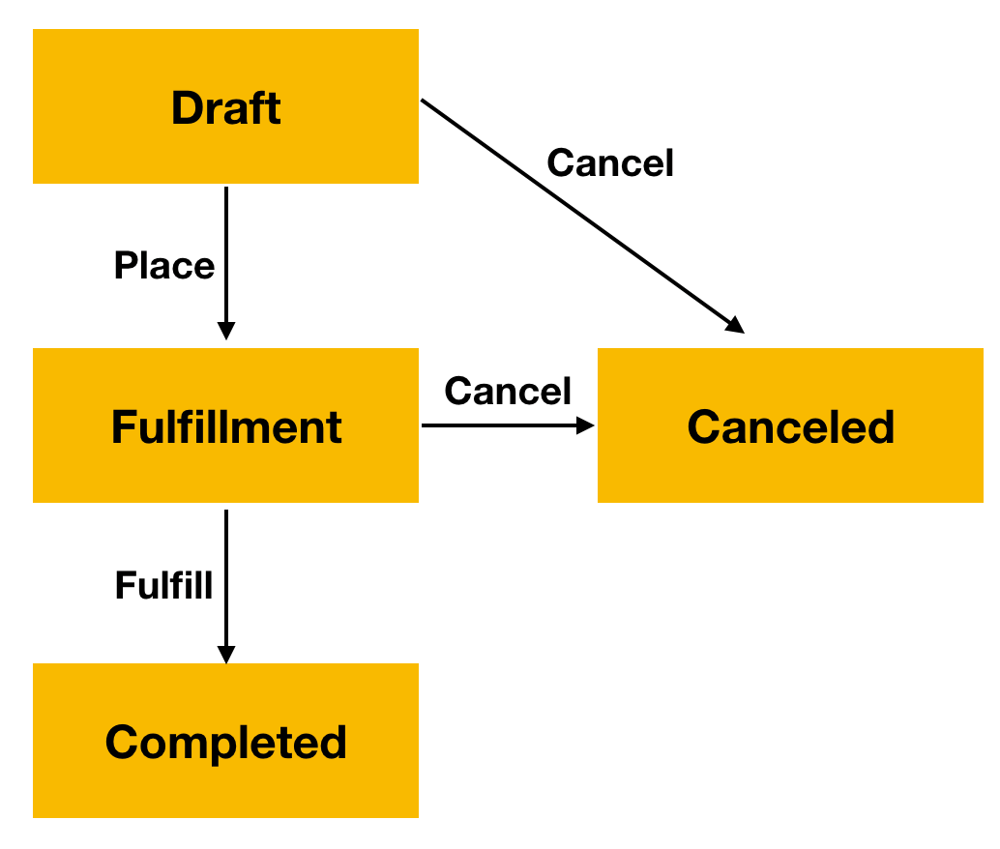
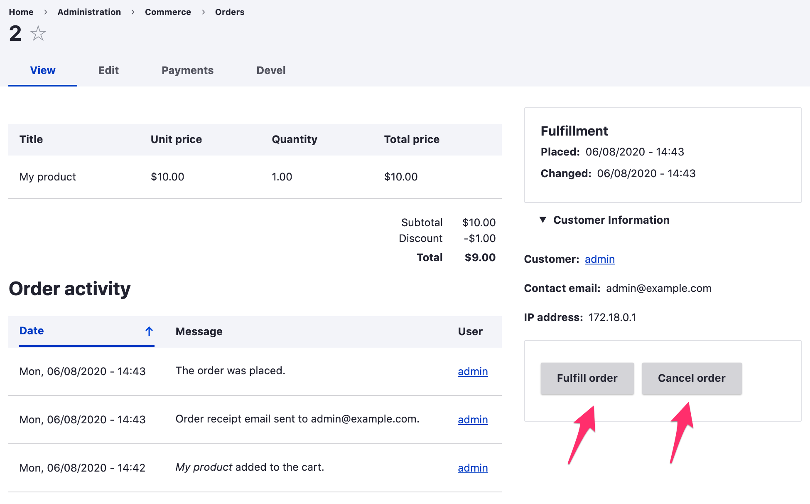
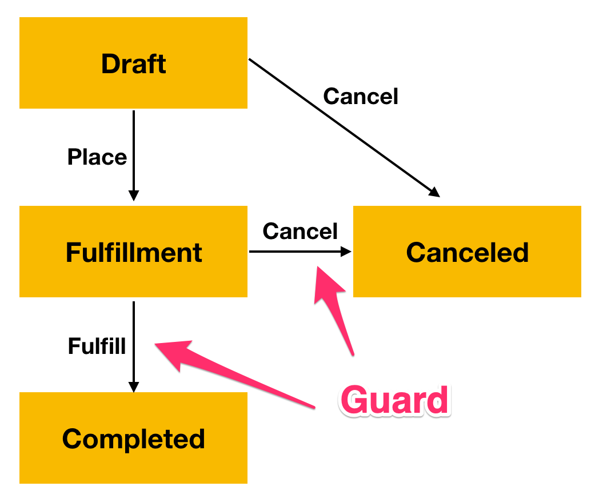

The workflow set for a State field defines all the states and transitions that are available for that field. For example, the Commerce Order "Fulfillment" workflow has states: "Draft", "Fulfillment", "Completed", and "Canceled", with transitions: "Place", "Fulfill", and "Cancel". This diagram illustrates the states and transitions of the Order fulfillment workflow:



When an order is placed, either at checkout or through the admin UI, its State changes from "Draft" to "Fulfillment". After that, administrative users can manually transition the order's state to "Completed" or "Canceled". 



But what if we wanted to add constraints to prevent administrative users from moving an Order from the Fulfillment state to Completed or Canceled under certain conditions? In the [Custom state fields documentation](../custom-state-fields), we created a custom State field for Order items, to track fulfillment on a per-item basis. We might want to prevent users from cancelling an order if any of its order items have already been "filled". And we might want to prevent users from transitioning an order to Completed if any of its items are still "un-filled". The State Machine module's state transition "Guards" provide the ability to incorporate this sort of business logic. State transition Guards limit the transitions available for a State field based on contextual information. Transitions can be restricted based on the current user's permissions, a parent entity field, etc.



Using Guards requires writing custom code. Specifically, you will need to write a tagged service that implements `Drupal\state_machine\Guard\GuardInterface`. This interface defines a single method that returns a boolean TRUE/FALSE value:

```php
public function allowed(WorkflowTransition $transition, WorkflowInterface $workflow, EntityInterface $entity);
```

If the given transition is allowed for the workflow, return `TRUE`; otherwise return `FALSE`.

Here is an example Guard implementation that implements the business logic described above:

```php
<?php

namespace Drupal\mymodule\Guard;

use Drupal\Core\Entity\EntityInterface;
use Drupal\state_machine\Guard\GuardInterface;
use Drupal\state_machine\Plugin\Workflow\WorkflowInterface;
use Drupal\state_machine\Plugin\Workflow\WorkflowTransition;

class FulfillmentOrderGuard implements GuardInterface {

  public function allowed(WorkflowTransition $transition, WorkflowInterface $workflow, EntityInterface $entity) {
    if ($transition->getId() == 'cancel') {
      // Do not cancel orders with filled items.
      foreach ($entity->getItems() as $order_item) {
        if ($order_item->get('field_fulfillment_state')->first()->getId() == 'filled') {
          return FALSE;
        }
      }
      return TRUE;
    }
    if ($transition->getId() == 'fulfill') {
      // All items must be filled or backordered. At least one must be filled.
      $has_filled_item = FALSE;
      foreach ($entity->getItems() as $order_item) {
        $inventory_state = $order_item->get('field_fulfillment_state')->first()->getId();
        if ($inventory_state != 'filled' && $inventory_state != 'backordered') {
          return FALSE;
        }
        $has_filled_item = $inventory_state == 'filled' ? TRUE : $has_filled_item;
      }
      return $has_filled_item;     
    }

    // All other transitions.
    return TRUE;
  }

}
```

By itself, this `FulfillmentOrderGuard` class won't do anything. We need to add it to our custom module's `services.yml` file so that it can be discovered. The `group` argument allows the guard factory to only instantiate the guards relevant to a specific workflow group. In this case, we want the `commerce_order` group since our Guard is intended for the Commerce order `State` field:

```yaml
services:
  mymodule.fulfillment_order_guard:
    class: Drupal\mymodule\Guard\FulfillmentOrderGuard
    tags:
      - { name: state_machine.guard, group: commerce_order }
```

If we wanted to implement a Guard for the custom Order item "Fulfillment state" field we implemented in the [Custom state fields documentation](../custom-state-fields), the `group` value would change to match that custom workflow group:

```yaml
  mymodule.fulfillment_order_item_guard:
    class: Drupal\mymodule\Guard\FulfillmentOrderItemGuard
    tags:
      - { name: state_machine.guard, group: mymodule_order_item }

```
