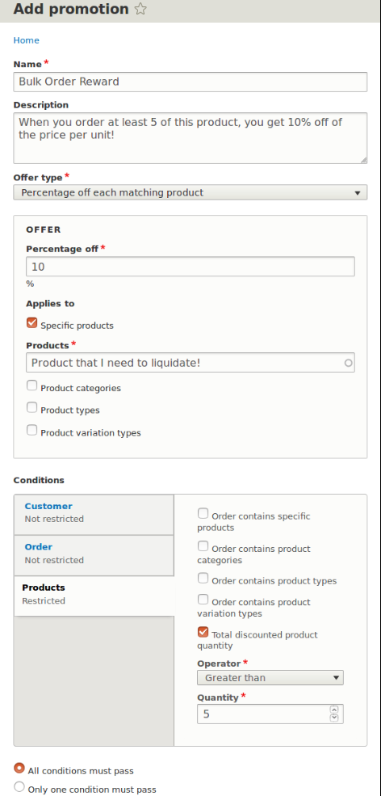
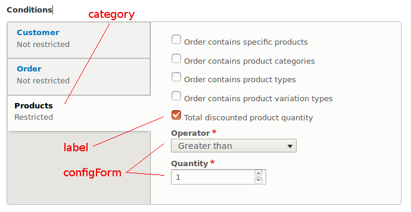

Introduction
---

Conditions are a set of plugins unique to the commerce project. They are used
to determine applicable **Promotions**, **Payment Gateways**, or **Shipping 
Methods** for an order.


Example user stories / use cases:
---

  **Payment Gateway:** As a store manager I will only accept credit card 
  payments from customers with US billing addresses. 
  Use: [OrderBillingAddress - Billing address](https://cgit.drupalcode.org/commerce/tree/modules/order/src/Plugin/Commerce/Condition/OrderBillingAddress.php)
  
  **Shipping:** As a store manager I want to offer flat rate shipping for 
  only certain products. 
  Use: [OrderProduct - Order contains specific products](https://cgit.drupalcode.org/commerce/tree/modules/product/src/Plugin/Commerce/Condition/OrderProduct.php)

  **Promotion:** As a store manager I want to encourage bulk ordering by 
  creating a promotion that applies to orders of at least 5 products. 
  Use: [OrderItemQuantity - Total discounted product quantity](https://cgit.drupalcode.org/commerce/tree/modules/promotion/src/Plugin/Commerce/Condition/OrderItemQuantity.php)
  This use case will be used as an example for the rest of this tutorial. 
  Note: This use case will only be fully realized when the new promotion is
  given a coupon and the coupon is applied to an order during checkout.  
  
  
  

Minimum requirements to build a condition:
---

As you can see from comparing 
[ConditionInterface](https://cgit.drupalcode.org/commerce/tree/src/Plugin/Commerce/Condition/ConditionInterface.php)
with [ConditionBase](https://cgit.drupalcode.org/commerce/tree/src/Plugin/Commerce/Condition/ConditionBase.php),
there is only one function required when extending ConditionBase to fulfill 
the ConditionInterface definition of ***evaluate***. 

```
interface ConditionInterface extends ConfigurablePluginInterface, PluginFormInterface, PluginInspectionInterface {
  /** * Gets the condition label. */ 
  public function getLabel();
  /** * Shown in the condition UI when enabling/disabling a condition. */
  public function getDisplayLabel();
  /** * This is the entity type ID of the entity passed to evaluate(). */
  public function getEntityTypeId();

  /**
   * Evaluates the condition.
   *
   * @param \Drupal\Core\Entity\EntityInterface $entity
   *   The entity.
   *
   * @return bool
   *   TRUE if the condition has been met, FALSE otherwise.
   */
  public function evaluate(EntityInterface $entity);
}

```

Functionally, a condition might not be useful without some sort of user 
configuration. `defaultConfiguration`, `buildConfigurationForm`, and 
`validateConfigurationForm` go hand in hand with `evaluate` to create a basic 
condition.

Lets see how these functions are used in practice by analysing one of 
the simplest conditions to ship with commerce:  [OrderItemQuantity](https://cgit.drupalcode.org/commerce/tree/modules/promotion/src/Plugin/Commerce/Condition/OrderItemQuantity.php)


Annotations
---

First, meta-information about the condition must be declared in the 
@CommerceCondition annotation. 

```
/**
 * Provides the total discounted product quantity condition.
 *
 * Implemented as an order condition to be able to count products across
 * non-combined order items.
 *
 * @CommerceCondition(
 *   id = "order_item_quantity",
 *   label = @Translation("Total discounted product quantity"),
 *   category = @Translation("Products"),
 *   entity_type = "commerce_order",
 *   parent_entity_type = "commerce_promotion",
 *   weight = 10,
 * )
 */
class OrderItemQuantity extends ConditionBase implements ParentEntityAwareInterface { }
```

| Tag | Description | 
|---  |---|
| `id` | A machine name unique to commerce condition.|
| `label` | This is displayed along with a checkbox to engage condition.|
| `category` | Decides which container the condition label is displayed in.|
| `entity_type` | Ensures that this promotion only applies to commerce orders. Enforced by `$this->assertEntity($entity)` in the evaluate function.|
| `parent_entity_type` | When specified, a condition will only be available on that entity type. |
| `weight` | The order in which conditions are displayed within a container.|

This is where `label`, `category`, and `parent_entity_type` will be displayed
 to the user:
 
 


ParentEntityAware trait, interface, annotation.
---

The ParentEntityAware annotation, interface, and trait are optional for a 
condition. OrderItemQuantity uses these to specify that this condition is 
only available for a promotion and is not available for a payment gateway or 
shipping method. 

This is explained concisely in the [\Drupal\commerce\Annotation CommerceCondition class](https://cgit.drupalcode.org/commerce/tree/src/Annotation/CommerceCondition.php) comments.

```
class CommerceCondition extends Plugin {
// ... 
/**
 * The parent entity type ID.
 *
 * This is the entity type ID of the entity that embeds the conditions.
 * For example: 'commerce_promotion'.
 *
 * When specified, a condition will only be available on that entity type.
 *
 * @var string
 */
public $parent_entity_type;
}
```


Build Configuration Form
---

A condition configuration form is built just like any other form using Form 
API. See the screenshot above to see how the config form will be displayed.

When adding a new component to a condition's configuration form, be sure to 
use the same setting name when declaring, calling, and setting 
defaultConfiguration. See emphasis of `***'operator'***`.

```
public function buildConfigurationForm(array $form, FormStateInterface $form_state) {
  $form = parent::buildConfigurationForm($form, $form_state);

  $form[***'operator'***] = [
    '#type' => 'select',
    '#title' => t('Operator'),
    '#options' => $this->getComparisonOperators(),
    '#default_value' => $this->configuration[***'operator'***],
    '#required' => TRUE,
  ];
  
  $form['quantity'] = [
    '#type' => 'number',
    '#title' => t('Quantity'),
    '#default_value' => $this->configuration['quantity'],
    '#min' => 1,
    '#required' => TRUE,
  ];

  return $form;
}
```

It is important not to hardcore values for a component's `'#default_value'` or 
`'#value'` in the `buildConfigurationForm` function. Doing so will stop any new
configuration values set by user input from being saved. Use 
`defaultConfiguration` function to set default values. 


Default Configuration Settings
---

Emphasis of setting name `***'operator'***` is to show how this name should be 
used across all functions in this class. 

```
public function defaultConfiguration() {
  return [
    ***'operator'*** => '>',
    'quantity' => 1,
  ] + parent::defaultConfiguration();
}
```


Submit Configuration Form
---

This is where user inputted values are saved to the form configuration settings.

```
public function submitConfigurationForm(array &$form, FormStateInterface $form_state) {
  parent::submitConfigurationForm($form, $form_state);

  $values = $form_state->getValue($form['#parents']);
  
// Note that the setting name here needs to be consistent with defaultConfig
// and buildConfigurationForm.
  $this->configuration[***'operator'***] = $values[***'operator'***];
  $this->configuration['quantity'] = $values['quantity'];
}
```


Evaluate Function
---

This is the guts of a condition. The goal of `evaluate` is to decide if an 
order meets a certain criteria and to return a boolean TRUE if so. 

```
// *** Remember annotations are inherited from ConditionInterface.***
public function evaluate(EntityInterface $entity) {

// This line is essential as it ensures this condition will only run for the 
// 'entity_type' declared in this condition's annotations. 
  $this->assertEntity($entity);
  
  /** @var \Drupal\commerce_order\Entity\OrderInterface $order */
  $order = $entity;
  /** @var \Drupal\commerce_promotion\Entity\PromotionInterface $promotion */
  $promotion = $this->parentEntity;
  $offer = $promotion->getOffer();

  $quantity = '0';
  foreach ($order->getItems() as $order_item) {
  
// First assess if each order item can apply to this condition.
    // If the offer has conditions, skip order items that don't match.
    if ($offer instanceof OrderItemPromotionOfferInterface) {
    
      $conditions = $offer->getConditions();
      $condition_group = new ConditionGroup($conditions, 'OR');
      
      if (!$condition_group->evaluate($order_item)) {
        continue;
      }
    }
    
// Get the quantity from each item and add to a running total.
    $quantity = Calculator::add($quantity, $order_item->getQuantity());
  }

// This is where the final decision is made to whether a condition is met.
  switch ($this->configuration['operator']) {
    case '>=':
     return $quantity >= $this->configuration['quantity'];
     
/* To be more explicit for this tutorial's use case: 
 * If the total quantity of all order items is greater than or equal to the 
 * quantity that the user set in the configuration form, return TRUE. If not, 
 * return FALSE and the promotion will not be applied to the order.
 */
    
    case '>':
      
      return $quantity > $this->configuration['quantity'];

    case '<=':
      return $quantity <= $this->configuration['quantity'];

    case '<':
      return $quantity < $this->configuration['quantity'];

    case '==':
      return $quantity == $this->configuration['quantity'];

    default:
      throw new \InvalidArgumentException("Invalid operator {$this->configuration['operator']}");
  }
}
```

! We need help filling out this section! Feel free to follow the *edit this page* link and contribute.

