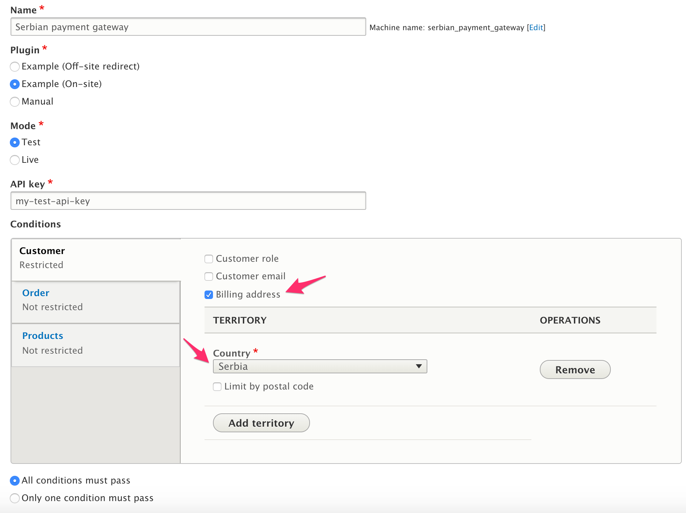
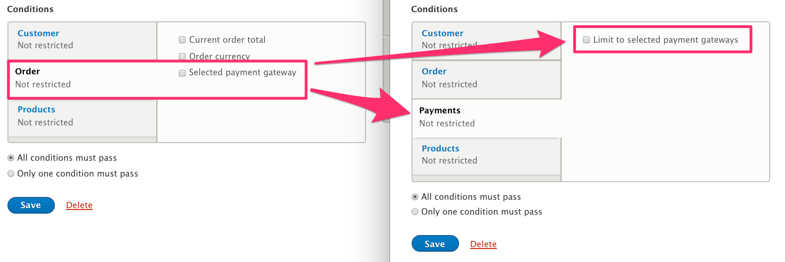
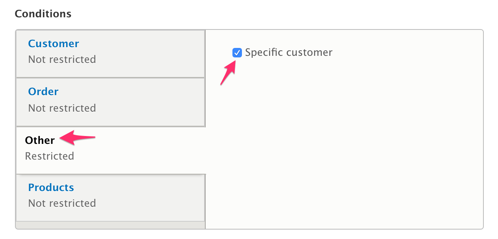
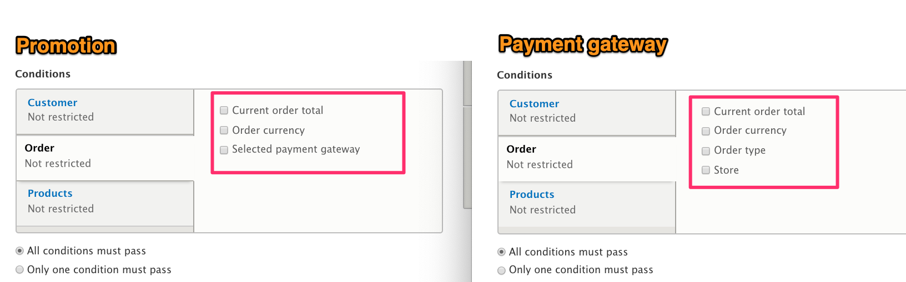

### Overview
Drupal Commerce allows administrative users to control the availability of [Promotions](../../06.pricing/03.promotions) and [Payment gateways](../../05.payments/01.available-gateways) using *Conditions*. In Commerce 1.x, you would have used the [Rules module] for this functionality. In Commerce 2.x, the Core Conditions component allows us to create configuration entities with conditions.  

For example, you can use the *Billing address* Condition to specify that a certain payment gateway can only be used in a specific country (or countries). Here is a screenshot of a *Payment gateway* administrative page configured to only allow Serbian customers to use the gateway:



Commerce core provides Conditions based on properties of *orders* in three categories. Both Promotions and Payment gateway configuration pages use these conditions:
* Customer
 - Customer role
 - Customer email
 - Billing address
* Order
 - Current order total
 - Order currency
 - Selected payment gateway *(available for Promotions only)*
 - Store
 - Order type
* Products
 - Order contains specific products
 - Order contains product categories
 - Order contains product types
 - Order contains product variation types
 - Total discounted product quantity *(available for Promotions only)*

Additionally, Commerce core provides several Conditions based on properties of *order items*. These conditions are used for the configuration of Promotion Offers:
 - Specific products
 - Product categories
 - Product types
 - Product variation types

### Combining multiple Conditions: Condition Groups
Both Promotions and Payment Gateways allow multiple Conditions to be combined in a *Condition Group* using either an *AND* operator or an *OR* operator. A *Condition Group* with an *AND* operator evaluates to `TRUE` only if *all* of its Conditions are `TRUE`; a *Condition Group* with an *OR* operator evaluates to `TRUE` if *any* of its Conditions is `TRUE`. In the administrative UI, you'll see these as options:
- All conditions must pass
- Only one condition must pass

Within Drupal Commerce core, the `ConditionGroup` class provides this functionality. In the `PaymentGateway` entity class, for example, the `applies()` method creates a new `ConditionGroup` object with all of the Payment Gateways's conditions and the Payment Gateways's AND/OR operator. If the *Condition Group* evaluates to `TRUE`, then the Payment Gateway is *applies* and is available. Similarly, a Condition Group is used to determine whether a Promotion *applies* to a specific order/cart.

If neither a single Condition nor a combination of Conditions covers your business logic needs, then you can create a custom Condition plugin. The remainder of this documentation page describes the structure of Drupal Commerce Condition plugins and how to create your own.

### Structure of a single Condition plugin
A Commerce Condition plugin is defined by the `CommerceCondition` annotation, which has the following properties:

| Property | Required | Description |
| -------- | -------- | ----------- |
| `id` | Yes | Unique string id for the plugin. |
| `label` | Yes | Translatable label for the plugin. |
| `display_label` | No | Translatable label that is displayed in the *Conditions* UI. Defaults to the plugin label. |
| `category` | No | Translatable label for the category. Defaults to *Other*. *Customer*, *Order*, and *Product* are all categories defined for Commerce Conditions. |
| `entity_type` | Yes | The entity type ID of the entity passed to the plugin for evaluation. For example, use `commerce_order` for a Condition that applies to orders. |
| `parent_entity_type` | No | The entity type ID of the parent entity for the Condition. When specified, the condition is only available on that entity type. For example, the *Total discounted product quantity* has `commerce_promotion` for its `parent_entity_type` and is only available for Promotions. It does not appear as an option for Payment gateways. |
| `weight` | No | An integer value used for sorting Conditions within the UI. Defaults to 0. Conditions are sorted by *weight* and then *display label*. |

#### How to alter an existing Condition plugin
If you want to change the value for a property of an existing Condition plugin, you can use `hook_commerce_condition_info_alter()`. For example, suppose you want to change the display label and category for the *Selected payment gateway* Condition. That plugin has `order_payment_gateway` as its id, so our hook implementation looks like this:

```php
function mymodule_commerce_condition_info_alter(&$definitions) {
  if (isset($definitions['order_payment_gateway'])) {
    $definitions['order_payment_gateway']['display_label'] = t('Limit to selected payment gateways');
    $definitions['order_payment_gateway']['category'] = t('Payments');
  }
}
```

And here are the before-and-after screenshots:


You can also use `hook_commerce_condition_info_alter()` to swap out an existing plugin implementation with your own custom code, using the `'class'` and `'provider`' keys. Note that your custom plugin code should *not* include an annotation; it uses the same annotation as the original plugin. Here is an example for a custom *Billing address* Condition plugin:

```php
function mymodule_commerce_condition_info_alter(&$definitions) {
  if (isset($definitions['order_billing_address'])) {
    $definitions['order_billing_address']['class'] = \Drupal\mymodule\Plugin\Commerce\Condition\CustomOrderBillingAddress::class;
    $definitions['order_billing_address']['provider'] = 'mymodule';
  }
}
```

### ConditionInterface and ConditionBase
All Commerce Condition plugins must implement `ConditionInterface`, which defines the key method that must be implemented by Condition plugins: 

`public function evaluate(EntityInterface $entity);`

The `evaluate()` method contains all the logic for the Condition and returns `TRUE` or `FALSE` based on whether the condition has been met.

`ConditionBase` provides basic implementations for all other methods required by `ConditionInterface`. By extending `ConditionBase`, a complete Condition plugin can be created with very little code. Here is an example of a complete `CommerceCondition` plugin that simply checks whether the order belongs to a specific customer, based on the customer ID:

```php
<?php

namespace Drupal\custom_module\Plugin\Commerce\Condition;

use Drupal\commerce\Plugin\Commerce\Condition\ConditionBase;
use Drupal\Core\Entity\EntityInterface;

/**
 * Provides a basic condition for orders.
 *
 * @CommerceCondition(
 *   id = "custom_module_order_specific_customer",
 *   label = @Translation("Specific customer"),
 *   entity_type = "commerce_order",
 * )
 */
class OrderSpecificCustomer extends ConditionBase {

  /**
   * {@inheritdoc}
   */
  public function evaluate(EntityInterface $entity) {
    $this->assertEntity($entity);
    /** @var \Drupal\commerce_order\Entity\OrderInterface $order */
    if ($customer_id = $order->getCustomerId()) {
    	// Condition is TRUE only for customer with ID #2.
    	return ($customer_id == 2);
    }

    return FALSE;
  }

}
```
After clearing caches, the new Condition shows up in the *Conditions* UI, in the *Other* category, since we didn't specify a category. Notice that there is no way to configure this Condition. The value *2* is set in the `evaluate()` code.



In this sample code, we used the `assertEntity($entity)` method. This is one of two helper method provided by `ConditionBase`. It checks the entity type and throws an *Invalid Argument* if the type of the $entity does not match the type specified in the annotation for `entity_type`.

The second helper method provided by `ConditionBase` is `getComparisonOperators()`. This method returns an array of operator values with labels. This is useful for providing a list of operator options in a configuration form:

```php
return [
  '>' => $this->t('Greater than'),
  '>=' => $this->t('Greater than or equal to'),
  '<=' => $this->t('Less than or equal to'),
  '<' => $this->t('Less than'),
  '==' => $this->t('Equals'),
];
```

### Providing Configuration options for a Condition plugin
`ConditionInterface` extends two standard Drupal plugin interfaces: `ConfigurablePluginInterface` and `PluginFormInterface`. These interfaces define the methods you can use to provide configuration options for your custom Condition plugin:
* `public function defaultConfiguration();`
* `public function buildConfigurationForm(array $form, FormStateInterface $form_state);`
* `public function validateConfigurationForm(array &$form, FormStateInterface $form_state);`
* `public function submitConfigurationForm(array &$form, FormStateInterface $form_state);`

Once you've implemented the configuration form for your plugin, you can access configuration values in your `evaluate()` method like this:

```php
`$this->configuration['my_configuration_variable']`
```

> Tip: search for `@CommerceCondition` in the Drupal Commerce code base to find examples of Condition plugin configuration forms. For some plugins, you'll find that the configuration forms are provided by included Traits.

### ParentEntityAwareInterface and ParentEntityAwareTrait
In some cases, you will want to access information related to the Condition's *parent entity*. For example, see the implementation of the `OrderItemQuantity` Condition, provided by the Promotion submodule.

Both Promotion and Payment gateway entities have been set up to let their Conditions know their entity types. This happens in the `getConditions()` method in each of the entity classes:
```
if ($condition instanceof ParentEntityAwareInterface) {
  $condition->setParentEntity($this);
}
```
The `setParentEntity()` is defined by the `ParentEntityAwareInterface` interface and implemented by the `ParentEntityAwareTrait` trait. To access parent entity information in a Promotion or Payment gateway Condition, do the following:
1. Set the `parent_entity_type` property in the Condition's annotation to `commerce_promotion` for a Promotion Condition or `commerce_payment_gateway` for a Payment gateway Condition. (If you want the Condition to apply to multiple parent entity types, you can leave this property unset; however, you will need to be careful in your `evaluate()` method implementation to check the type of the parent entity before accessing any of the parent entity's methods.)
2. Within your Condition class, include `ParentEntityAwareTrait` with `use ParentEntityAwareTrait;`.
3. Within your `evaluate()` method (or any plugin methods), access the parent entity with `$this->parentEntity`.

### FilterConditionsEvent
If you want to alter the list of Conditions provided to administrative users through the UI, you can create a custom event subscriber for the `CommerceEvents::FILTER_CONDITIONS` event. You can use the event's `getParentEntityTypeId()` method to specifically target Promotion or Payment gateway Conditions. 

For example, the UI for Promotions has a separate section for specifying the *Store* and *Order type* for the Promotion, so *Store* and *Order type* are removed from the Conditions options. The Promotion submodule provides an event subscriber,  `Drupal\commerce_promotion\EventSubscriber\FilterConditionsEventSubscriber`, that removes these Conditions:

```php
class FilterConditionsEventSubscriber implements EventSubscriberInterface {

  public static function getSubscribedEvents() {
    $events = [
      'commerce.filter_conditions' => 'onFilterConditions',
    ];
    return $events;
  }

  public function onFilterConditions(FilterConditionsEvent $event) {
    if ($event->getParentEntityTypeId() == 'commerce_promotion') {
      $definitions = $event->getDefinitions();
      unset($definitions['order_store']);
      unset($definitions['order_type']);
      $event->setDefinitions($definitions);
    }
  }

}
```

Likewise, the Payment submodule provides an event subscriber, `Drupal\commerce_payment\EventSubscriber\FilterConditionsEventSubscriber`, to remove the *Payment gateway* Condition:

```php
class FilterConditionsEventSubscriber implements EventSubscriberInterface {

  public static function getSubscribedEvents() {
    $events = [
      'commerce.filter_conditions' => 'onFilterConditions',
    ];
    return $events;
  }

  public function onFilterConditions(FilterConditionsEvent $event) {
    if ($event->getParentEntityTypeId() == 'commerce_payment_gateway') {
      $definitions = $event->getDefinitions();
      unset($definitions['order_payment_gateway']);
      $event->setDefinitions($definitions);
    }
  }

}
```

As a result, different Conditions are offered as options for Promotions vs. Payment gateways:




### Links and Resources
- [Drupal 8 documentation: Event Systems Overview & How to Subscribe To and Dispatch Events]
- [Drupal 8 documentation: Plugin API overview]

[Rules module]: https://www.drupal.org/project/rules
[Drupal 8 documentation: Event Systems Overview & How to Subscribe To and Dispatch Events]: https://www.drupal.org/docs/8/creating-custom-modules/event-systems-overview-how-to-subscribe-to-and-dispatch-events
[Drupal 8 documentation: Plugin API overview]: https://www.drupal.org/docs/8/api/plugin-api/plugin-api-overview

