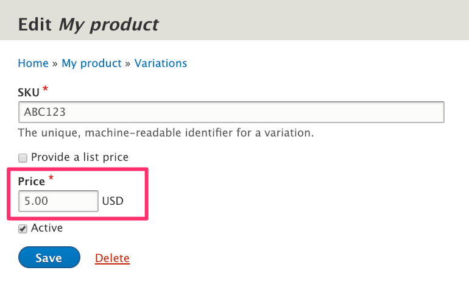
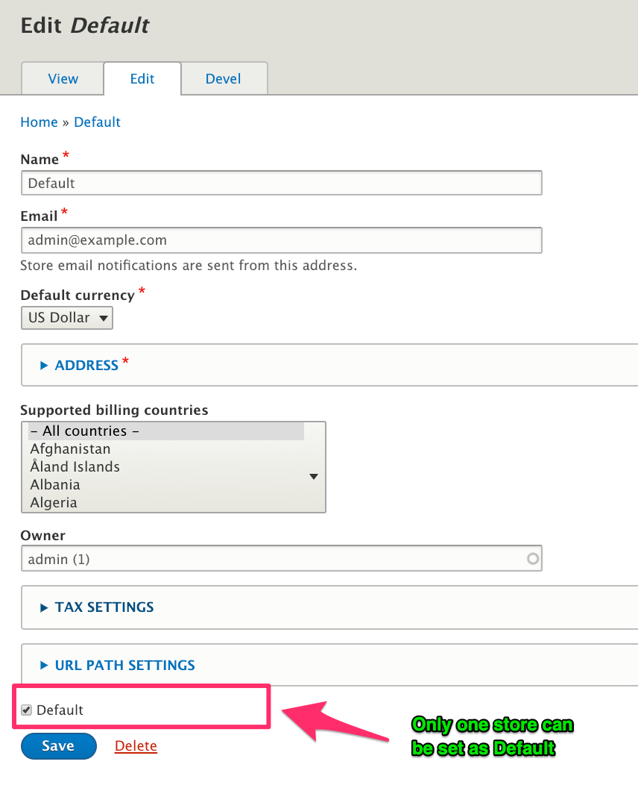
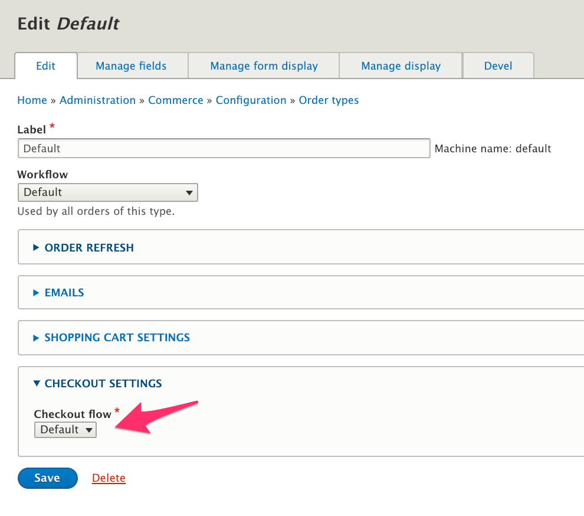

In Drupal Commerce, a *Resolver* is a service that provides an "answer" to a potentially complex question. That question might be, "what is the price of this product?" Or, "what series of steps should a customer take to move his order through the checkout process?" This documentation page describes what Resolvers are and how their code is structured. However, before we get to the technical details, let's look at a few types of Resolvers, how they are used within Drupal Commerce, and why we use them.

### Types of resolvers
#### Price resolvers
If you've set up [products](../../03.products/01.overview) for your Drupal Commerce site, then you know that every product variation has exactly one price and that you can set that price through the administrative UI:



But what if your products need to have different prices in different situations? Perhaps you have one set of prices for wholesale customers, another for regular customers, and yet another for some sort of "preferred" customers. Or maybe you have multiple stores, each with their own set of prices. If you have complex pricing needs like these, then you will need to create a custom *Price resolver*.

See the [Price resolvers](../../pricing/price-resolvers) documentation for additional information and example code.

#### Store resolvers
In Drupal Commerce, every order belongs to a specific [store](../../06.stores). A simple site may have only a single store, so all orders belong to that store. But if you have multiple stores, then Drupal Commerce needs a way to figure out which store to use for a particular cart or order. By default, it will always choose whichever store you've set as the *Default*. Here, the *Default* store has been set as the default store:



If you want to build a site with multiple stores, then you will need to create a custom *StoreResolver*. Your Store resolver will contain the logic that provides the answer to the question, "which store should I use?" For an example and more information, see the [Resolve the current store](../../06.stores/01.resolve-current-store) documentation page.

#### CheckoutFlow resolvers
Drupal Commerce allows you to support multiple checkout forms so that you can have different checkout experiences for your customers based on what they are purchasing. The default Drupal Commerce installation includes a single *Default* checkout flow.

Now, if you create multiple checkout flows, how does Drupal know which one to use when a customer goes to checkout? When a customer's cart is first created, it is assigned a specific *order type*. By default, the Checkout flow set for the order type will be used. Here, the *Default* order type has been configured to use the *Default* Checkout flow:



You can override that setting by creating your own custom CheckoutFlow resolver. See the [Links and resources](#links-and-resources) section at the end of this documentation page for links to helpful articles on CheckoutFlow resolvers.

#### Other resolvers
In addition to Price, Store, and CheckoutFlow resolvers, Drupal Commerce also provides the following types of resolvers, which will be described in greater detail in other documentation sections:

- Country
- Locale
- OrderType
- TaxRate

### Overall concept
For each type of Resolver, there's defined *default* functionality. That's the job of a *Default resolver*.
Drupal Commerce provides these default Resolvers. But as described in each of the examples above, custom Resolvers can also be created. So it's possible to have multiple Price Resolvers or multiple Checkout flow Resolvers or multiples of other types of Resolvers, all active at the same time on a site. So how do you know which Resolver is going to be used? That's the job of *Chain resolvers*.

Each type of Resolver has a special Resolver, called a *Chain resolver*. You can think of a Chain resolver as the "boss" of all the other Resolvers of that type. When you want to know the Price of a product, for example, you go to the *Chain price resolver* to get the answer. And being an effective "boss", the Chain price resolver immediately delegates all the actual work to other Price resolvers. Chain resolvers never include the actual logic needed to provide the answer. Instead, they simply go to the other Resolvers of that type and ask them one-at-a-time for the "answer". Once they get an answer, they stop asking and return that value as the result.

So that's the overall concept. You have a question that might require complex business logic to answer. You ask a Chain resolver. That Resolver asks all the other Resolvers of that type, one-at-a-time, in a specific order, until they get an answer. And for every type of Resolver, there's a *default* Resolver that gets "asked" last and always provides an answer.

### Structure of Resolvers
#### Service tags
All Resolvers are [services], and Chain resolvers are a special type of service called a service collector. See [Drupal 8 Documentation: Service Tags] for more information. For each type of Resolver, a specific *tag* has been defined. For example, here the `commerce_price.price_resolver` tag has been defined for the *Price* chain resolver:

```php
  commerce_price.chain_price_resolver:
    class: Drupal\commerce_price\Resolver\ChainPriceResolver
    tags:
      - { name: service_collector, call: addResolver, tag: commerce_price.price_resolver }
```

Every *Price* resolver needs to include that tag in its service definition. Here, the *Default* price resolver is defined:

```php
  commerce_price.default_price_resolver:
    class: Drupal\commerce_price\Resolver\DefaultPriceResolver
    tags:
      - { name: commerce_price.price_resolver, priority: -100 }
```

Here is the complete list of service tags for all Resolvers provided by Drupal Commerce.

| Resolver     | Service tag |
| ------------ | ----------- |
| CheckoutFlow | commerce_checkout.checkout_flow_resolver |
| Country      | commerce.country_resolver |
| Locale       | commerce.locale_resolver |
| OrderType    | commerce_order.order_type_resolver |
| Price        | commerce_price.price_resolver |
| Store        | commerce_store.store_resolver |
| TaxRate      | commerce_tax.tax_rate_resolver |

#### Resolver interfaces
Every type of Resolver defines its own interface.  Each Resolver interface defines a single method: `resolve()`. This is the method that returns the "answer" we're trying to find. Different types of Resolvers will require different parameters. For example, a Checkout flow resolver requires an *Order* entity; a Tax rate resolver requires a *Tax zone* entity, an *Order item* entity, and a *Customer profile* entity. Also, different types of resolvers will return different types of values with their `resolve()` methods. For example, a *Country* resolver returns a `\Drupal\commerce\Country` object; a *Locale* resolver returns a ` \Drupal\commerce\Locale` object. If a particular Resolver cannot provide a result, it returns `NULL`. When that happens, the next Resolver in the chain will be called.

Chain resolvers implement interfaces that extend these Resolver-type interfaces and define two additional methods:
- `addResolver()` takes a Resolver as its parameter and adds it to the array of Resolvers that will be used by the Chain resolver to determine the "answer" we're trying to find.
- `getResolvers() ` returns the array of all added Resolvers. 

#### Chain resolvers
When you're writing a custom resolver, you don't really need to worry too much about Chain resolvers and their interfaces. They've been fully implemented for you, and you won't need to make any customizations. To understand how they work, let's look at some of the code for the *Store* Chain resolver:

```php
  public function addResolver(StoreResolverInterface $resolver) {
    $this->resolvers[] = $resolver;
  }

  public function resolve() {
    foreach ($this->resolvers as $resolver) {
      $result = $resolver->resolve();
      if ($result) {
        return $result;
      }
    }
  }
```

When you create a custom *Store* resolver and define it with the `commerce_store.store_resolver` service tag, it gets added to the `resolvers` for the `ChainStoreResolver` with the `addResolver()` method. The Store resolvers are ordered from highest to lowest `priority` within the `resolvers` array. So then when the `resolve()` method gets called, if your custom *Store* resolver returns a non-NULL value, that value will be returned by the Chain resolver. If your custom Resolver does not return a value, the `resolve()` method for the next Resolver in the list will get called.

You may be wondering, "when does the `resolve()` method get called for the `ChainStoreResolver`"? There's a service class called `CurrentStore` that uses the `ChainStoreResolver` to determine the store that should be used. That's where the ChainStoreResolver's `resolve()` method gets called. Other types of Chain resolvers are similarly used in other places within Drupal Commerce.

#### Default resolvers
As mentioned above, every type of Resolver has a *default* Resolver, provided by Drupal Commerce. A *default* Resolver implements the Resolver interface for its type. Default Resolvers are defined with a `priority` of `-100` so that they can be called last. All custom Resolvers should be given higher priority values.

Default Resolvers provide implementations for the `resolve()` method that should always return a non-NULL value. If a default resolver returns a `NULL` value, that means that it was impossible to find an "answer". When you're writing a custom resolver, looking at the *Default* resolver for the Resolver type is a good place to start. Your custom resolver will have the same structure as the *Default* resolver but provide its own implementation of the `resolve()` method.


### Links and resources
- [Apply a VAT rate on a product with Drupal Commerce 2](https://www.flocondetoile.fr/blog/apply-vat-rate-product-drupal-commerce-2)
- [Working with the Drupal Commerce 2 checkout flows](https://www.flocondetoile.fr/blog/working-drupal-commerce-2-checkout-flows)
- [Drupal 8 Documentation: Service Tags]
- [Implementing a Checkout Flow resolver in Drupal Commerce 2.0](https://glamanate.com/blog/implementing-checkout-flow-resolver-drupal-commerce-20)

[services]: https://www.drupal.org/docs/8/api/services-and-dependency-injection
[Drupal 8 Documentation: Service Tags]: https://www.drupal.org/docs/8/api/services-and-dependency-injection/service-tags
