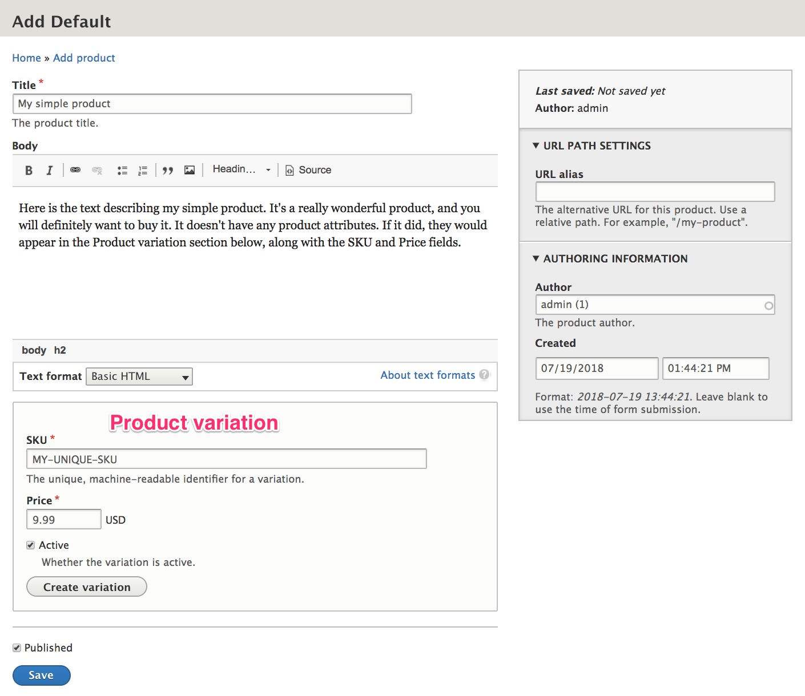

This page describes Drupal Commerce products at a conceptual level. For step-by-step instructions for setting up products for your site, see the [Product Architecture documentation](../../02.product-architecture). For more specific, technical explanations of the product-related data structures and relationships, see the [Product Information Structure documentation](../03.product-information-structure).

#### Product SKUs -- What are they and why are they important?
SKU stands for "stock keeping unit" and is a unique code that identifies the products you sell. Companies that are direct manufacturers may use MPNs, or "manufacturing part numbers", instead of SKUs (but they'll still be called "SKUs" in Drupal Commerce).

For stores that sell physical products, SKUs are critically important for inventory management. A complete list of all product SKUs along with a quantity value for each provides the information you need to monitor stock levels. What about stores that sell non-physical products, like services or virtual products, for which there may be *unlimited* inventory? You still need SKUs. SKUs are important for sales and financial reporting for all types of products. The SKU is your unique identifier for each product.

If you already have a well-defined list of products, each with a SKU, price, and other data fields, then you probably don't need to spend too much time thinking about SKUs. As long as each SKU is unique, you're good. However, in other cases, creating the template/structure for your product SKUs may be one of your first product-related design decisions. In Drupal Commerce, SKUs can be any strings up to 255 characters long, but typically, you will want to keep your SKUs as short and simple as possible. Also, avoid spaces and special characters, and be consistent with your format.

In the context of developing a Drupal Commerce site, properly defining your product SKUs will help you design the structure of your products. **In Drupal Commerce, every product SKU corresponds to exactly one *product variation*.** In the most basic terms, a product variation is the thing you're selling. It has a SKU, a price, a name/title, and a status (active/inactive). When a customer adds an item to a cart, he's adding a specific quantity of a ***product variation***.

#### Drupal Commerce products and product variations
In Drupal Commerce, every product has at least one product variation, and every product variation belongs to exactly one product. For some types of products, you may have a one-to-one correlation between products and product variations. For example, if you sell books in a single electronic format, each book you sell will be a product with a single variation; the customer will be presented with a simple *Buy now* button to purchase a book. There are no other options.

In contrast, suppose some of your books are offered in multiple formats (Hardcover, Paperback, Large print, etc). For each book you sell, the customer should be presented with a way to specify the format they want to receive, and changing the format might also change the price. For each book product, there are now multiple product variations, each with its own SKU, price, and specific format.

In Drupal Commerce, we refer to variation differentiators like the format in this example as ***product attributes***. The various options available for the attribute are ***product attribute values*** (for example, Hardcover, Paperback, Large print, etc.).

#### Product attributes and product attribute values
Whenever a product has multiple product variations, you need to define one or more ***product attributes*** for the distinguishing characteristic(s) of those product variations. In our book example, we defined a *format* product attribute. Other common product attributes are *color* and *size*.

For each product attribute, you will also define a specific list of all possible product attribute values. For Book products, the list of Format product attribute values might include: Hardcover, Paperback, Kindle Edition, Large Print, Audio CD, and Board Book. (The list of product attribute values defined for a product attribute can be added to and updated over time.)

Note that for any specific product, you may only have product variations for a subset of all the possible product attribute values. You may sell a book that's only offered in Hardcover. In that case, the book product will have only a single product variation. Another book product might have 6 or more product variations, one for every possible Format.

#### Customizable products
What about customizable products? Suppose you sell a Writing Journal that comes in a variety of colors with a title on the cover that's either "My Journal" or includes a specific name, like "John's Journal". To start, you'd create one product attribute for *Color* with all available color options as its values.

Do you also need a product attribute for *Name*? Well, it depends... are you going to carry stock for writing journals pre-printed with some of the most common names? John's Journal, Mary's Journal, Luke's Journal, Anna's Journal... If so, then yes, you'd create a SKU for every color/name combination you offer. And you'd create a product attribute for *Name* with a list of specific names as its values.

What about names for which you're not going to carry stock? For those, you can create an additional *Name* product attribute value, called "Other" (or "Custom") and then provide a way for customers to enter a name when they purchase a product. *(See the [Add to cart form documentation](../../04.displaying-products/02.add-to-cart-form) for more information on how to set this up.)* You'll create a SKU and a product variation for the "Other" *Name* attribute value in each of the available colors.

Alternatively, suppose you're only going to carry stock for writing journals in each available color, with no pre-printed titles. In that case, you'll only need a single product attribute for *Color*. The name to be used for the titles will not be a product attribute; instead, it will be an extra order item field, stored with the order data.

#### Product types, product variation types, and product attributes
Suppose our store sells both traditional books (in a variety of formats) and Customizable Writing Journals (in a variety of colors), as described in the examples above. In Drupal Commerce terminology, these are two different ***product types***, each with a corresponding ***product variation type***.

- When customers buy a traditional book, they will specify its *Format*. The *Traditional book* ***product variation type*** will have *Format* as its only ***product attribute***. And the *Traditional book* ***product type*** will have product variations of type *Traditional book*.
- When customers buy a journal, they will specify its Color and a Name for the title. The *Writing journal* ***product variation type*** will have *Color* and *Name* as its ***product attributes***. And the *Writing journal* product type will have product variations of type *Writing journal*.

Just as you can define any product attributes you need to match your specific products, you can define your own product and product variation types. In Drupal Commerce, there isn't a set of predefined "product types". You are free to create as many product types as you need to precisely define your products. The [Product Architecture documentation](../../02.product-documentation) describes a variety of approaches to product architecture.

When you first create a Drupal Commerce site, you will see a *Default* product type and a *Default* product variation type. You can use these types as is, customize them, or delete them from your site completely. If you have a homogenous list of products, you may not need to create any custom product/variation types; the default types may be sufficient. If you do not customize the Default product type, as provided by Drupal Commerce, in any way, then your administrative users will add and edit products using a form that looks like this:

If you would like to customize the forms used to enter products, see the [Editing products page](../../03.product-management/02.product-data-entry) in the [Product Management documentation](../../03.product-management).

### Links and Resources
* [SKU Best Practices for Online Shopping Sites], by Andrew Brett Watson

[SKU Best Practices for Online Shopping Sites]: http://andrewbrettwatson.com/index.php/help/187-sku-best-practices-for-online-shopping-sites
