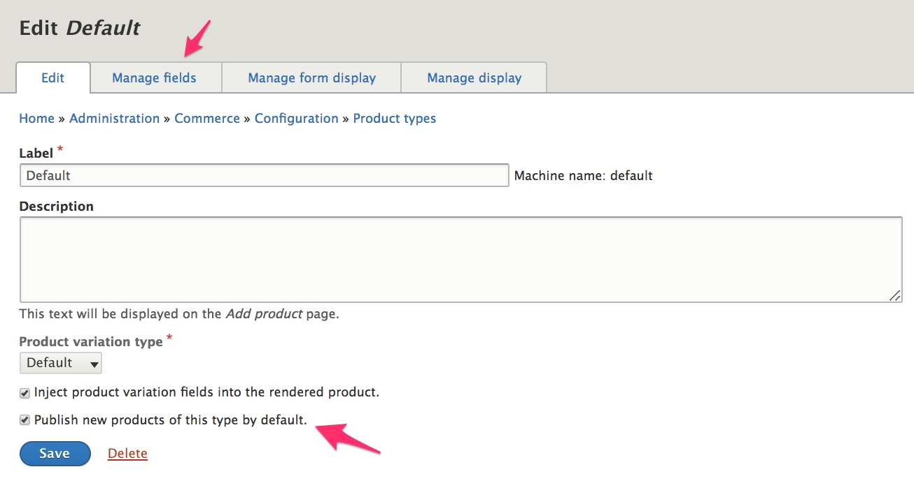
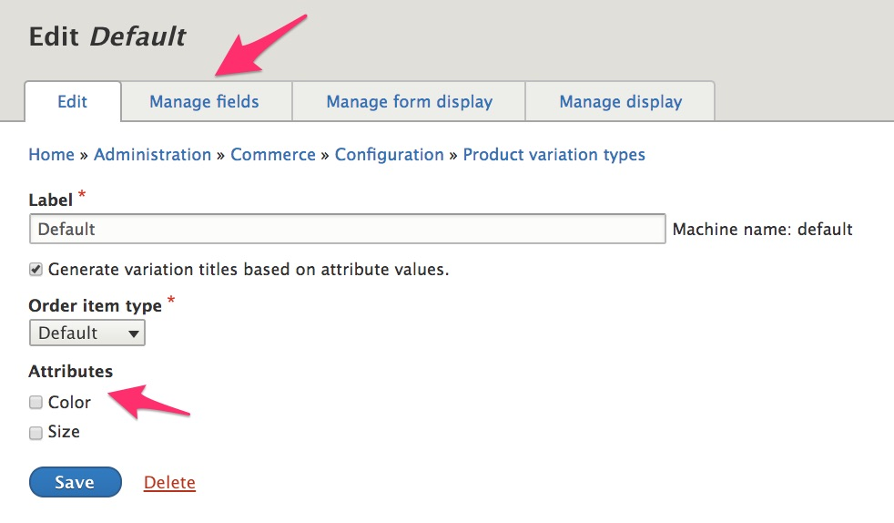
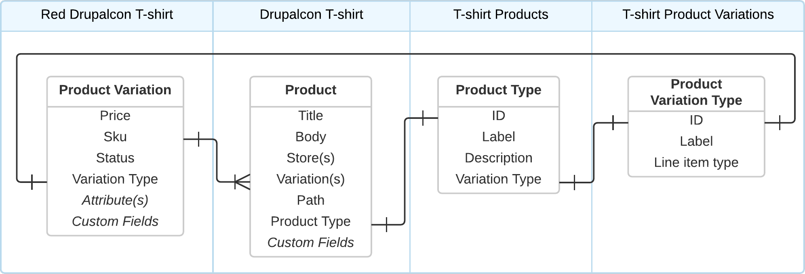

This page provides specific, technical explanations of the product-related data structures and relationships in Drupal Commerce. Familiarity with Drupal concepts including configuration entities, content entities, bundles, base fields, and plugins is assumed. For a more general introduction to Drupal Commerce products,  see the [Concepts documentation page](../02.concepts). For step-by-step instructions for setting up products for your site, see the [Product Architecture documentation](../../02.product-architecture).

#### Products
A **product** is a content entity that has a product type as its bundle entity type. Products are translatable. Like standard Drupal nodes, products are designed to be displayed as standalone pages on your site. In fact, most of a product's base fields are very similar to those of node entities:

| Base field | Description |
| ---------- | ----------- |
| product_id | Unique numeric id for the product |
| title      | The product title, or name; required |
| body       | A text with summary field, displayed on the product page |
| status     | Published status; boolean |
| type       | Id of the product type bundle |
| path       | Optional URL alias for the product display page |
| uid        | The product author |
| created    | Time when the product was created |
| changed    | Time when the product was last edited |

Additionally, product entities have two required, unlimited cardinality entity reference fields: ***stores*** and ***variations***.
- Each product can belong to multiple stores, but each individual order belongs to a single store. Thus, customers will be unable to purchase products from multiple stores in a single order.
- Every product has one or more variations, which are the items that are actually purchased by customers. The `Product` class has a `getDefaultVariation()` method which returns the first active variation. This method is used when products are displayed, whenever a specific variation has not been selected by the customer.

**Deleting products**
- Deleting a product deletes its variations.

#### Product variations
A **product variation** is a content entity that has a product variation type as its bundle entity type. Product variations are translatable. Each product variation has a parent [product entity](#products), sku, title, price, and status (active/inactive). The sku must be unique across all product variation types. See the [Product Concepts documentation](../02.concepts) for more information on product skus. The author of the variation as well as its created and changed timestamps are also stored.

| Base field   | Description |
| ------------ | ----------- |
| variation_id | Unique numeric id for the product variation |
| product_id   | Id of the parent product entity |
| sku          | Unique product variation sku, required |
| title        | The product variation title, required |
| price        | The variation price, required |
| status       | Whether th variation is active, boolean |
| type         | Id of the product variation type bundle |
| path         | Optional URL alias for the product display page |
| uid          | The product variation author |
| created      | Time when the product was created |
| changed      | Time when the product was last edited |

Since product variations belong to specific products and since products are specifically assigned to one or more stores, product variations are also assigned to stores. The `ProductVariation` class provides a `getStores()` method that returns an array of stores in which the product variation is available.

The `ProductVariation` class also provides these methods that are used when a product variation is purchased (added to a cart):
- The `getOrderItemTypeId()` method loads the variation's ***product variation type*** and returns the ID of the order item type set for that product variation type.
- The `getOrderItemTitle()` method will return the product variation's title, if set. If the variation's title has not been set, then a title will be generated as described below, in the [product variation types documentation](#product-variation-types).

Since product variations aren't designed to be displayed as standalone pages, the `Drupal\Core\Entity\Entity:toUrl()` method has been overridden by the `ProductVariation` class for the product variation *canonical* and *revision* link templates. In place of a product-variation-specific page, the canonical view page for the product variation's *parent product* is displayed, with `v=VARIATION_ID` appended as the URL's query.

In the `ProductVariationStorage` class, the `loadFromContext()` method will use the variation specified in the URL: `?v=1`, for example. It loads the identified variation, provided it is currently active and belongs to the current product. It also ensures that the current user has the necessary access permissions. If no variation is specified (or the specified variation cannot be loaded), then the product's *default* variation is instead loaded. Note that the returned variation may not be enabled; the caller needs to check it against the list from `loadEnabled()`. (See below.)

 This `loadFromContext()` method is used by the `ProductViewBuilder` class and product variation widgets (which are used by the add-to-cart form) to properly display the *selected* product variation. (See `Drupal\commerce_product\Plugin\Field\FieldWidget\ProductVariationWidgetBase`.)

In addition to the `loadFromContext()` method, the `ProductVariationStorage` class also provides these methods for loading product variations:
- The `loadBySku($sku)` method loads the variation corresponding to the given sku string.
- The `loadEnabled(ProductInterface $product)` returns an array of enabled product variations for the given product, in the original sort order. Custom modules can apply their own filtering (based on date, stock, etc.) using the `FILTER_VARIATIONS` event. This method also ensures that the current user has the necessary access permissions.

#### Product types and product variation types
Product types and product variation types are configuration bundle entities for products and product variations, respectively. Both extend the `CommerceBundleEntityBase` base class.

##### CommerceBundleEntityBase
 The CommerceBundleEntityBase base class provides unique id and label fields, an array of ***entity traits***, and a ***locked*** boolean field.

An **entity trait** represents a behavior that can be attached to a specific entity bundle, by acting as a marker, or flag, and/or providing a set of fields. For example, the [Commerce Shipping] module adds a *Shippable* trait to product variation types. If a product variation type is flagged as *shippable*, then a *weight* field is added to product variations of that type.

Entity traits are implemented as plugins. If you are interested in creating your own product or product variation type entity traits, you can get started by looking at the *EntityTraitBase* class, located in `Drupal\commerce\Plugin\Commerce\EntityTrait`.

The **locked** property of a commerce entity bundle controls whether a bundle can be deleted. CommerceBundleEntityBase provides `lock()` and `unlock()` methods that can be used to set the locked status for a commerce entity bundle.

##### Product types
A **product type** is a configuration bundle entity that extends `CommerceBundleEntityBase`. It has a description, *variation type* ID field, and an *inject variation fields* boolean field.

Why does a product type need a set variation type? The variation type ID field value is set when a new product type is created. It is used to set the target bundle for the product *variations* field so that whenever a variation is added to a product, the correct type of variation is added. The variation type ID field is also used for the *Product attributes overview* formatter, a formatter that displays a product's variations as rendered attribute entities.

The *inject variation fields* setting affects how products are displayed. You can learn more about [product variation field injection](../../04.displaying-products/01.product-display) in the [Displaying products documentation](../../04.displaying-products).

The product type administrative page also includes an option to *Publish new products of this type by default*. This option value is not stored with the product type configuration data; instead, it is used to set the default value for the product entity's *status* base field, for the product type.

A standard Drupal Commerce installation includes a product type named *Default*. Its product variation type is the *Default* product variation type, and its *inject variations fields* and *publish new products of the type by default* settings are enabled. You can change these default values or customize the *Default* product variation type with additional fields.

Alternatively, if you do not want to use the *Default* product type, you can also delete it completely from your site.

**Deleting product types**
- Product types cannot be deleted if products of those types exist.
- Locked product types cannot be deleted.
- Deleting a product type does not delete its variation type, even if the variation type is not being used by any other product type.

##### Product variation types
A **product variation type** is a configuration bundle entity that extends `CommerceBundleEntityBase`. It has an *order item type* ID field and a boolean *generate title* field. You can also customize a product variation type by adding custom fields and/or product attributes.
- The ***order item type*** ID field is used to determine what type of order item should be added to a customer's cart at the time a product variation is selected for purchase.
- The ***generate title*** field corresponds to the *Generate variation titles based on attribute values* option on the product variation type administration form. If selected for a product variation type, titles for its product variations will be automatically generated whenever the variations are saved. 
The pattern for the generated title is the product title followed by a dash ('-') character and a comma-separated list of attribute value labels. For a product variation type with *color* and *size* attributes, one product variation title might be, "Drupal Commerce Hoodie - Green, Medium". (If the product variation type does not have any product attributes, the product title is used for the variation title.)

A standard Drupal Commerce installation includes a product variation type named *Default*. Its order item type is the *Default* order item type, and its *generate title* setting is enabled. You can change these default values or customize the *Default* product variation type with additional fields and product attributes. In this screenshot, *Color* and *Size* product attributes have been added to the site, so they can be added to the Default product variation type.

Alternatively, if you do not want to use the *Default* product variation type, you can also delete it completely from your site.

**Deleting product variation types**
- Product variation types cannot be deleted if product variation entities of those types exist.
- Locked product variation types cannot be deleted.

##### Product type and product variation type relationships
A product type has a single product variation type, but a single product variation type could be used for multiple product types. In most cases, though, you will have paired product types and product variation types. For example, the *Default* product type with the *Default* product variation type, the *Clothing* product type with the *Clothing* product variation type, and the *Book* product type with the *Book* product variation type.

In the following diagram, you can see that a Product entity can optionally have *Custom Fields*, and a Product variation entity can optionally have both *Custom Fields* and *Attribute(s)*. These additional fields are all specific to bundle types. You use the product type and product variation type administrative pages to specify custom fields and product attributes for product and product variation entities.

#### Product attributes and product attribute values
Structurally, product attributes and product attribute values are similar to taxonomy vocabularies and terms, respectively. Each product variation has a product attribute value for each product attribute selected for its product variation type. When thinking about whether to create a product attribute or, alternatively, to create a taxonomy for categorizing/distinguishing variations of a product, the key is to consider product variation SKUs and prices. If a particular characteristic of a product variation, such as *storage conditions*, for example, does not correspond to a specific SKU/price combination, then you will probably want to use a taxonomy term reference custom field instead of a product attribute. It can also be helpful to think of product attributes as *things selected by the customer*. If the product display page should present a set of options to the customer for the product, these options are generally going to be the product attribute values.

A **product attribute** is a configuration entity that has the following properties:

| Property    | Description |
| ----------- | ----------- |
| id          | Unique string id. |
| label       | Label to be used for the attribute and typically displayed to customer. For example: *Color* or *Size*. |
| elementType | Element to be used for displaying the attribute value options to the customer. One of: <ul><li>**radios**: radio buttons</li><li>**select**: select list</li><li>**commerce_product_rendered_attribute**: Rendered attribute. See [Product attributes](../../04.displaying-products/03.product-attributes) in the Displaying products documentation for more information.</li></ul> |

The product attribute entity also has two useful *getter* methods:
- The `getElementType()` method returns the attribute's entityType value.
- The `getValues()` method returns an array of `ProductAttributeValueInterface` objects, sorted by weight and name.

**Deleting product attributes**
- If a product attribute is deleted, then all of its product attribute values will also be deleted.

A **product attribute value** is a content entity that has a product attribute as its bundle entity type. Its base fields are:

| <nobr>Base field</nobr> | Description |
| ---------- | ----------- |
| attribute  | The ID of the product attribute value's ***product attribute*** bundle. |
| name       | Typically displayed to customers as a selectable product option, like *Blue*, *Green*, or *Red*. |
| weight     | Used for ordering attribute values in relation to other attribute values. The default ordering is alphabetical. |
| created    | Time when the attribute value was created. |
| changed    | Time when the attribute value was last edited. |

Custom fields can be added to product attribute value entities through the administrative UI.

The following diagram illustrates the relationships amoung product attributes, product attribute values, product variations, and products.

##### Product attribute field manager service
**ProductAttributeFieldManager** is a service the manages attribute fields. Attribute fields are the entity reference fields that store values of a specific attribute on the product variation. See `Drupal\commerce_product\ProductAttributeFieldManagerInterface` for information on the methods provided by this service. For product variation entities, it is used by several *getter* method related to product attributes:
- `getAttributeFieldNames()` gets the names of the variation's attribute fields.
- `getAttributeValueIds()` gets the variation's attribute value IDs, keyed by field name.
- `getAttributeValueId($field_name)` gets the variation's attribute value ID for the given field name.
- `getAttributeValues()` gets the variation's attribute values, keyed by field name.

This service is also used to provide the list of available attributes on the product variation type administrative form.

[Commerce Shipping]: https://www.drupal.org/project/commerce_shipping
