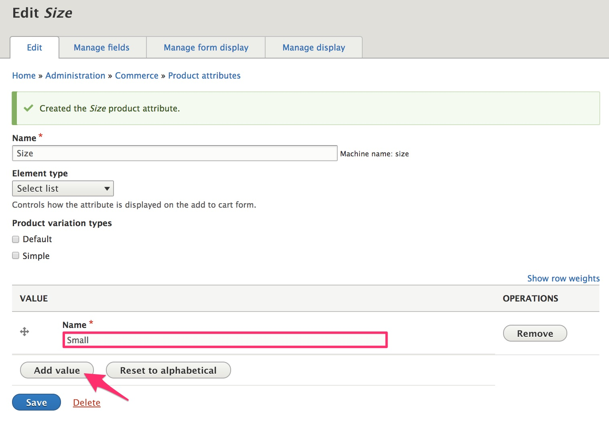
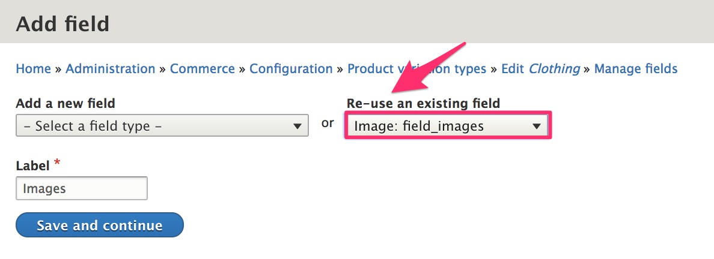
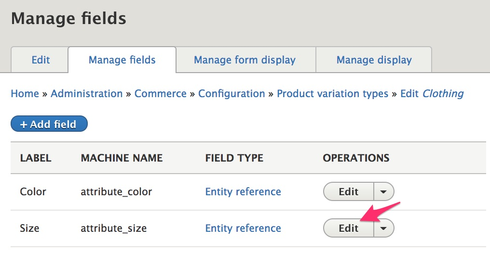
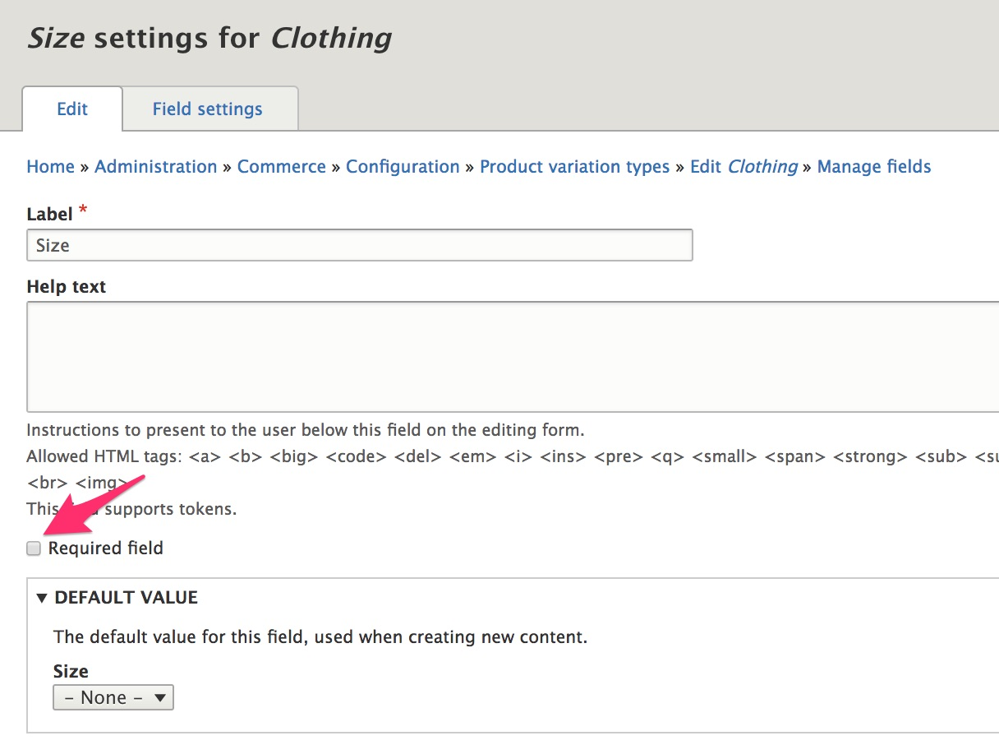
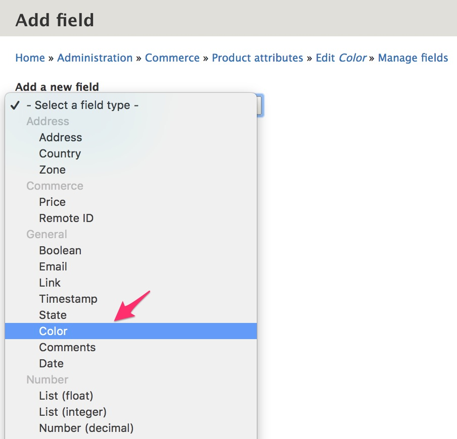
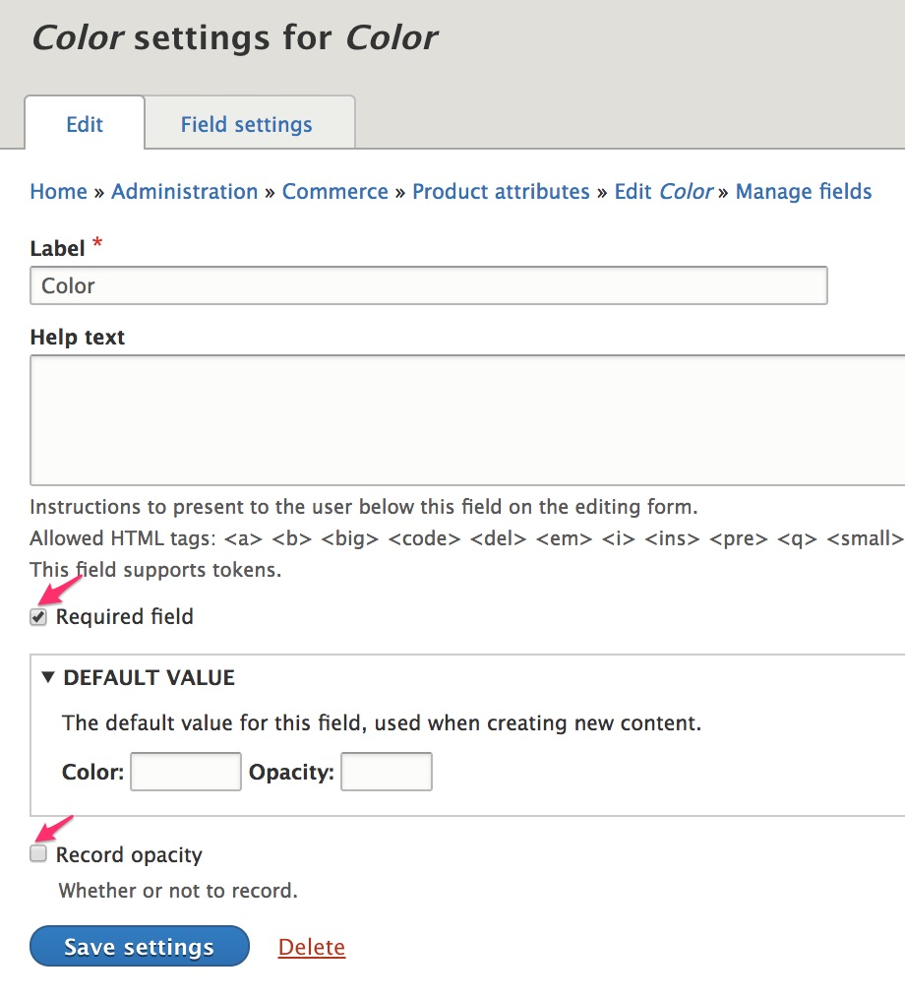

If your products have options like size, color, format, or package size, then you need to create product attributes and their values. For example, suppose you are selling a t-shirt that comes in a variety of sizes and colors. Then you need to create a "Size" attribute (with values like, "Small", "Medium", and "Large"), and you need to create a "Color" attribute (with values like "Red", "Blue", "Orange", and "Green").

As the above image suggests, a product with a particular set of attributes will not necessarily have a variation for every possible combination. Perhaps the size Large t-shirt is only available in Green, and the Medium t-shirt is only available in Blue and Orange. Product attribute values do not define the complete set of product variations; rather they define a set of possible attribute combinations available to product variations.

### Create a basic product attribute

Let's start by creating a "Size" attribute with values Small, Medium, and Large.

1. Navigate to the "Product attributes" page by using the menu item under the main "Commerce" menu or `/admin/commerce/product-attributes`.
2. Enter "Size" for the Name.
3. Select "Select list" for the Element type. See [Product attributes] in the "Displaying products" documentation section for a description of how these options affect product displays.
4. Do not select any Product variation types. This Size attribute will not be used for the Default or Simple product types. When we create a new "Clothing" product type (below), we can come back to update the configuration.
5. Click the "Save" button to create the new product attribute.

#### Create product attribute values
On the Size product attribute configuration form, add "Small", "Medium", and "Large" as values.

1. Enter "Small" for the Name.
2. Click the "Add value" button. A new text field will appear in the list.
3. Enter "Medium".
4. Repeat steps 2 and 3 to enter "Large" as the third value.
5. Click the "Save" button.

You can use the drag-and-drop handle in the leftmost column, the "Reset to alphabetical" button, or the "Show row weights" link and "Weight" select lists to reorder the values. This order will be used on the form used to enter product variation data. CHECK ON THIS--FOR DEMO, ORDER DOESN'T SEEM TO WORK???

### Add a product attribute to a product variation type
In the [Simple product type](../01.simple-product) documentation, we created a product type named, "Simple". Use the same procedure to create a new product type named, "Clothing", with a corresponding "Clothing" product variation type. When you add the "Images" field to the product variation type, you can re-use the existing Image field instead of creating a new one:

If you look at the configuration form for any product variation type, you'll see that a new "Attributes" section has been added, with a checkbox for the new "Size" product attribute. Select this attribute for the "Clothing" product variation type: `/admin/commerce/config/product-variation-types/clothing/edit`.

#### Make a product attribute optional

By default, all product attributes are required. However, after adding a product attribute to a product variation type, you can change its field settings so that it is not required. For example, to make the "Size" attribute optional for the "Clothing" product type, navigate to its "Manage fields" configuration page at `/admin/commerce/config/product-variation-types/clothing/edit/fields`. Click the button for the "Edit" operation for the "Size" field.

On the "Size settings for Clothing" page, de-select the "Required field" checkbox and click the "Save settings" button to make the Size attribute optional for the Clothing product type.

### Add a field to a product attribute
For the Color attribute, we want to present the options as color swatches instead of just the color names. Most of the documentation for this functionality will be covered in the [Add to cart form](../../04.displaying-products/02.add-to-cart-form) page of the Displaying products section. Here we'll just set up the Color product attribute.

>To set up the Color product attribute like this, you will need to install the [Color module]. See the documentation on [Extending Drupal Commerce](../../../02.install-update/06.extending) for an overview of installing contributed Drupal modules.

The initial steps for creating the Color attribute are the same as the steps described above, for creating the Size attribute. Briefly, you need to:
1. Navigate to the "Product attributes" page by using the menu item under the main "Commerce" menu or `/admin/commerce/product-attributes`.
2. Enter "Color" for the Name.
3. Select the "Clothing" product variation type.
4. Click the "Save" button to create the new product attribute.
5. Enter "Black", "Blue", "Green", and "Pink" for the Color attribute values. (T
6. Click the "Save" button.

Now that we've created the "Color" attribute, we can add an additional field by navigating to the "Manage fields" configuration page for the Color attribute: `/admin/commerce/product-attributes/manage/color/fields`.

1. Click the "Add field" button.
2. Select "Color" from the list of field types.
3. Enter "Color" for the Label.
4. Click the "Save and continue" button.

On the "Field settings" configuration page, leave the default values are fine. On the "Color settings for Color" page, enable the "Required field" option and disable the "Record opacity" option. After saving the changes, you can return to Edit the page again, to set the default value for the color to "#000000".

After adding and configuring the Color field, return to the main configuration page for the Color attribute: `/admin/commerce/product-attributes/manage/color`. Enter the following values for the "Color" for each attribute value:

- Black: #000000
- Blue: #9CC8D5
- Green: #9ACA96
- Pink: #E1A7CE

Click the "Save" button to complete the configuration for the "Color" product attribute.

---
In the next section, we'll look at creating product categories.

[Color module]: https://www.drupal.org/project/color_field