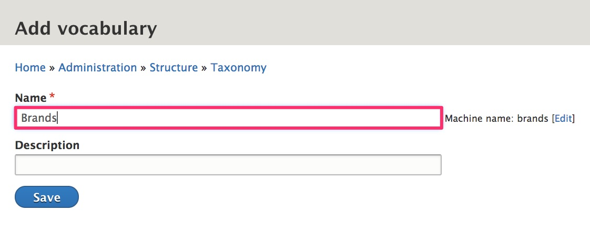
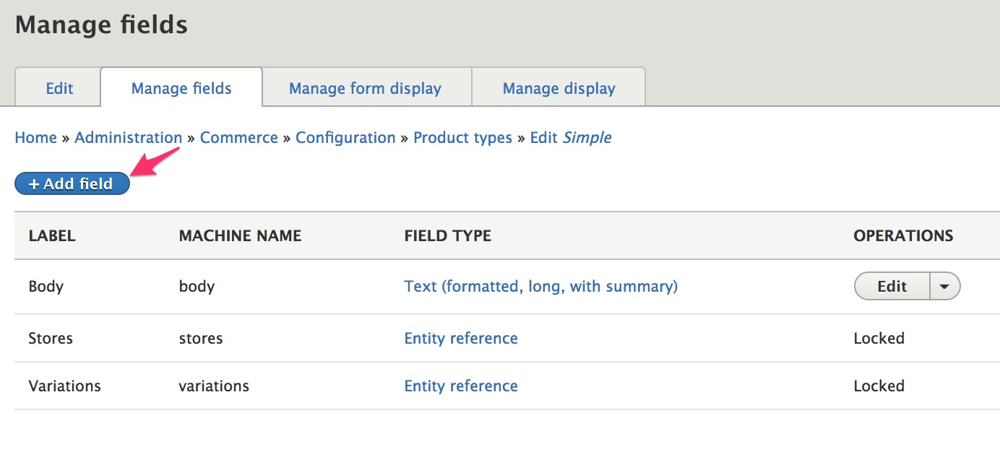
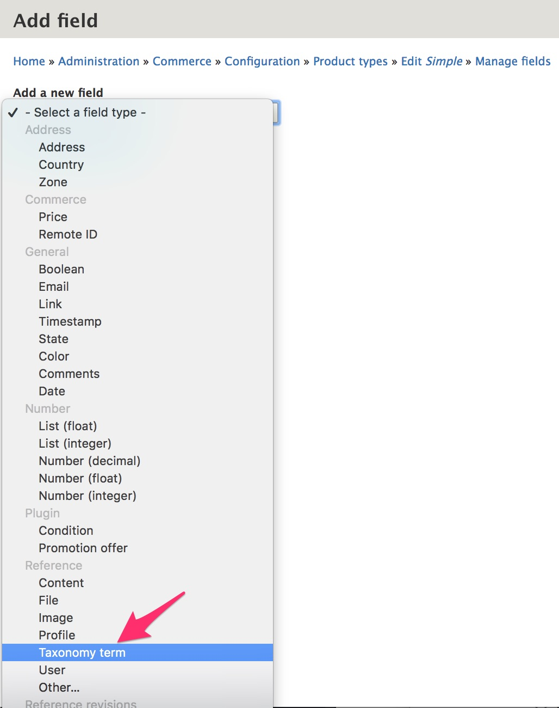
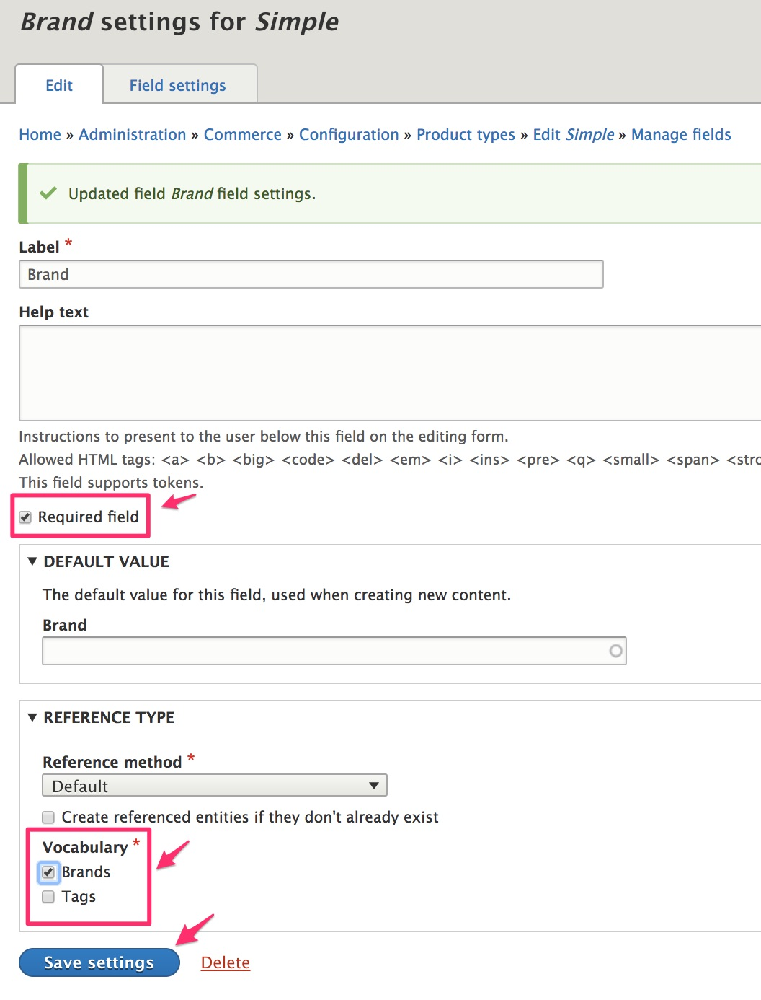

In the [Simple product type](../01.simple-product) documentation, we added a custom field to a *product variation type*, to allow product variations to have images. In the [Product type with attributes](../02.product-attributes) documentation, we added a custom field to a *product attribute*, to allow a Color attribute to be displayed as a color swatch image instead of just the color name. In this section, we're going to look at how to add fields to *product types* so that we can organize products into categories that can be used for the product catalog.

#### Prerequisites
- Drupal 8 User Guide documentation on [Concept: Taxonomy]
- Creating the [Simple product type](../../02.product-architecture/01.simple-product)

### Create a basic product category

Let's start by creating a "Brands" taxonomy to organize products by brand.

1. Navigate to the "Taxonomy" page at `/admin/structure/taxonomy`.
2. Click the "Add vocabulary" button.
3. Enter "Brands" for the Name.
4. Click "Save" to create the new vocabulary.

Now you can add terms to the vocabulary or look into using the [Feeds module] or [Migrate Tools module] to import your pre-existing data.

### Create a term reference field for your product category

Let's add a field that references our "Brands" taxonomy to both our Simple product type.

1. Navigate to the "Proudct types" page at '/admin/commerce/config/product-types'.
2. Select the "Manage fields" operation for the Simple product type.
3. Click the "Add field" button.

4. Select "Taxonomy term" for the new field type.
5. Enter "Brand" for the Label.
6. Click the "Save and continue" button.

7. Click "Save field settings" on the next page to save the default configuration values.
8. On the "Brand settings for Simple" page, select "Required field" and select "Brands" for the Vocabulary.
9. Click the "Save settings" button.

The "Brand" field has now been added to the Simple product type. To add the Brand field to another product type, you can "Re-use an existing field" to select this Brand field on the "Add field" page for the product type.

>Instructions here with link to page describing how to use these categories
---
In the next section, we'll look at options for product architectures in Drupal Commerce.

[Concept: Taxonomy]: https://www.drupal.org/docs/user_guide/en/structure-taxonomy.html
[Feeds module]: https://www.drupal.org/project/feeds
[Migrate Tools module]: https://www.drupal.org/project/migrate_tools
