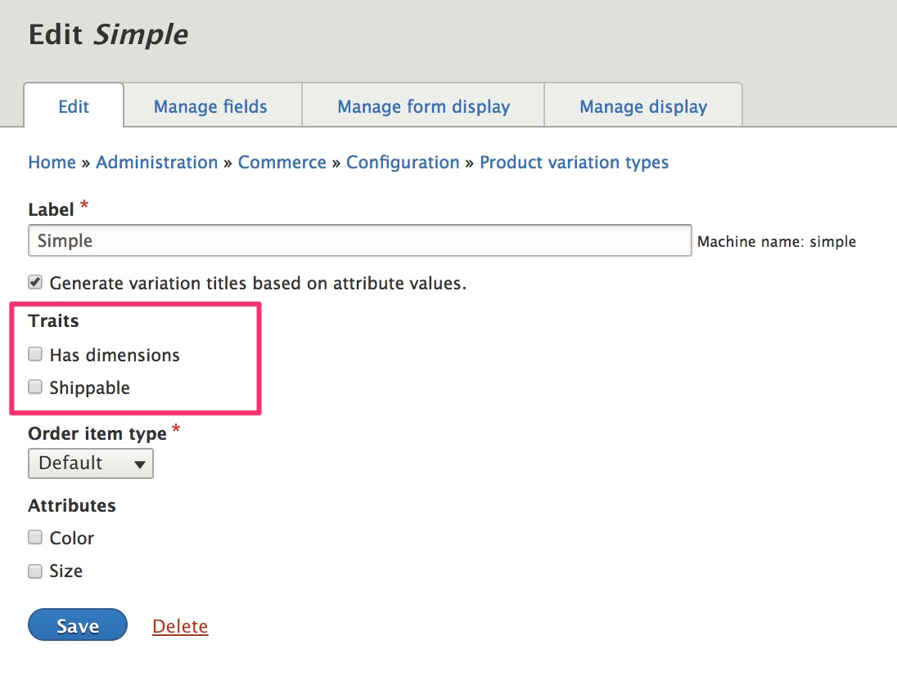
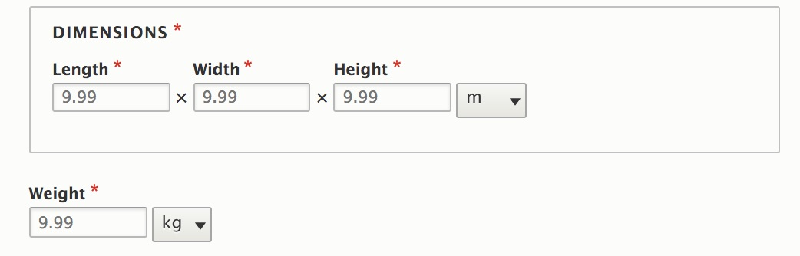

This page provides a general overview of some of the most commonly used types of product architectures:

- [Virtual products](#virtual-vs-physical-products)
- [Physical products](#physical-product-configuration)
- [Configurable / customizable products](#configurable-customizable-products)
- [Downlodable products / files](#downloadable-products-files)
- [Subscriptions](#subscriptions)
- [Product bundles](#product-bundles)
- [Unique / none-of-the-above architectures](#purchasable-entities)

### Virtual vs physical products

In Drupal Commerce, products can be either virtual or physical. A physical product is any product that needs to be shipped or physically delivered to customers in some other way.

If you have virtual products, no special configuration is necessary. Drupal Commerce will work for virtual products as is.

If you have physical products, then you will need to extend Drupal Commerce with the [Commerce Shipping module]. (See the [Extending Drupal Commerce](../../../02.install-update/06.extending) documentation to add Commerce shipping to your project.)

#### Physical product configuration
Afer installing Commerce Shipping, navigate to the "Product variation types" page at `/admin/commerce/config/product-variation-types` and click the "Edit" button next to the name of your physical product variation type.

You will see that two "traits" have been added to the configuration form for the product type:
- Has dimensions
- Shippable

- If you specify that your product variation type "has dimensions", then a "Dimensions" field will be added to your product variation type.

- If you specify that your product variation type is "shippable", then a "Weight" field will be added to your product variation type.

Both these fields can be managed just like any other field in terms of displaying them on data entry forms and product displays. For more information on how these fields are used in the context of the Commerce Shipping module, see the [Shipping documentation](../../../10.shipping).

#### Stock management for physical products
An important aspect of product architecture with respect to stock management is the definition of your product attributes and variations. For each unique combination of attributes, i.e., for each product variation, you get a single SKU. If you need to keep track of the number of units for each color, for example, then "Color" should be a product attribute.

In contrast, suppose you sell custom t-shirts that can be ordered in *any* customer-specified color and/or design, and you only track inventory based on Size (Small, Medium, Large, etc.) In this case, you would want "Size" as a product attribute, but "Color" would not be a product attribute. Instead, you would want to add a custom "Color" field that customers can use at the time they order an item to specify the t-shirt color.

The Drupal 8 version for the [Commerce Stock module] is currently being ported to Drupal 8. It is not yet ready for use on a live site.

### Configurable / customizable products
A configurable product is one for which a customer can specify unique information for a product. For example, a product that can be monogrammed with a name or initials is a configurable product. Product attributes, like "color" or "size" can only be used when the list of all possible values is known and set in advance. For example, the values for "size" for an item of clothing might be "S", "M", "L", and "XL".

To implement a configurable product in the context of Drupal Commerce product architecture, the key is to add a custom field to the [Add to cart form](../../04.displaying-products/02.add-to-cart-form).
- Customers use the field to enter their unique product configuration.
- Merchants receive the information as part of the order's line item data.

Both single-variation products and products with attributes / variations can be customized as a configurable product. Also, multiple custom fields could be added for a configurable product. For step-by-step instructions, see [Add fields for customizable products](../../04.displaying-products/02.add-to-cart-form) in the "Configuring the Add to cart form fields" section of the documentation on the "Add to cart form".

### Downloadable products / files
For downloadable products / files, we recommend the [Commerce File module]. The port to Drupal 8 is currently in progress. See the [Port to Drupal 8] issue for the current status.

### Subscriptions
For subscription products, we recommend the [Commerce Recurring Framework module], which provides recurring billing for Drupal Commerce. See the [Subscriptions documentation](../../../12.recurring) for additional information.

### Product bundles
For product bundles, we recommend the [Commerce Product Bundle module]. The port to Drupal 8 is currently in progress. See the [Drupal 8 (Commerce 2) Version] issue for additional information:

### Purchasable entities
When it comes to product architectures, there is no one true answer. That’s why it’s important for Drupal Commerce to support any number of product architectures. Do you need a Commerce solution that uses a completely unique architecture? Perhaps there's just no way to make the "products/variations/attributes" structure provided by the Product module fit your needs. If so, you can develop a completely custom product architecture but still benefit from the rest of the Drupal Commerce ecosystem of modules (cart, checkout, order, payment, etc.).

The key to Drupal's product architecture flexibility is the concept of a "purchasable entity". Product variations are one example of purchasable entities. Every product variation (and every purchasable entity) in Drupal Commerce has 4 key properties:

| Property  | What does it mean? |
|----------------------------|
| Stores | The stores through which the item can be purchased. |
| Title | The name or label of the item being purchased. |
| Price | The base price of the item being purchased. |
| Order item type | The type of order item (line item) to use when a product is purchased (added to order/cart). |

 Order line items can be configured to reference *any* "purchasable entity". On the Order item type configuration page, you can specify the "Purchasable entity type" for your line items. "Product variation" is just the default option.

If you're interested in writing custom code to define your own "purchasable entities", you can start by looking at the `PurchasableEntityInterface`, which is included in the [Code recipes](../10.code-recipes) page of this documentation section.

---
In the next section, we'll describe the setup for multilingual products.

[Commerce Shipping module]: https://www.drupal.org/project/commerce_shipping
[Commerce Stock module]: https://www.drupal.org/project/commerce_stock
[Commerce File module]: https://www.drupal.org/project/commerce_file
[Port to Drupal 8]: https://www.drupal.org/project/commerce_file/issues/2875904
[Commerce Recurring Framework module]: https://www.drupal.org/project/commerce_recurring
[Commerce Product Bundle module]: https://www.drupal.org/project/commerce_product_bundle
[Drupal 8 (Commerce 2) Version]: https://www.drupal.org/project/commerce_product_bundle/issues/2799643
