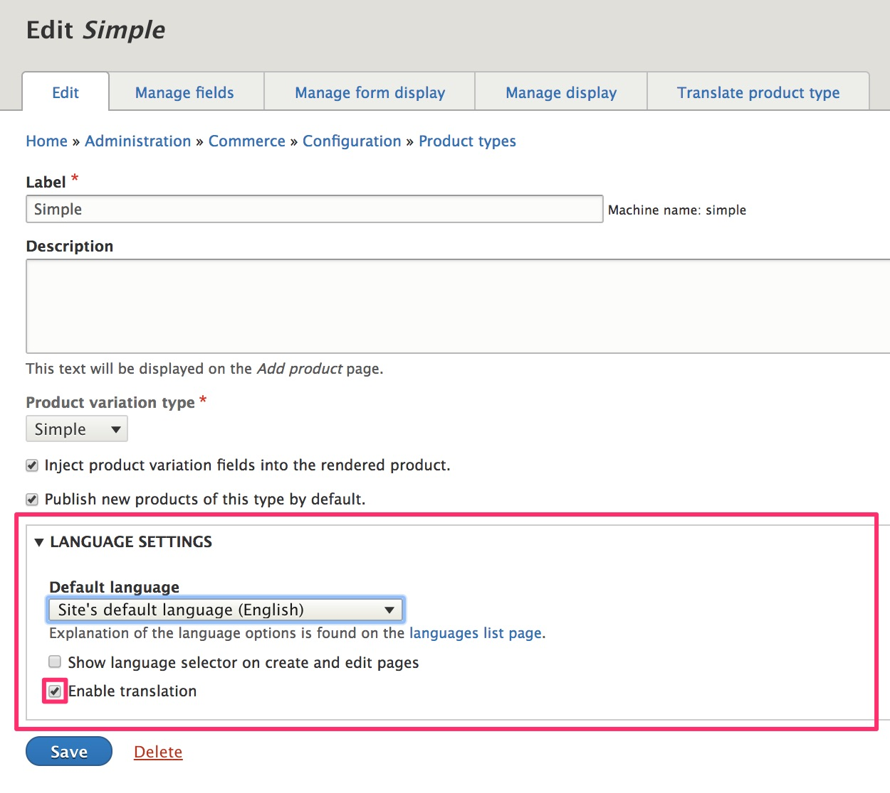
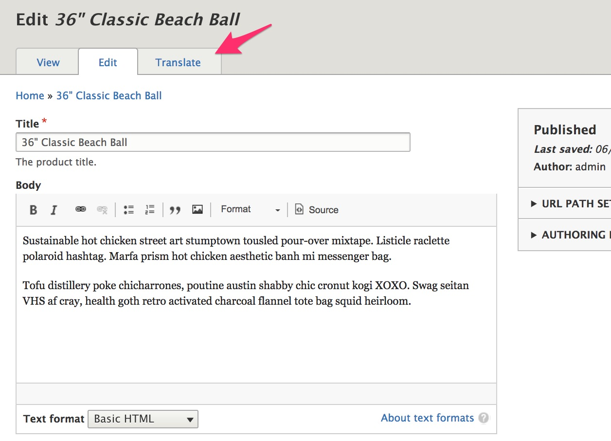
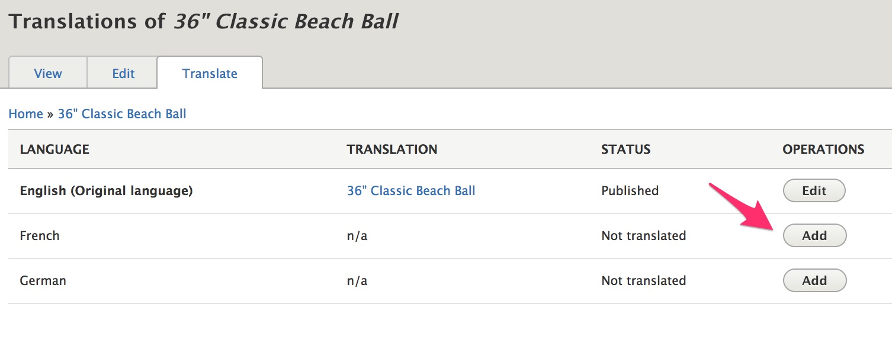
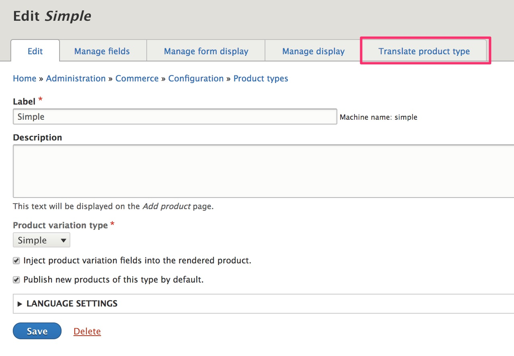
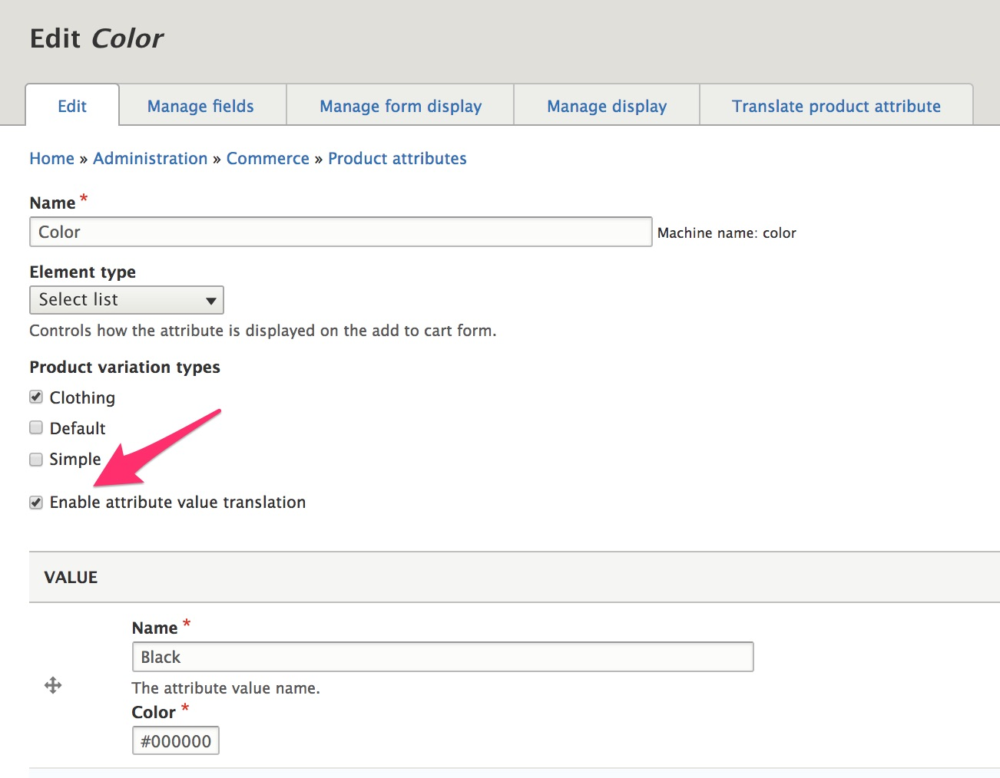
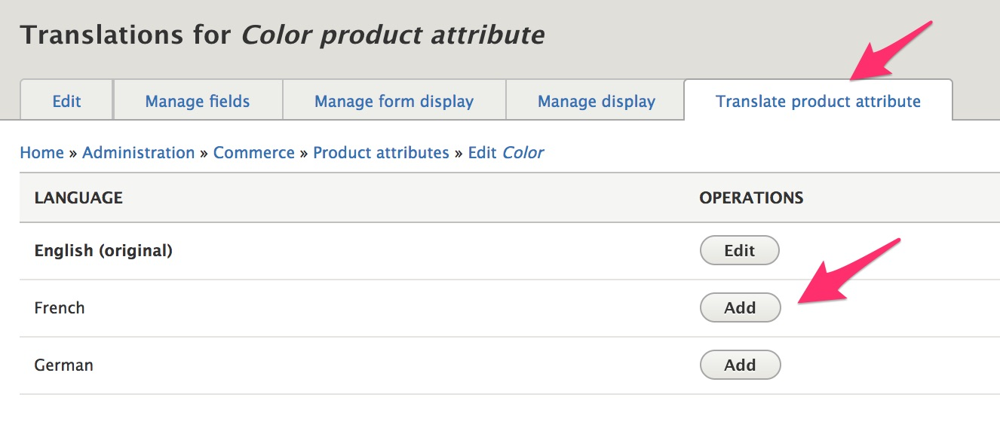
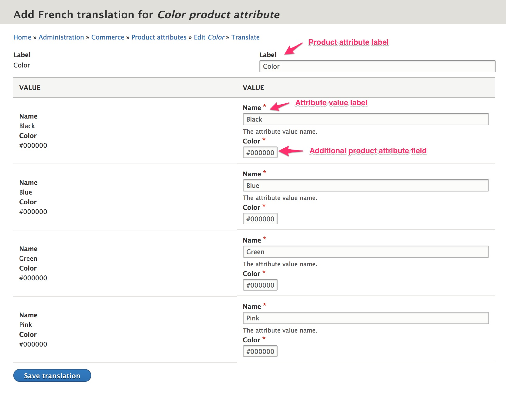

If you need to display the products on your site in multiple languages, you will need to build a Multilingual Drupal site. Multilingual functionality in Drupal is beyond the scope of this Drupal Commerce documentation guide. For an overview, please see the Drupal 8 User Guide section on [Making Your Site Multilingual]. This page describes basic multilingual setup for products, product variations, and product attribute values.

#### Prerequisites
- The Drupal core [Content Translation module] is required for multilingual products.
- If you have product attributes, you'll also need to install the Drupal core [Configuration Translation module].
- Before you can translate content, there must be at least two languages. You can add languages at `/admin/config/regional/language/add`.

#### Enable translations for Products and variations
Once the Content Translation module has been installed, you will see a new "Language settings" section on the configuration forms for all Product types and Product variation types. Click the triangle to the left of the "Language settings" label to expand the form options.

Alternatively, you can also use the main "Content language" configuration page to set the language settings for all types of Products and Product variations in the same place. Navigate to `/admin/config/regional/content-language` to make your selections. When you select the checkboxes next to any content type, a corresponding set of configuration options will appear on the form.

Enable translation for product and product variation types that should be translated.

Once translation has been enabled for a product type, you will see a "Translate" tab for products of that type.

On the Translations page for each product, you will see options for adding a translation in each of your installed languages. Your content editors can click the Add or Edit button to update the product text for each language.

If you would like to translate the names of your product and product variation types, you can use the "Translate" tabs on the configuration forms for each type.

>Need more here about product variations, link to docs on prices, currencies...

### Product attribute values:
For multilingual product attribute values, you need to enable attribute value translation for each product attribute that requires translation.
1. Go to the "Product attributes" page by selecting the menu item from the main "Commerce" menu or navigating to `/admin/commerce/product-attributes`
2. Click the "Edit" button for each product attribute.
3. Click the checkbox for "Enable attribute value translation".
4. Click the "Save" button (below the list of attribute values).

After enabling translation for an attribute, navigate to its "Translations" page. For the "Color" attribute, this page is located at `/admin/commerce/product-attributes/manage/color/translate`. You can also use the "Translate product attribute" tab link. Click the Add or Edit button next to each language to enter translations.

You can add translations for the product attribute label and the names for each of its values. If you added extra fields to a product attribute that also need to be translated, you can enable those fields for translation using the main "Content language" configuration page, located at `/admin/config/regional/content-language`. For our "Color" product attribute, adding a translation for the hex value of its "Color" field doesn't make sense, but for other added product attribute fields, translations might be necessary.

[Making Your Site Multilingual]: https://www.drupal.org/docs/user_guide/en/multilingual-chapter.html
[Content Translation module]: https://www.drupal.org/docs/8/core/modules/content-translation/overview
[Configuration Translation module]: https://www.drupal.org/docs/8/core/modules/config-translation
