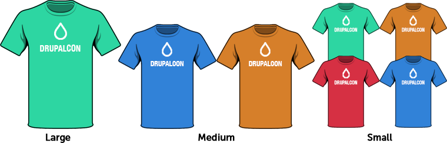
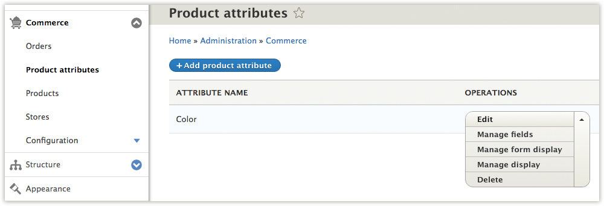

If your products have options like size, color, format, or package size, then you need to create product attributes and their values. For example, suppose you are selling a t-shirt that comes in a variety of sizes and colors. Then you need to create a "Size" attribute (with values like, "Small", "Medium", and "Large"), and you need to create a "Color" attribute (with values like "Red", "Blue", and "Green"). Defining product attributes is one of the first steps involved in setting up your Drupal Commerce products.

Creating Attributes and their Values
------------------------------------

For our t-shirt we need two attributes: color and size. Let's start by
creating the color attribute. Go to the Drupal Commerce administration page and visit the **Product Attributes** link.

Click on the **Add product attribute** link to create an attribute. For now, you can just leave the Element type set to "Select list" and choose "Default" for the Product variation type. *links here to Displaying products section, etc.*

After you have created the color attribute, we need to define at least
one value. Normally we would simply say the color is "blue" or "red" but
sometimes you might need to further define the attribute using fields.
Adding fields is covered in detail later on in the documentation.

Need to mention that content_translation module needs to be enabled...
Show a screen shot without the additional field.

The product attribute values user interface allows creating and
re-ordering multiple values at the same time and a very powerful
translation capability:

Adding fields to Attributes
---------------------------

Product attributes are so much more than a word. Often times they
represent a differentiation between products that is useful to call out
visually for customers. The fieldable attribute value lets the
information architect decide what best describes this attribute. Like
any other fieldable entity, you can locate the list of attribute bundles
and click edit fields:

``/admin/commerce/product-attributes``

Add a field as you would expect. Most fields are supported and will
automatically show up when you go to add attribute values:

