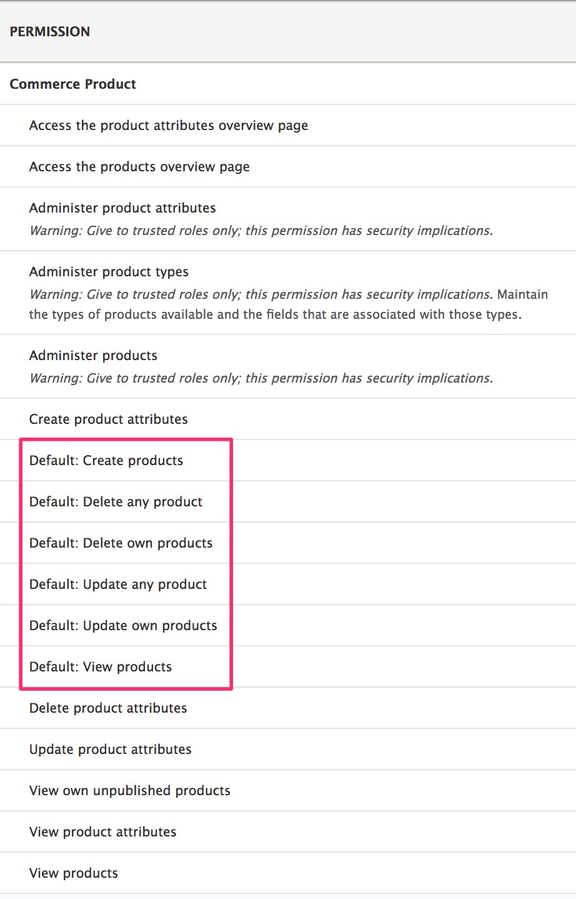

In Drupal Commerce, access control for product management is based on Drupal's permissions system. If you are unfamiliar with the concept of `Permissions` in Drupal, you can read about [Users, Roles, and Permissions] in the Drupal 8 User Guide. [Managing user roles & permission in Drupal 8] is also a good introductory article on the topic.

Administrative users with product management responsibilities will need the `Use the commerce administration pages` permission as well as any relevant `Commerce Product` permissions. Here is a list of Commerce Product permissions, as displayed on the User Permissions page (`/admin/people/permissions`).

In the above image, six permissions prefixed with "Default:" have been highlighted. Drupal Commerce provides bundle-level granularity for its Product permissions. In other words, each product type has its own set of create / delete / update / view permissions. So it's possible to have different product managers for different product types. All users with product management responsibilties will also need the `Access the product overview page` permission so that they can access the Products page at `/admin/commerce/products`.

---
In the next section, we'll look at how you can customize the Product overview page to improve the product management experience for you and your administrative users.

[Users, Roles, and Permissions]: https://www.drupal.org/docs/user_guide/en/user-concept.html
[Managing user roles & permission in Drupal 8]: https://valuebound.com/resources/blog/managing-user-roles-permission-drupal-8