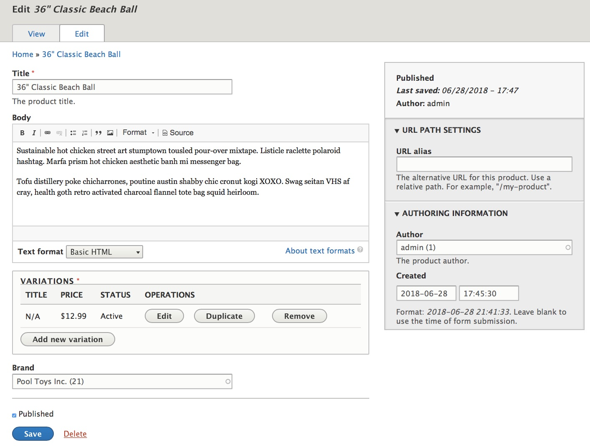
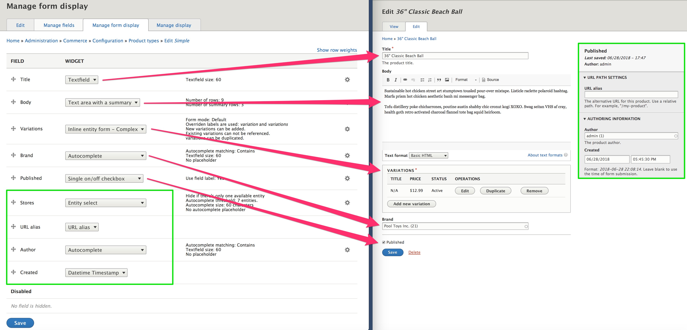
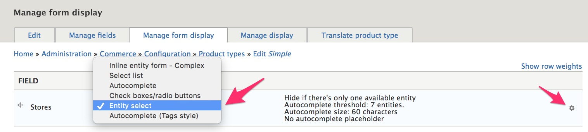
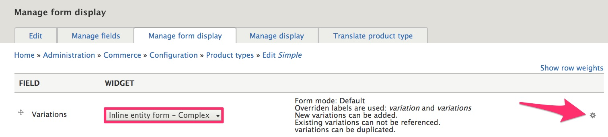
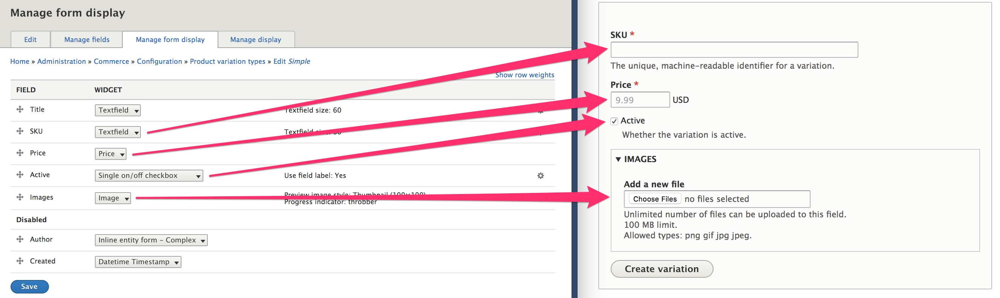

This documentation page describes how you can customize the forms used to enter product data in Drupal Commerce. A single form is used for both creating new products and editing existing products, but the product form can be  configured uniquely for each of your product types. For the [Simple product type](../../02.product-architecture/01.simple-product#configure-a-product-variation-type) we created in the Product architecture section of the documentation, this is what the product form looks like, without any modifications.

### Manage the product form display
To customize the product data entry form, start by navigating to the *Manage form display* configuration page for your product type. For the Simple product type, that page is located at `/admin/commerce/config/product-types/simple/edit/form-display`. Let's look at the configuration form (on the left) alongside the product form (on the right) to better understand how they're related.

The first thing to notice is that there are four fields that do not appear in the main section of the form; the Stores, URL alias, Author, and Created fields are separated into a Sidebar section of the product field. We will look at the Sidebar section next, but for now, let's focus on the main section of the product form.

For the non-sidebar product fields, you can use a product type's *Manage form display* configuration page to control:
- The ordering of the fields, by using the drag icon in the leftmost column or clicking the *Show row weights* link to manually set the order.
- Whether fields are enabled (included on the form) or disabled, by dragging disabled fields to the *Disabled* section at the bottom of the form.
- The selected widget for each field, from a list of available widgets for the field type. (For some field types, only a single widget type will be available.)
- The configuration options for each widget, using the gear icon link that appears in the rightmost column.

#### Customizing the sidebar section of the product form
The Sidebar section of the product form, highlighted in green in the image above, is a custom administrative section that separates a set of specific product fields from the rest of the form.

##### Structure of the sidebar section
- Meta information (read-only)
 - If the product already exists, its Published status is displayed as either *Published* or *Not published*.
 - Last saved date or *Not saved yet*, if the product is new.
 - Author (the product author)
- Visibility settings
 - If you have more than one store, you can select the stores through which the product can be sold.
- URL path settings
 - URL alias (link to doc page on SEO, in marketing section)
- Authoring information
 - Author
 - Created date and time

##### Stores field and the Entity select widget
The *Stores* field appears in the Visibility settings of the Sidebar section of the product data entry form. If you  have only a single store for your site and want to hide the *Visibility* settings from users, use the *Entity select* field widget with its *Hide if there's only one available entity* setting enabled. Make sure you **do not** Disable the Stores field; it is required, and if a product isn't assigned to any store, your customers will get ugly error messages when they attempt to add the product to their cart.

By default, *Entity select* is set as the widget for the Stores field. This is a custom Drupal Commerce widget that can be used by entity reference fields, like Stores. The entity select widget is an adaptive field widget that changes its form element based on the number of available options for the field. If there is only one available entity (i.e., only one available store in this case), you can enable a setting to hide the field completely. If shown, the single option will be displayed with either a checkbox or radio button. Checkboxes are used whenever multiple items can be selected; radio buttons are used when only a single item can be selected. Since products can belong to multiple stores, checkboxes will be used for the Stores field.
You can also set an *autocomplete threshold* for the Entity select widget. If the number of option values exceeds the autocomplete threshold, then an autocomplete field will be presented to the user instead of checkboxes/radio buttons. Users can use the autocomplete field to enter text to search for the Store by name.

If you do not want to use the Entity select widget, you can select one of the other available options. However, you should avoid using the *Inline entity form - Complex* widget, since you will generally not want users to edit Store data when they're editing products.

To set the configuration options for your selected widget, use the gear icon link that appears in the rightmost column of the Manage form display fields table.

##### URL alias field
The URL alias field appears in the URL path settings of the Sidebar section of the product data entry form. If you move the URL alias to the Disabled section of the *Manage form display* configuration form, *URL path settings* will not appear on your product data entry forms. In a standard Drupal Commerce installation, there are no alternative widgets or configuration options available for this field.

##### Author and Created fields
The Author and Created fields appear in the Authoring information of the Sidebar section of the product data entry form. If both fields are Disabled, *Authoring information* will not appear on your product data entry forms.

The Author field can reference any User, including any that are customers rather than administrative users, so the list of options for Author may be quite long. As a result, you will probably want to use the *Autocomplete* field widget for the Author field.

In a standard Drupal Commerce installation, there are no alternative widgets or configuration options available for the Created field.

### Manage the product variation form display
The *Inline entity form - Complex* widget is used for the Variations field. Unless you've developed a custom field widget for your product variations field, you should not change the widget type for the Variations field.

You can configure some basic settings for the widget; for example, you might want to disable the, *Allow users to duplicate variations* option for a product type that has only a single variation per product. If you want to further customize the display of the Variations field on your form, see the [documentation on inline entity form](../../../03.core/00.libraries-and-dependencies/04.ief).

This widget embeds a data entry form for a product variation, as configured for the specific product variation type. In this case, we are looking at a *Simple* product with a *Simple* product variation type. To customize the data entry form for the Simple product variation, navigate to its *Manage form display* configuration form at `/admin/commerce/config/product-variation-types/simple/edit/form-display`.

In the above image, you can see how the settings for the form display of the Simple product variation type (on the left) correspond to the Variations form that's embedded into the data entry form for the Simple product (on the right).

You can use a product variation type's *Manage form display* configuration form to control:
- The ordering of the product variation fields
- Whether fields are enabled (included on the form) or disabled
- The selected widget for each field
- The configuration options for each widget

In this example, the *Title* field is not displayed even though it's enabled, since we selected the *Generate variation titles based on attribute values* option for this product variation type. (See the [Simple product type documentation](../../02.product-architecture/01.simple-product#configure-a-product-variation-type).)

### Theming the product form
If you need to customize the layout for your product form beyond what is possible using the administration UI, you can use the product form Twig template as part of a custom theme. Theming is an advanced topic beyond the scope of this Drupal Commerce documentation guide. For an overview, please see the [Theming Drupal Guide] on Drupal.org.

The default product form template is commerce-product-form.html.twig

Also, you may want to look at the custom css library that's used for the default product form, located within the Drupal Commerce Product module: `css/product.form.css`.

### Links and resources
* Drupal 8 User Guide documentation on [Concept: Forms and Widgets](https://www.drupal.org/docs/user_guide/en/structure-widgets.html)

---
In the next section, we'll look at customization options for the Product overview page.

[Theming Drupal Guide]: https://www.drupal.org/docs/8/theming
