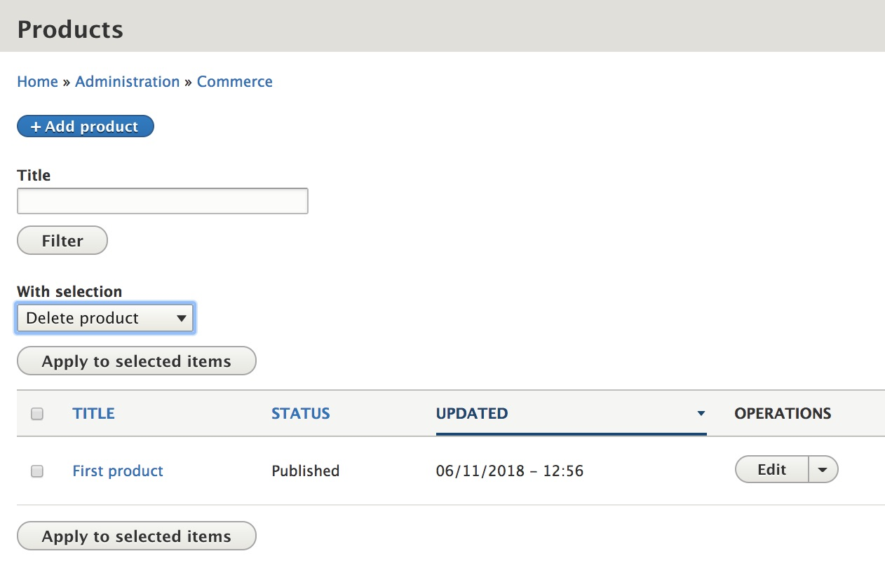

This section describes how you can use Drupal Views to customize the Product overview page, located at `/admin/commerce/products`.  If you are unfamiliar with using `Views` in Drupal, you can read about [Creating Listings with Views], in the Drupal 8 User Guide.

Without any customizations, administrative users can use the Product overview page to:
- Search for products by title (product name) or type (if multiple product types exist).
- Sort the listing by title, product type, published status, or last update.
- Perform delete, publish, and unpublish operations in bulk on selected products.

The functionality of this page is powered by Views. Navigate to `/admin/structure/views/view/commerce_products` to begin customizing the Products View using the administrative interface:

### Modify displayed columns
Use the FIELDS section to add, remove, or reorder the columns displayed on the Products overview page. If you look at the list of Fields, you'll see two special items in addition to Title, Type (hidden if there's only one bundle), Status, and Updated. Bulk update and Operations links are two special Fields that will be described below. To control sorting options for the displayed fields, use the `Settings` link in the FORMAT section.

### Modify filter options
You can create additional criteria for filtering products by setting options in the FILTER CRITERIA section. For example, if you want to provide an option for displaying only Published or Unpublished products, add "Published" as a filter criterion and select the "expose this filter to visitors" option. In the EXPOSED FORM section of the ADVANCED settings, you can further customize the appearance of the filter form on the products page.

### Bulk update options
The "Bulk update" field provides the checkbox in the first column of the listing as well as the "With selection" menu. Drupal Commerce provides three options by default:
- Delete product
- Publish product
- Unpublish product

Administrative users with the [necessary permissions](../01.access-control) can execute these operations on selected products. You can remove any of these options by clicking on the "Product: Bulk update" item in the FIELDS section. You can also add options by creating [Action plugins] with custom code. Looking at the code for the Publish and Unpublish product Action plugins is a good place to start: `Drupal\commerce_product\Plugin\Action\PublishProduct`. The, [Create an action for custom mass updates with Drupal 8](https://www.flocondetoile.fr/blog/create-action-custom-mass-updates-drupal-8), article is a good introduction to the topic.

### Operations links
The Operations menu that appears in the rightmost column of the Products overview page can be modified with custom code, using [hook_entity_operation_alter]. If you are unfamiliar with hooks, see [Understanding Hooks] in the documentation provided by drupal.org.

---
In the next section, we'll look at how you can futher customize the Products View to provide Product Export options.

[Creating Listings with Views]: https://www.drupal.org/docs/user_guide/en/views-chapter.html
[Action plugins]: https://api.drupal.org/api/drupal/core%21lib%21Drupal%21Core%21Action%21ActionInterface.php/interface/ActionInterface/8.5.x
[hook_entity_operation_alter]: https://api.drupal.org/api/drupal/core%21lib%21Drupal%21Core%21Entity%21entity.api.php/function/hook_entity_operation_alter/8.5.x
[Understanding Hooks]: https://www.drupal.org/docs/8/creating-custom-modules/understanding-hooks

