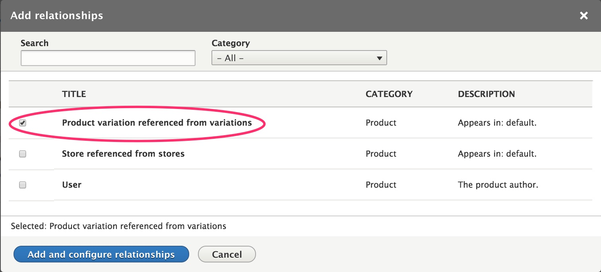
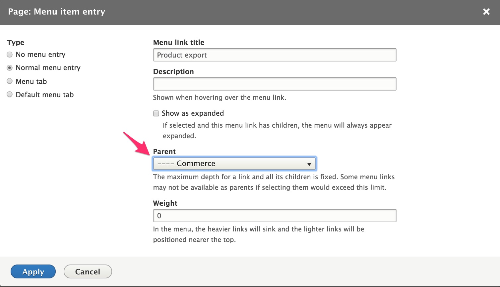
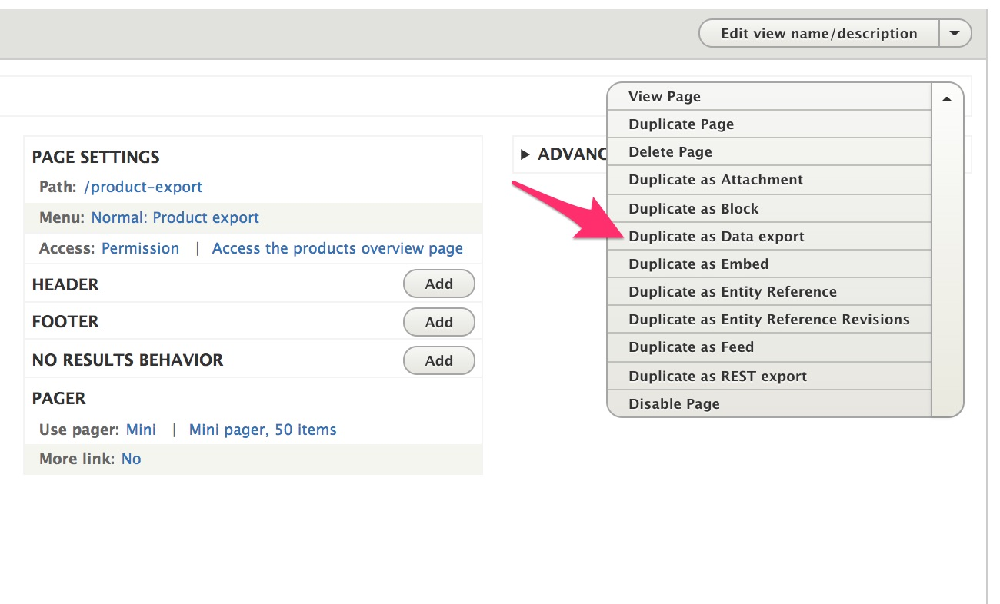
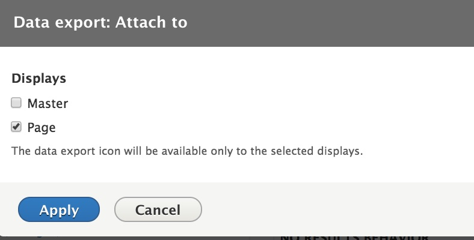
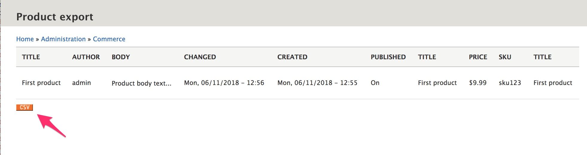

Functionality for importing and exporting products is not built into Drupal Commerce core. This section describes how various Drupal contrib modules can be used to extend Drupal Commerce for importing and / or exporting products. See [Extending Drupal Commerce documentation](../../../02.install-update/06.extending) for information on how Drupal Commerce can be extended with additional modules.

## Importing products
The [Commerce Feeds module] can be used to import data in a variety of formats into Products, using the administrative interface. Unfortunately, it is not yet fully ported into Drupal 8. It is built on top of the [Feeds module], which does have a pre-release version for Drupal 8 as well as [documentation pages]. If you are interested on working to develop the Drupal 8 version of Commerce Feeds, [this issue] has been opened, with a link to the work that has been done so far.

If you are comfortable writing custom code for importing products, then the [Commerce Migrate module] is a good place to start. There is a version for Drupal 8, [documentation], and an explanation of the differences between using Feeds vs. using Migrate for importing products.

## Exporting products
You can use the [Views data export module] to provide product export functionality. If you are unfamiliar with using `Views` in Drupal, start by reading about [Creating Listings with Views], in the Drupal 8 User Guide.

Here is an example of using Views data export for exporting products:

#### 1. Install and enable the [Views data export module] using composer.

`` $composer require drupal/views_data_export --prefer-dist ``

#### 2. Set up a new View page for Product data
 -  Create a new View for Product data, displayed as a table. Create a page and an Administration menu link.

 - Under the ADVANCED view options, add a relationship to product variations and set it as required.

 - Add all the product and variation fields you want to export.

 - If you want to add any Exposed filter criteria (so that users can specify subsets of products to be exported), make sure you check the "Remember Last Selection" option for those exposed filters.

 - If you want to add "Product export" as an option under the Commerce administrative menu, click on the "Menu" link under PAGE SETTINGS, select "Normal menu entry" as the Type, enter a Menu link title, and specify "Commerce" (under the <Administration> menu) as the Parent.

 - Under the PAGE SETTINGS section, you can also set the Path to something like `/admin/commerce/product-export` so that Breadcrumbs will work correctly and set Access to a permission like "Access the products overview page" to control access to the product export page.

#### 3. Set up a Data export View Display for your Product data View
 - Use the "View Page" dropdown menu to select the "Duplicate as Data export" option.

 - Under the PATH SETTINGS section of the view settings for this new "Data export" display, click on the "Attach to" link and select the original "Page" display. Once the data export display has been attached to the page display, a button will be added to the bottom of the page display, to be used to export the product data.

 - Under the FORMAT section of the view settings, click on the "Settings" link for the "Format". Specify the format and optional settings for the data export.

 - Set the PAGER Items to display to "Display all items".

After saving all your changes, you should be able to navigate to your new Product export view page and see a "CSV" (or other format) button in the lower left-hand corner of the page. Users with access to this page will be able to click on that button to export product data.

---
In the next section, we'll look at image management in Drupal.

[Creating Listings with Views]: https://www.drupal.org/docs/user_guide/en/views-chapter.html
[Commerce Feeds module]: https://www.drupal.org/project/commerce_feeds
[Feeds module]: https://www.drupal.org/project/feeds
[documentation pages]: https://www.drupal.org/docs/8/modules/feeds
[this issue]: https://www.drupal.org/project/commerce_feeds/issues/2931860
[Commerce Migrate module]: https://www.drupal.org/project/commerce_migrate
[documentation]: https://www.drupal.org/docs/8/modules/commerce-migrate
[Views data export module]: https://www.drupal.org/project/views_data_export
