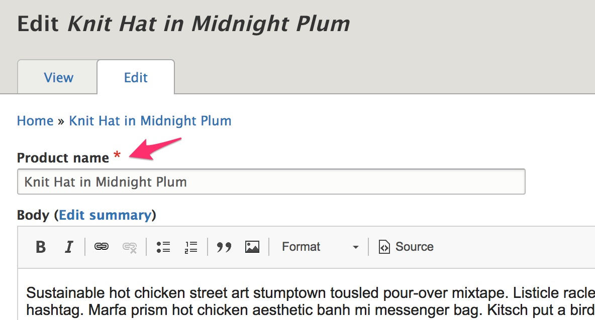

  If you want to write custom code to programatically create or manage products, you can use these code recipes as a starting point.

- **Create:**
 - [Products](#creating-products)
 - [Variations](#creating-variations)
 - [Attribute values](#creating-values-for-an-attribute)
- **Load:**
 - [Products](#loading-a-product)
 - [Variations](#loading-a-variation)
 - [Attribute values](#loading-an-attribute-value)
- **Manage product attributes:**
 - [Check if an attribute value exists](#checking-if-an-attribute-value-exists-within-a-particular-attribute-type)
 - [Assign attribute values to a variation](#assigning-attribute-values-to-a-variation)
- [**Alter the product title field label**](#altering-the-title-field-label)

### Creating products
- Since product variations are the purchasable parts of products, products need at least one variation.
- Since every product belongs to one or more stores, products need at least one store.

```php

    /**
     * uid [Integer]
     *   Foreign key of the user that created the product.
     *
     * type [String] - [DEFAULT = default]
     *   Foreign key of the product type being used.
     *
     * title [String]
     *   The product title.
     *
     * stores [Array(\Drupal\commerce_store\Entity\StoreInterface)]
     *   Array of stores this product belongs to.
     *
     * variations [Array(\Drupal\commerce_product\Entity\ProductVariationInterface)]
     *   Array of variations that belong to this product.
     */

    // The variations that belong to this product.
    $variations = [
      $variation_blue_large,
    ];

    $product = \Drupal\commerce_product\Entity\Product::create([
      'uid' => 1,
      'type' => 'my_custom_product_type',
      'title' => 'My Custom Product',
      'stores' => [$store],
      'variations' => $variations,
    ]);
    $product->save();

    // You can also add a variation to a product using the addVariation() method.
    $product->addVariation($variation_red_medium);
    $product->save();

    // Adding a variation to a product automatically creates a backreference on the variation.
    // You can access the product of a variation via:
    $variation->getProduct();

```

### Creating variations
```php


    /**
     * type [String] - [DEFAULT = default]
     *   Foreign key of the variation type to use.
     *
     * sku [String]
     *   The sku for this variation.
     *
     * status [Bool] - [OPTIONAL, DEFAULTS TO TRUE]
     *   [AVAILABLE = FALSE, TRUE]
     *   Whether or not it's enabled or disabled. 1 for enabled.
     *
     * price [\Drupal\commerce_price\Price] - [OPTIONAL]
     *   The price for this variation.
     *
     * title [String] - [POTENTIALLY NOT REQUIRED]
     *   The title for the product variation.
     *   If the variation type is set to generate a title, this is not used.
     *   Otherwise, a title must be given.
     */
    $variation = \Drupal\commerce_product\Entity\ProductVariation::create([
      'type' => 'my_custom_variation_type',
      'sku' => 'test-product-01',
      'status' => TRUE,
      'price' => new \Drupal\commerce_price\Price('24.99', 'USD'),
    ]);
    $variation->save();

```

###Creating values for an attribute
```php

    /**
     * attribute [String]
     *   Foreign key of the attribute we want.
     *
     * name [String]
     *   The name of this value.
     */
    $red = \Drupal\commerce_product\Entity\ProductAttributeValue::create([
      'attribute' => 'color',
      'name' => 'Red',
    ]);
    $red->save();

    $blue = \Drupal\commerce_product\Entity\ProductAttributeValue::create([
      'attribute' => 'color',
      'name' => 'Blue',
    ]);
    $blue->save();

    $medium = \Drupal\commerce_product\Entity\ProductAttributeValue::create([
      'attribute' => 'size',
      'name' => 'Medium',
    ]);
    $medium->save();

    $large = \Drupal\commerce_product\Entity\ProductAttributeValue::create([
      'attribute' => 'size',
      'name' => 'Large',
    ]);
    $large->save();
```

###Loading a product
```php

    // Loading is based off of the primary key [Integer]
    //   1 would be the first one saved, 2 the next, etc.
    $product = \Drupal\commerce_product\Entity\Product::load(1);

```

###Loading a variation
```php

    // Loading is based off of the primary key [Integer]
    //   1 would be the first one saved, 2 the next, etc.
    $variation = \Drupal\commerce_product\Entity\ProductVariation::load(1);

```

###Loading an attribute value
```php

    // Loading is based off of the primary key [Integer]
    //   1 would be the first one saved, 2 the next, etc.
    $red = \Drupal\commerce_product\Entity\ProductAttributeValue::load(1);
```

###Checking if an attribute value exists within a particular attribute type
```php
    // Look up while filtering by Attribute
    $productAttributeId = \Drupal::entityTypeManager()
          ->getStorage('commerce_product_attribute_value')
          ->condition('attribute', 'attribute_machine_name')
          ->condition('field_value', field_value)
          ->execute();
```

###Assigning attribute values to a variation
Let's say we want our hypothetical product to have two variations. One will be the color red and size medium, and the other will be the color blue and size large.
- If a Product Variation Type has fields for attributes, then variations of that type **MUST** have those attributes.

```php
    /**
     * attribute_<ATTRIBUTE_ID> [\Drupal\commerce_product\Entity\ProductAttributeValueInterface]
     *   The attribute value entity to use for the attribute type.
     */
    $variation_red_medium = \Drupal\commerce_product\Entity\ProductVariation::create([
      'type' => 'my_custom_variation_type',
      'sku' => 'product-red-medium',
      'price' => new \Drupal\commerce_price\Price('10.00', 'USD'),
      'attribute_color' => $red,
      'attribute_size' => $medium,
    ]);
    $variation_red_medium->save();

    $variation_blue_large = \Drupal\commerce_product\Entity\ProductVariation::create([
      'type' => 'my_custom_variation_type',
      'sku' => 'product-blue-large',
      'price' => new \Drupal\commerce_price\Price('10.00', 'USD'),
      'attribute_color' => $blue,
      'attribute_size' => $large,
    ]);
    $variation_blue_large->save();
```

### Altering the title field label
The following example will change the label for the product name from *Title* to *Product name*.



```php

    use Drupal\Core\Entity\EntityTypeInterface;

    /**
     * Implements hook_entity_base_field_info_alter().
     */
    function mymodule_entity_base_field_info_alter(&$fields, EntityTypeInterface $entity_type) {
      if ($entity_type->id() == 'commerce_product') {
        // Change the title field label.
        $fields['title']->setLabel(t('Product name'));
      }
    }
```

