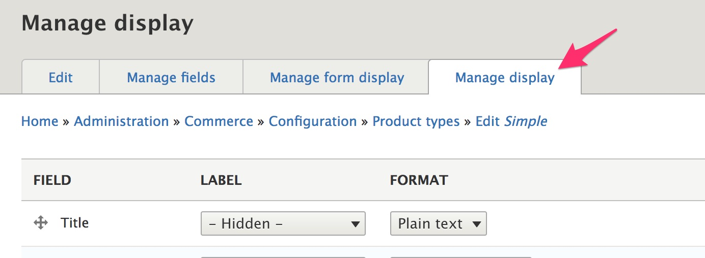
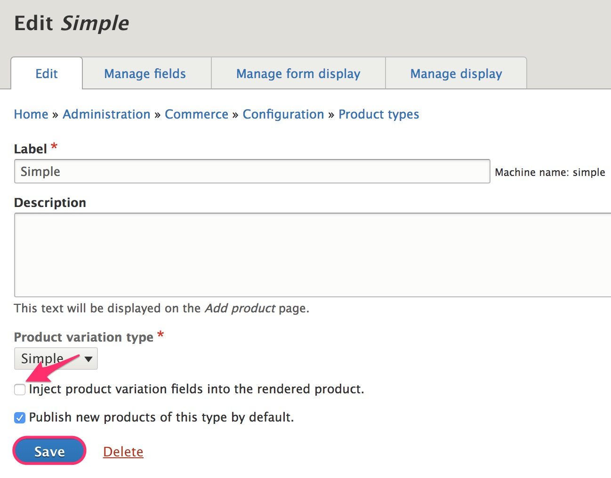
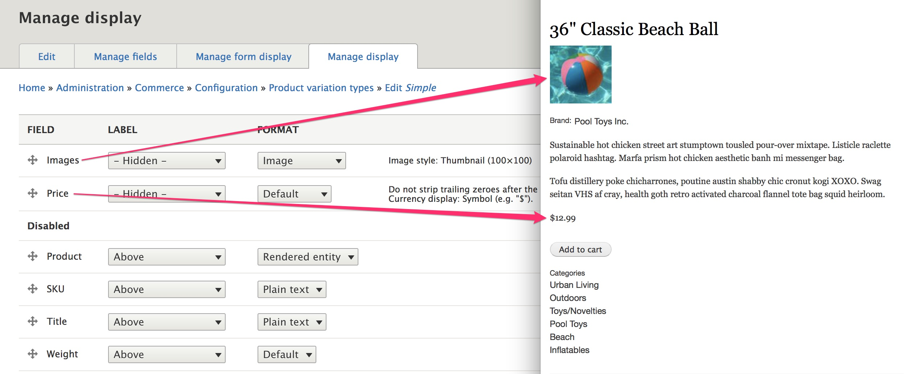
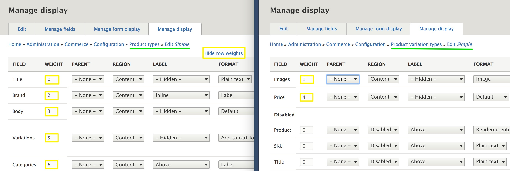
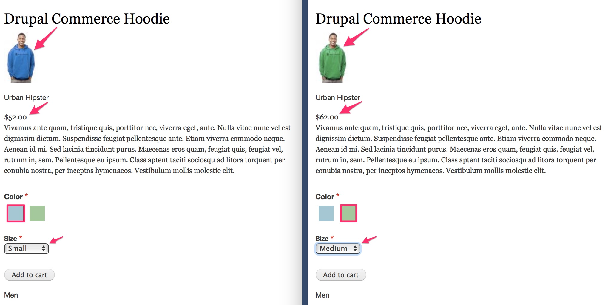

This section describes how to customize the product pages that are displayed on your site. We will look at how to manage configuration for products and variations using the *Manage display* form for product types.

#### Prerequisites
- Creating the [Simple product type](../../02.product-architecture/01.simple-product)

### Product variation field injection

When a product type is created, the, *Inject product variation fields into the rendered product* configuration setting is enabled by default. To see what that setting does, let's start by *disabling* product variation field injection for the Simple product type, using its *Edit* form.

In the following image, we have the *Manage display* configuration form for the Simple product type on the left. To the right, we have a Simple product as it's displayed on the site. You can see that the order of the fields matches up, and labels are displayed as expected.

> The *Add to cart form* formatter is used by default for the *Variations* field, to display an *Add to cart* button instead of variations data (like title, price, and attributes). Configuration for the *Add to cart form* formatter is explained in [the next section](../02.add-to-cart-form).

But what if you want the *Add to cart* button/form **and** variations data displayed on your product page? That's what the *product variation field injection* setting gives you. Enable the setting, and you'll see additional fields that come from the *Manage display* configuration for the *Product variation type*. This is the same Simple product with product variation field injection enabled:

The fields from the Product variation type display are combined with those of the Product type display. At this point, you may be wondering how to control the positions of the Product variation fields, in relation to the Product fields. When a product is rendered, *all* the product and product variation fields are sorted based on weight. To control the field positions, you should use the *Show row weights* link to explicitly set the weight for each field. This link is located at the top-right of each *Manage display* configuration form.

In this image, the *Manage display* configuration form for the Simple Product type is on the left; the *Manage display* configuration form for the Simple Product variation type is on the right. *Show row weights* has been enabled. The weight values have been set so that the Product variation *Images* field is displayed after the Product *Title* field, and the Product variation *Price* field is displayed after the Product *Body* field.

#### Product variation field injection with multiple variations

In the previous section, we looked at product variation field injection for the *Simple* product type, which is a product type with no attributes and only a single variation per product. For product types with attributes and multiple variations, the values that are rendered for the product variation correspond to the *currently selected* product variation.

In this example, we have a Product type with two attributes, Color and Size. The *Drupal Commerce Hoodie* has a price of $52.00 for Size Small and $62.00 for Size Medium. When the selected product variation is changed from the default Blue / Small to Green / Medium, both the Product variation
*Image* and Product variation *Price* fields are updated on the displayed page.

### Links and resources
* [Changing Content Display (Drupal user guide)](https://www.drupal.org/docs/user_guide/en/structure-content-display.html)

---
In the next section, we'll look at how you can customize the Add to cart form.
