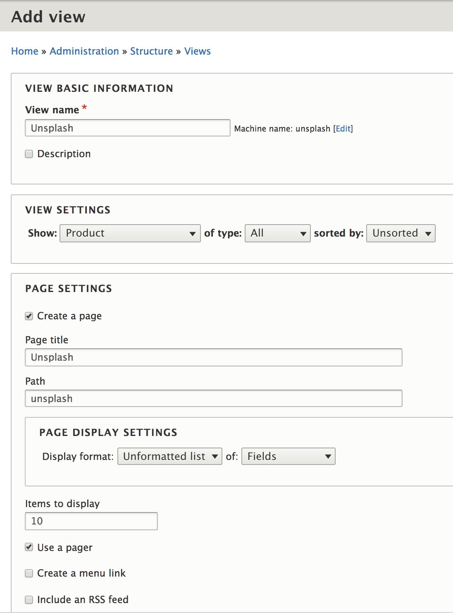
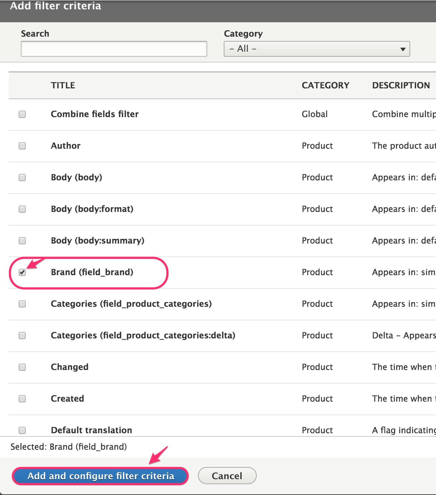
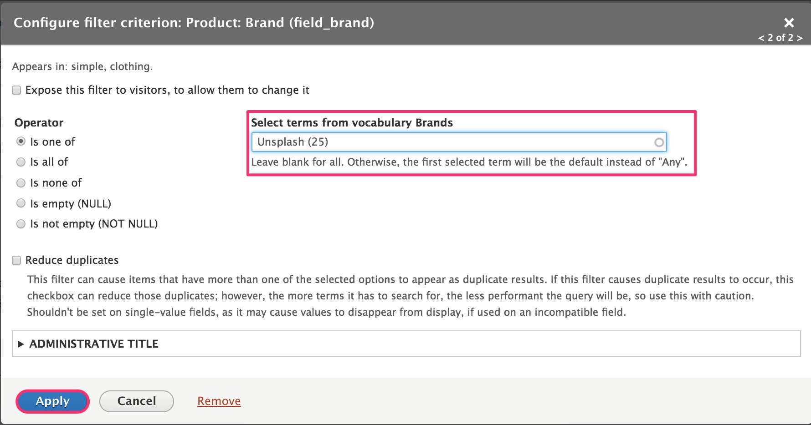
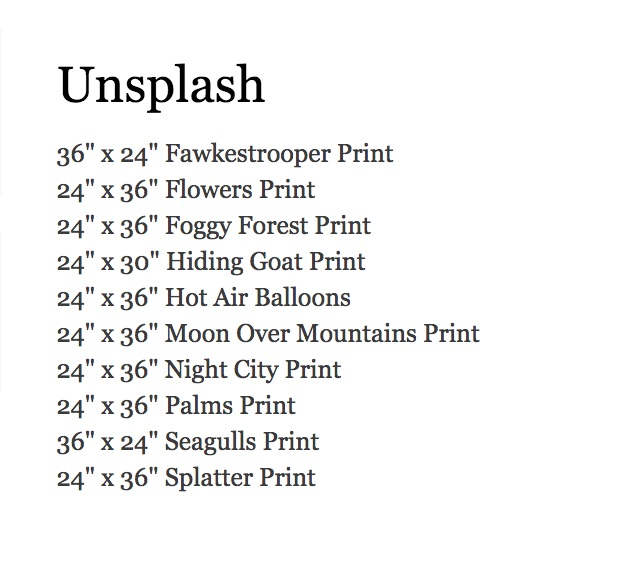
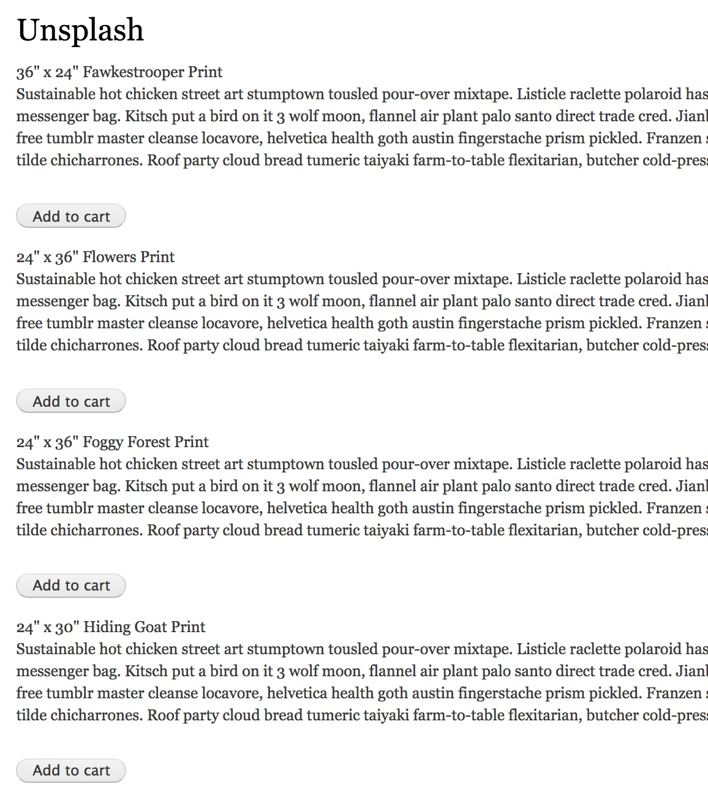

This section describes how you can create a page that displays multiple products, with [Add to cart forms](../02.add-to-cart-form), using the [Drupal Views module].

In (some page in basic setup), we added a "Brand" field to our product types. In this example, we'll create a page that lists all products for one particular brand: "Unsplash".

### Create the "Unsplash" View

1. Navigate to the Views administration page and click the "Add view" button: `/admin/structure/views`.
2. Under "View basic information", enter the "View name" as "Unsplash".
2. Under "View settings", select "Product" of type "All".
3. Under "Page settings", check the "Create a page" checkbox. The default settings are fine.
4. Click "Save and edit" to create the new view.

### Filter products by the "Unsplash" brand

At this point, our Unsplash view is set up to show *all* products that are published/active. We need to filter the list of products to that only "Unsplash" products are displayed. To do that, use the "Filter criteria" section of the View administration page.

1. Click the "Add" button next to "Filter criteria".
2. Select "Brand (field_brand)" on the "Add filter criteria" form.
3. Click "Add and configure criteria".

4. On the next form, you can leave the default "Brands" vocabulary and "Autocomplete" selection type selected.
5. Click "Apply and continue".
6. On the "Configure filter criterion" form, enter "Unsplash" into the "Select terms from vocabulary Brands" textbox. You can leave the other settings set to their default values.
7. Click the "Apply" button to complete the creation of the "Unsplash" branch filter criterion.
8. Save the View by clicking the "Save" button.

At this point, if you navigate to the page that was created for this view (`/unsplash`), you'll see the Titles of only "Unsplash" brand products displayed.

### Add Product fields to the page display

For this View, we've selected an "Unformatted list" of "Fields" as the format. By default, only the Product Title field is displayed. Let's add Product "Body" text and the Add to cart form.

1. Click the "Add" button to the right of the "Fields" heading.
2. Select "Body" and "Variations" from the list of field options and click the "Add and configure fields" button.
3. For the "Body" field, select the "Summary or trimmed" formatter option to reduce the amount of text displayed for each product. Click the "Apply" button.
4. For the "Variations" field, select "Add to cart form" as the Formatter and check the, "Combine order items containing the same product variation" option. Click the "Apply" button.
5. Save the changes to the View by clicking the "Save" button.

We now have a list of "Unsplash" brand products displayed with some descriptive text and an "Add to cart" button. If these products had multiple variations, an Add to cart form would be displayed with options for selecting a specific product variation.

### Customizing the page display

The View configuration form can be used to customize your page display in a variety of ways. Here are some to consider:

* Using the Format/Format setting, change the Format to a table or grid.
* Using the Format/Show setting, display each product as a rendered entity, utilizing a custom View mode.
* Using the Fields settings,
 - reorder the fields.
 - add additional fields.
 - add custom HTML or css classes to the output.
* Using Filter Criteria settings, allow end-users to specify the Brand to be displayed by using Exposed filters.
* Using Sort Critiera settings, add criteria for Sorting the list (or allow end-users to control the sort themselves).
* Using Page Settings, change the path or create a menu for the page.
* Add a Header or Footer to the page.
* Using Page settings, configure pager options.

Additionally, to make changes to the way the Add to cart form is displayed, any of the options presented in the [Add to cart form documentation](../02.add-to-cart-form) can also be applied here.

---
In the next section...

[Drupal Views module]: https://www.drupal.org/docs/8/core/modules/views