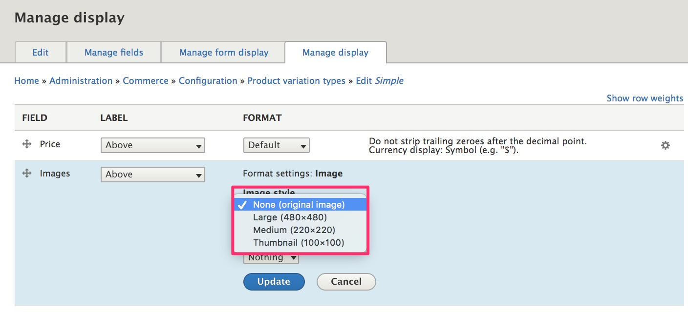
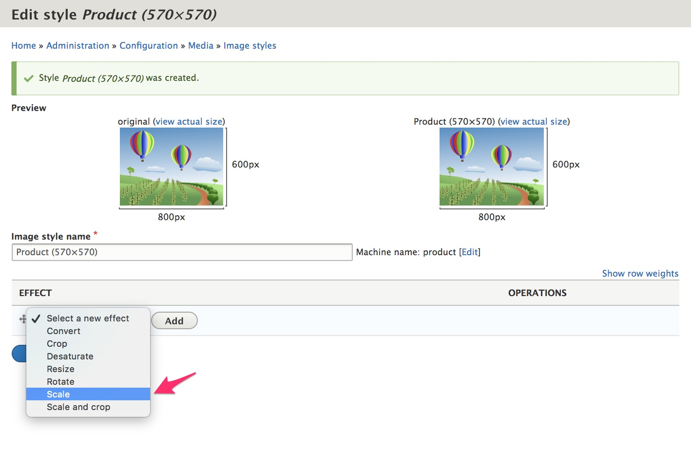
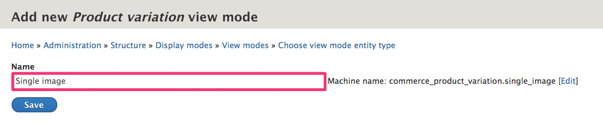
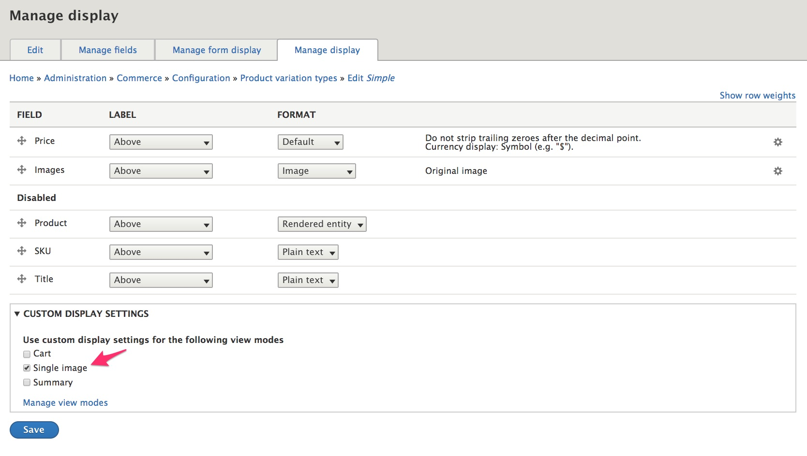
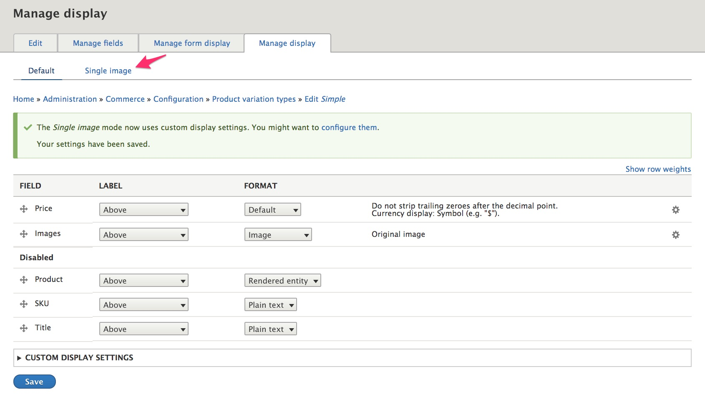
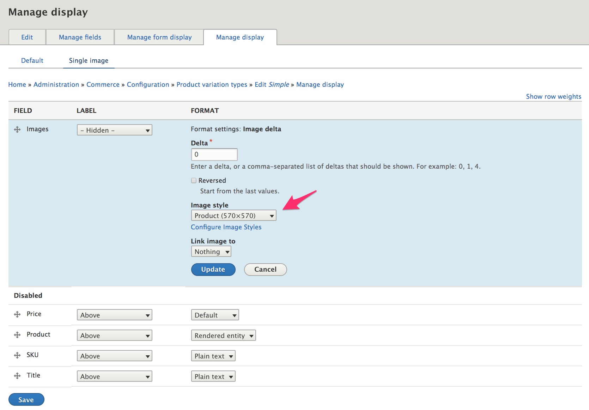

This page includes tips and useful modules for displaying product images in Drupal Commerce.

### Drupal Core Image module
The [Image module] defines the image field type and provides image manipulation tools. It is installed by default in a standard Drupal 8 site. To help maintain consistency for the display of your product images, you can set up a custom image style. This image style will appear as one of the options for *Image* field formatters.

##### **Example:** Create a Product image style
1. Navigate to the Image styles administration page at `/admin/config/media/image-styles`.
2. Click the *Add image style* button.
3. Enter "Product (570×570)" for the Image style name.
4. Click the *Edit* button next to the automatically created Machine name to change the machine name to "product".
5. Select the *Scale* Effect.

6. Click the *Add* button to add the Scale effect.
7. Enter "570" for both the Width and the Height values.
8. Click the *Add effect* button.

The *Product (570x570)* image style will now appear as an option for Image field formatters.

#### Image Delta Formatter module
The [Image delta formatter module] provides a custom formatter for image fields that are configured for multiple images. It allows the user to specify which images (deltas) should be displayed. It can be useful in cases in which a product or product variation has multiple images, but in a certain context, you only want to display a single image. For example, if you want to display multiple products in a uniform grid layout, showing just a single image per product looks best.

##### **Example:** Create a custom *Single image* view mode for product variations
See the [Multi-product displays documentation](../05.multiple-products) for an example of how this custom view mode can be used.
1. Start by installing the Image delta formatter module [in the usual way](../../../02-install-update/-6.extending).
2. Navigate to the View modes administration page at `/admin/structure/display-modes/view`.
3. Scroll down to the *Product variation* entity type and click the *Add new Product variation view mode* link.
4. Enter "Single image" for the Name and click the *Save* button.

5. Navigate to the Manage display administration page for your product variation type at `/admin/commerce/config/product-variation-types/simple/edit/display` (for the [*Simple* product variation type](../../02.product-architecture/01.simple-product)).
6. Click on *Custom Display Settings* to enable the *Single image* view mode.

7. Click the *Save* button.
8. Click on the *Single image* link that now appears at the top of the Manage display administration page.

9. Drag the *Price* field to the *Disabled* section.
10. Set the *Images* field Label to *Hidden*.
11. Set the *Images* field Format to *Image delta*.
12. Click the gear icon in the rightmost column to set the image delta formatter's *Image style* to the *Product (570x570)* image style (or another preferred image style).

13. Click the *Update* button to close the formatter configuration form.
14. Click the *Save* button to save the settings for the Single image product variation display.

The *Single image* view mode will now be an option for displaying product variations.

#### Single media
The [Single media](https://www.drupal.org/project/single_media) is very similar to previous one, but provides field formatter for **media** fields that are configured for multiple images.

### Links and resources
* Drupal 8 User Guide documentation on [Concept: Image Styles]

[Image module]: https://www.drupal.org/docs/8/core/modules/image
[Image delta formatter module]: https://www.drupal.org/project/image_delta_formatter
[Concept: Image Styles]: https://www.drupal.org/docs/user_guide/en/structure-image-styles.html

