In this section, we'll transform the [Basic product search](../01.product-search) page we already created into a Product catalog page with faceted search functionality. We'll use the Brands and Product categories taxonomies we created in the [Product categories documentation](../../02.product-architecture/03.product-categories). We'll also incorporate the [Add to cart form](../../04.displaying-products/02.add-to-cart-form) into our product catalog listing to encourage browsing users to become buying customers.

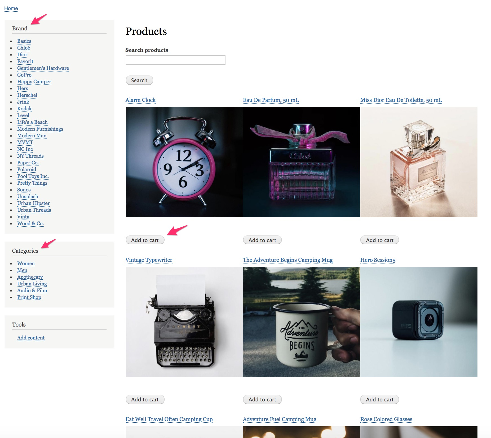

#### Configure Search API
For the [Basic product search](../01.product-search), we installed Search API modules, added a server and an index, and selected the fields to be indexed for the search. For a faceted product catalog, we can use the same server and index. We'll just add a few additional fields and configure an additional processor.

**Add fields to the Products search index**
1. Navigate to the Products search index fields administration page at `/admin/config/search/search-api/index/products/fields`.
2. Click the *Add fields* button.
3. For the facets, add the *Brand* and *Categories* fields.
4. For the Add to cart form, add the *Variations* field.
5. Click the *Done* button to add the fields.
6. Click the *Save changes* button.
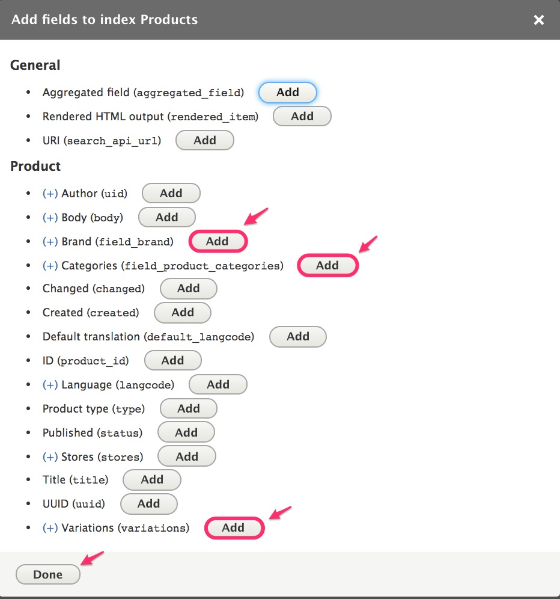

**Enable the *Index hierarchy* processor**

Since Categories is a hierarchical taxonomy, we'll enable the hierarchy processor.
1. Navigate to the Products search index processors administration page at `/admin/config/search/search-api/index/products/processors`.
2. Select *Index hierarchy* as an enabled processor.
3. In the Processor settings section, select *Categories* as the field to which hierarchical data should be added.
4. Click the *Save* button.
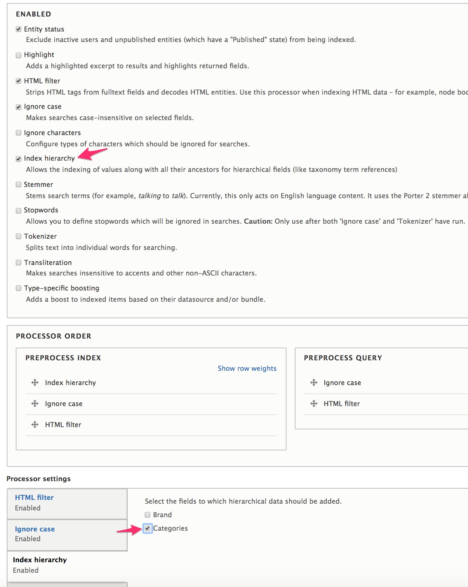

#### Configure the product catalog view
We're going to build upon the Product search view we created for the [Basic product search documentation](../01.product-search), to save a few steps here. The following steps assume that you have already created a view and will add an additional display. Alternatively, you could create the view and then make changes directly to the original *Page* view for your faceted product catalog page.

**Add a Product catalog display to the product search view**
1. Navigate to the administration page for the Product search view at `/admin/structure/views/view/product_search`.
2. Click the *Add* button under *Displays* to add a new *Page* display.
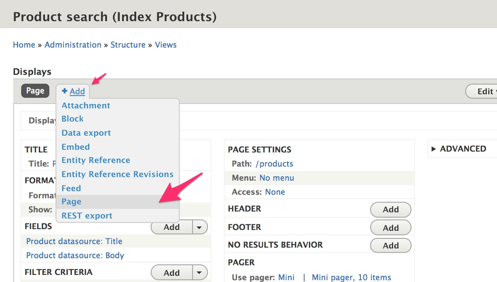
3. Click the *Page 2* link next to *Display name* to change the display name to "Product catalog".
4. In the Page settings section, click the *No path is set* link next to *Path* to set the path to "product-catalog".
5. In the Pager section, change the Items per page to "12".
6. In the *Advanced* section, under *Other*, change the *Caching* setting to "Search API (tag-based)". Otherwise, facets break:
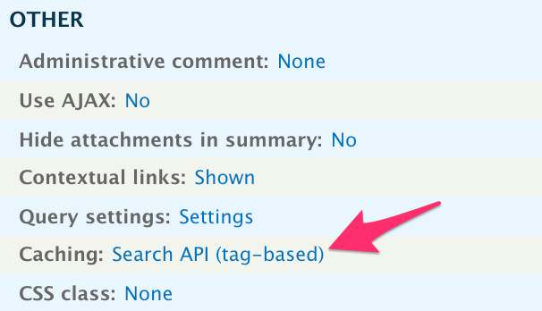

**Customize the product catalog display**
>For these steps, make sure that you select *This page (override)* before applying changes. Also, see [Configure the Product Brand View fields](../../04.displaying-products/05.multiple-products#configure-the-product-brand-view-fields) in the Multi-product displays documentation for a more detailed description, with screenshots, of the configuration options we're applying here.

1. In the Format section, click the *Unformatted list* link next to *Format* to select *Grid* for the view style. Then click the *Settings* link next to Grid to change the number of columns to 3.
2. Remove the *Product datasource: Body* field.
3. Add a *Variations (Product datasource)* field.
 - Select *Use entity field rendering*.
 - Select *Rendered entity* for the Formatter.
 - Select *Single image* for the View mode.
 - Enter "1" for the number of values to display.
4. Add a second *Variations (Product datasource)* field.
 - Select *Use entity field rendering*.
 - Select *Add to cart form* for the Formatter.
 - Enter an Administrative title to distinguish this variations field from the other.

If you navigate to the product catalog page, at `/product-catalog`, we now have a searchable grid-style product catalog, with add-to-cart buttons. Only the facets are missing.
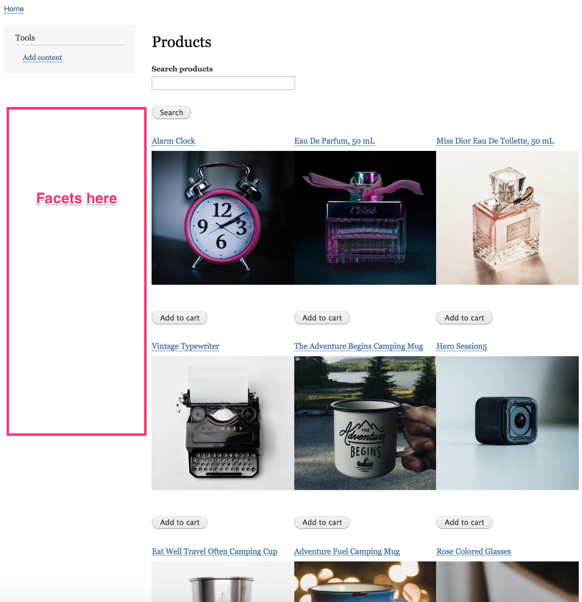

#### Create facets
**Install and administer facets**
1. Add and install the [Facets module]. (*See the [documentation on extending Drupal Commerce](../../../02.install-update/06.extending).*)
2. Navigate to the Facets administration page at `/admin/config/search/facets`, where you will see all existing views of type DB index.

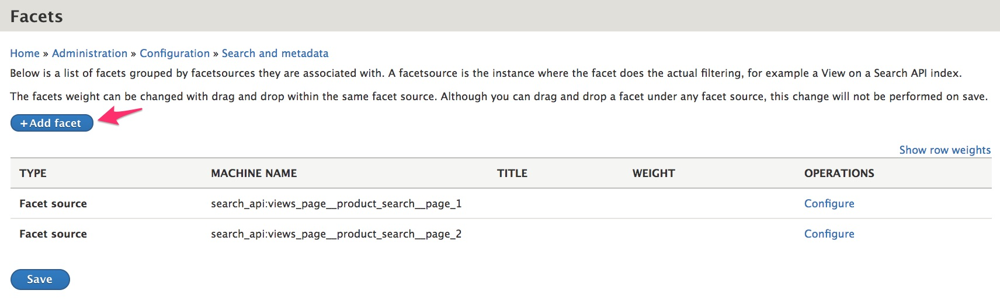

**Add the Brand facet**
1. Click the *Add facet* button on the Facets administration page.
2. For the Facet source, select the view and display for which you want to create facets.
3. Select the field to be used as the data source for the facet. In this case, we'll select the Brand field.
4. Enter a name for the facet, like "Brand".
5. Cick the *Save* button.

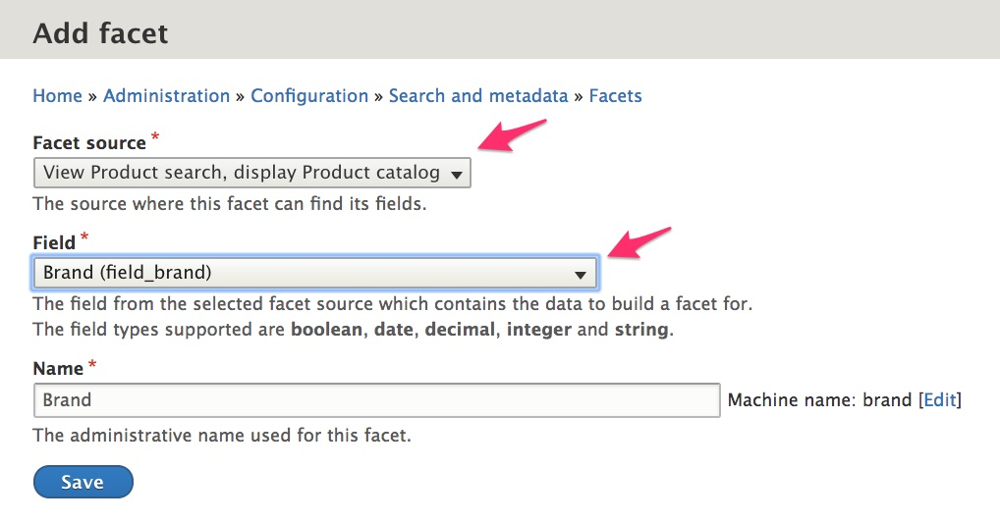

**Configure the Brand facet**
1. In the Facet Settings section, select *Transform entity ID to label* so that the Brand names will be displayed instead of their numeric IDs.
2. In the Facet Sorting section, de-select *Sort by active state* and *Sort by count* so that products will appear alphabetically.
3. Click the *Save* button to apply the changes.

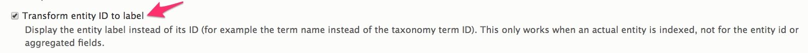
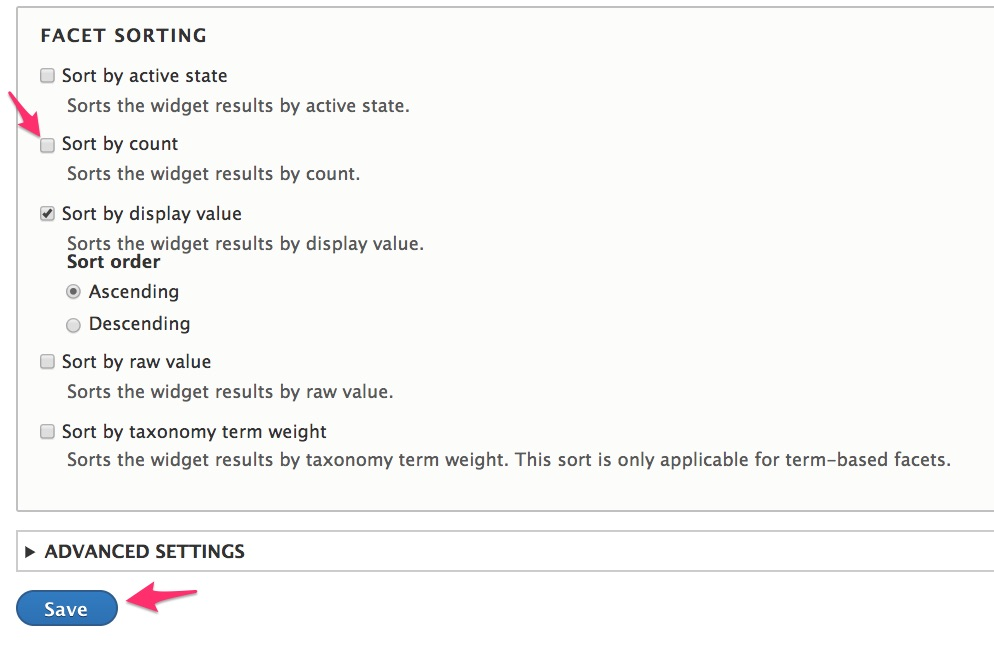

**Add the Categories facet**
1. Return to the Facets administration page at `/admin/config/search/facets`.
2. Repeat the *Add the Brand facet* steps to add a facet for the *Categories* field.

**Configure the Categories facet**
1. In the Facet Settings section:
 - Select *Transform entity ID to label*.
 - Select *Use hierarchy*, since Categories is a hierarchical taxonomy.
2. In the Facet Sorting section, select only *Sort by taxonomy term weight* to use the ordering previously set for the Categories taxonomy.
3. Click the *Save* button to apply the changes.

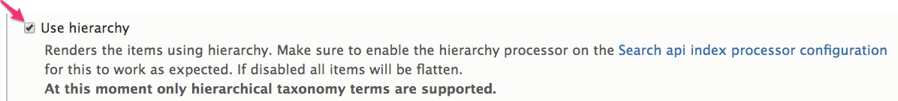
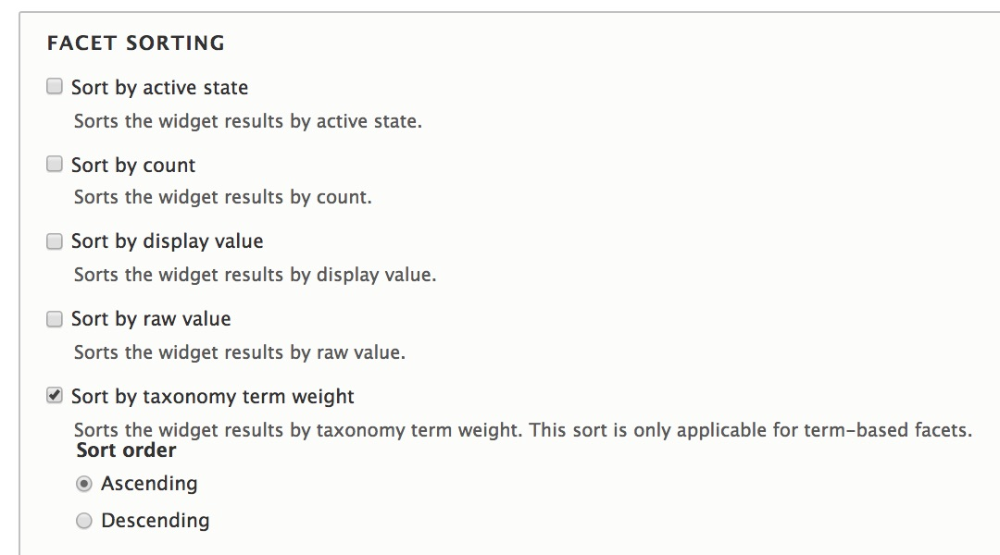

We have now created two facets, which can be viewed on the Facets administration page and are available as blocks.

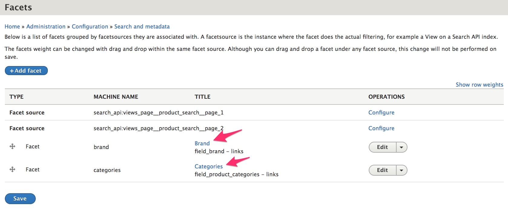

**Place facets block on the product catalog page**
1. Navigate to the Block layout administration page at `/admin/structure/block`.
2. Click the *Place block* button for the *Sidebar first* region.
3. Click the *Place block* button for the Facets *Brand* block.

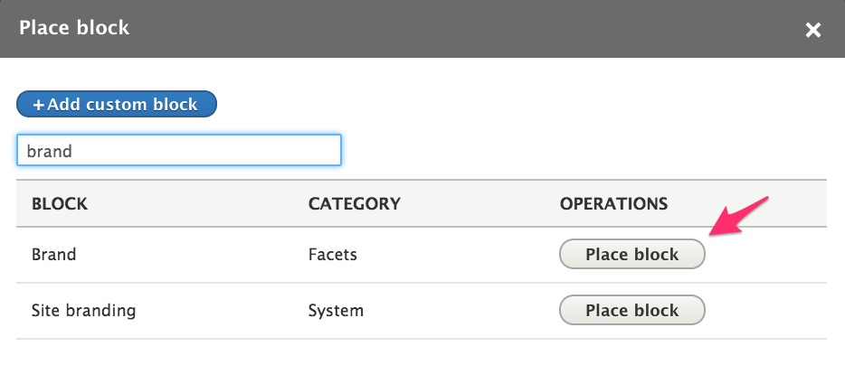

4. For the *Configure block* settings, the default values are fine. Click *Save block* to add the Brand block.
5. Repeat steps 2-4 for the Facet *Categories* block.
6. Rebuild the cache and navigate to the Product catalog page at `/product-catalog` to view the results.

For the screenshot below, I selected the *Urban Living* Category. Then its five sub-categories appeared. Selecting *Toys/Novelties* reduced the number of matching products to just two. Notice that only the single *Pool Toys Inc.* Brand is listed, since that is the brand for both toys.
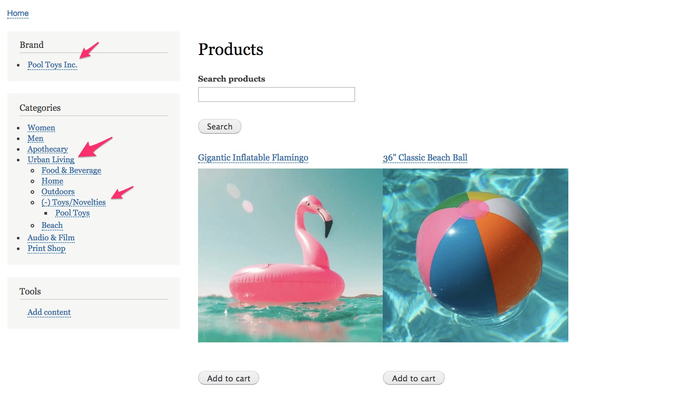

### Links and resources
* [Search API module documentation]
* Drupal 8 User Guide documentation on [Creating Listings with Views]
* Drupal 8 User Guide documentation on [Concept: Blocks]

---
In the next section...

[Search API module documentation]: https://www.drupal.org/docs/8/modules/search-api
[Creating Listings with Views]: https://www.drupal.org/docs/user_guide/en/views-chapter.html
[Facets module]: https://www.drupal.org/project/facets
[Concept: Blocks]: https://www.drupal.org/docs/user_guide/en/block-concept.html
