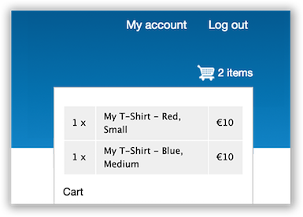
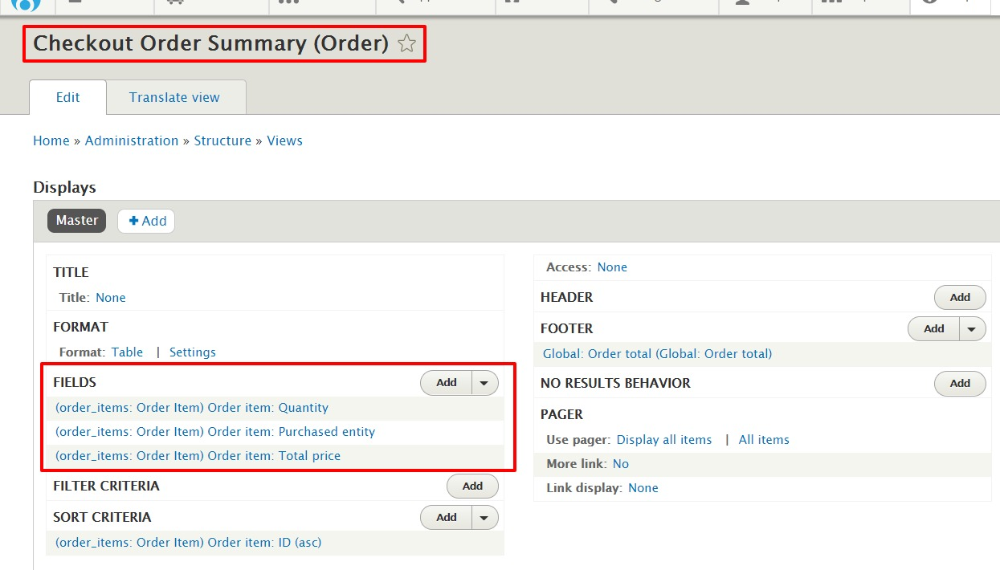
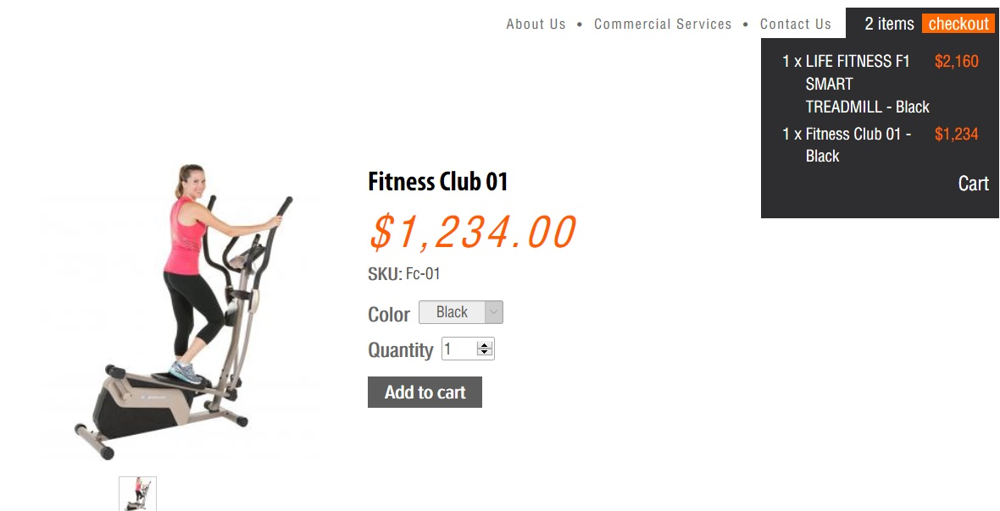

Drupal Commerce provides highly customizable "Shopping Cart" block which can be placed anywhere on site , using block , showing cart contents on all pages, and the ability for customers to add or remove cart contents.

<blockquote>Shopping cart lets customers continue browsing the website but still know how many items has been added to their shopping cart and manage their current order.</blockquote>

Both the block and checkout page are quite dynamic, and can easily be <a href="#manipulate">customized</a> via the Views user interface and themed to match your site, just like any other listing built in the View module.

Your shopping cart and checkout process should look great right out of the box. But everybody wants something a little different and so there is a lot you can do to make your cart page unique to your store. We'll outline the tweaks which are available below so you can personalize your cart to just how you like it.  The html markup as well as the associated stylesheets of Cart Block can be easily adapted to match existing theme style.

The shopping cart is represented by a Drupal block shown in figure 1 that consists of a View Listing(fig 2) the line items on the cart order with a footer summarizing the items on the order and linking to the cart page and checkout form.


<i>Fig 1 - A Collapsible Shopping Cart showing number of items per product and cost</i>

<h2>Customizing the Mini Cart templates and styles</h2>
<ol>
  <li>Copy files <code>commerce-cart-block.html.twig</code> and <code>commerce-cart-empty-page.html.twig</code> from <code>modules\contrib\commerce\modules\cart\templates</code> to your theme folder. For better folder organization you can copy these files to <code>your-theme-folder/templates/cart</code>  i.e.  <code><i>your-theme-folder/templates/cart/commerce-cart-block.html.twig your-theme-folder/templates/cart/commerce-cart-empty-page.html.twig</i></code></li>
  <li>Once the files have been copied, you will need to clear Drupal Cache from <strong>Administration > Configuration > Development</strong>. You will then be able to customize the look and feel of the cart using twig and css.</li>
</ol>

<h2 id="manipulate">Manipulating Fields in the Cart Summary</h2>
<strong>Shopping cart Summary view</strong> allows you to easily manipulate cart fields it works seamlessly out of the box.
 
<ul>
  <li>Open the Views admin page by selecting <strong>Structure → Views</strong> from the Drupal admin menu</li>
  <li>Locate the <strong>Shopping cart summary</strong> view and click the associated edit button</li>
  <li>You can edit/remove the fields under Fields Row</li>
</ul>

  
  <i>Fig 2 - The default shipping cart block is entirely configurable via the Views user interface</i>
<ul><li>Once Done, Save the field and the view</li></ul>

<h2>Overriding the cart stylesheets</h2>

Often you might find yourself undoing what the core cart stylesheets have defined. Instead of fighting with styles, you can actually replace or outright remove the stylesheet using your theme's <code>info.yml</code> file. Below we walk you through the process
The <code>commerce_cart.layout.css</code> and <code>commerce_cart.theme.css</code> files provide the styling which you can override in your own stylesheets using regular <a target="_blank" href="https://www.drupal.org/docs/8/theming-drupal-8/adding-stylesheets-css-and-javascript-js-to-a-drupal-8-theme#override-extend">Drupal</a> theme procedures. To override the cart stylesheet you can add following to your <code>yourtheme.info.yml</code> file

```yaml
libraries-override:
  commerce_cart/cart_block:
    css:
      layout:
        css/commerce_cart.layout.css: css/commerce_cart.layout.css
```

Or to completely disable the Cart stylesheet

```yaml
libraries-override:
  commerce_cart/cart_block:
    css:
      layout:
        css/commerce_cart.layout.css: false
```

In this case the file has been overridden with <strong>false.</strong>
 

<i>Fig 3 - illustrates how you can turn Shopping Cart into a fully custom shopping cart </i>

<h2>Why we don't merge carts</h2>

Drupal supports both anonymous and authenticated shopping carts and checkout. Authenticated users can preserve items in their shopping carts so they would see the same items when logging in from multiple devices or across multiple sessions.

This resulted in a small conflict that we had to figure out how to deal with: users could have items in their authenticated shopping carts but browse the site anonymously, create a new shopping cart, and then log in. What should happen to the items in their authenticated carts vs. the items in their anonymous carts?

There are three basic resolutions: combine the shopping carts together so the user still has a single shopping cart, remove the items from the previous session and leave it up to the customer to find them again if desired, or retain the old shopping cart but ignore it until the customer has completed checkout for the current cart.

In Drupal Commerce we changed course to retain the old cart but, from the customer's point of view, treat that anonymously created cart as the current cart after login.

There is an appropriate hook (hook_commerce_cart_order_convert()) so developers could alter this behavior on a site-by-site basis as need be.
Allows modules to perform additional processing to convert an anonymous shopping cart order to an authenticated cart.
