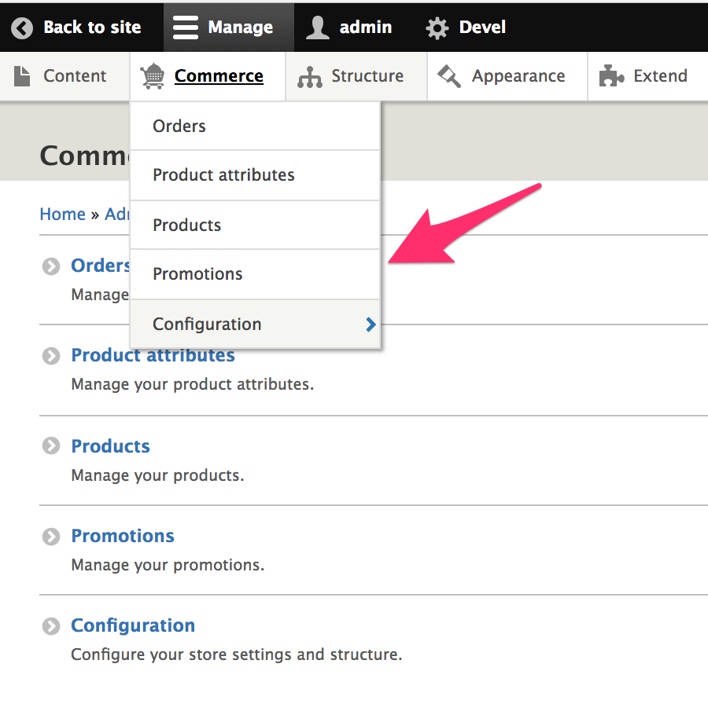
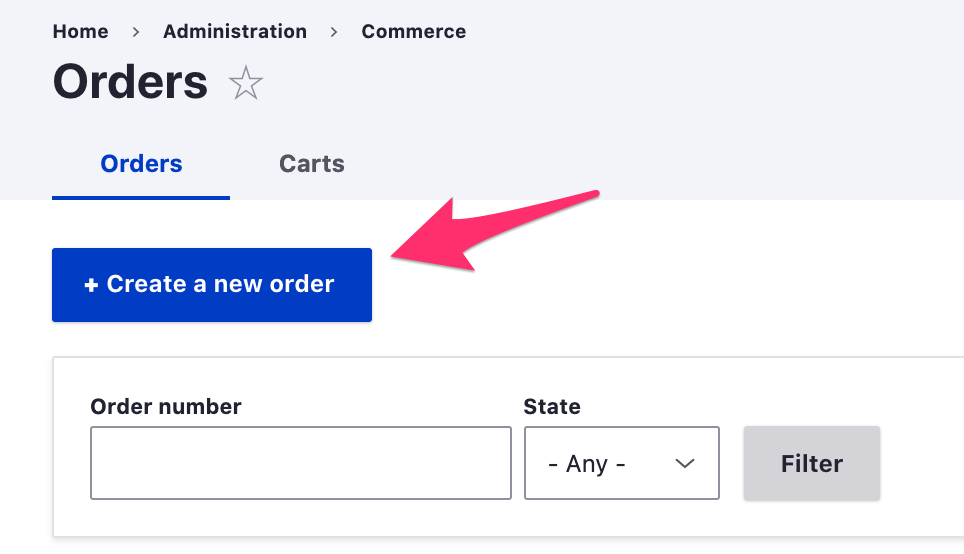

If you're looking at Drupal Commerce for the first time, you may be wondering, "where are the customers?" Under the *Commerce* administrative menu, you can see Orders, Products, and Promotions, but there is no item for *Customers*.

*Drupal Commerce* has been designed to allow developers to build ecommerce sites without an overly rigid structure for managing customers and their data. Instead, developers can take a wide variety of approaches with respect to *customers*. For example, you may already have CRM and marketing systems in place within your organization. In that case, you can adopt a minimalistic setup for your customers within Drupal Commerce and then feed the data into your existing external system(s). Conversely, if you do want your Drupal site to be an all-in-one ecommerce solution, you can extend the basic framework provided to customize and organize your customer information however you like, to suit your specific business logic.

Drupal Commerce is dependent upon three separate modules for its customer data:
- The Drupal core [User module](#user-module)
- The contributed [Profile module](#profile-module)
- The contributed [Address module](#address-module)

#### User module
The [User module] is provided by Drupal Core and is required for all Drupal sites. In Drupal, anyone who visits your website is a *user*. When a user registers on your site, a *user account* is created to store information including email address, username, and password. If you are unfamiliar with the concepts of users and user accounts in Drupal, you will want to read about [Managing User Accounts] in the Drupal 8 User guide.

In Drupal Commerce, a *customer* is any *user* who places an order. Whenever an order is created, the current user is assigned to that order. Administrative users can also create orders on behalf of customers by explicitly assigning them to orders.

The *user accounts* that belong to registered customers serve as *customer accounts* within Drupal Commerce. Each customer account has one or more *customer profiles*, which are provided by the *Profile* module.

For additional information about how to customize and manage *customer accounts* in Drupal Commerce, see the [Customer accounts documentation page](../04.customer-accounts).

#### Profile module
The [Profile module] is a popular, well-maintained Drupal 8 contributed module that is required by Drupal Commerce. Drupal Commerce defines its own type (bundle) of profile, called the *customer profile*. Customer profiles contain collections of data required to process orders such as billing information, shipping information, and other types of details. Orders and payment methods have *billing* profiles, and if you have physical products that require shipping, your shipments will have *shipping* profiles. Drupal Commerce provides just a single type of profile, the *customer profile*, to be used everywhere so that it's possible for customers to elect to use the *same* profile for both billing and shipping.

Customers can have multiple billing and shipping profiles. Each *customer profile* has a single *address* field, which is provided by the *Address* module. The collection of all profiles belonging to a customer account is called the customer's *address book*. All profiles are *revisionable*, and orders/payments/shipments all reference specific revisions of profiles so that the integrity of the data at the time of the order/payment/shipment is maintained even if the customer's profile data is subsequently updated.

For additional information about how to customize and manage *customer profiles* in Drupal Commerce, see the [Profiles documentation section](../03.profiles).

#### Address module
The [Address module] is another popular, well-maintained Drupal 8 contributed module that is required by Drupal Commerce. It provides functionality for storing, validating, and displaying international postal addresses. Within Drupal Commerce, customer addresses are all encapsulated into *customer profiles*. They do not exist independently, and every customer profile should have exactly one address.

For additional information about how to customize address data entry forms and the display of addresses in Drupal Commerce, see the [Addresses documentation section](../02.addresses).

[User module]: https://www.drupal.org/docs/8/core/modules/user
[Profile module]: https://www.drupal.org/project/profile
[Address module]: https://www.drupal.org/project/address
[Managing User Accounts]: https://www.drupal.org/docs/user_guide/en/user-chapter.html
