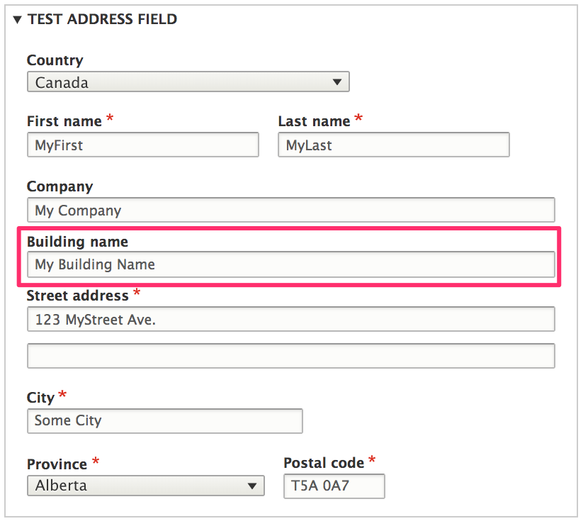
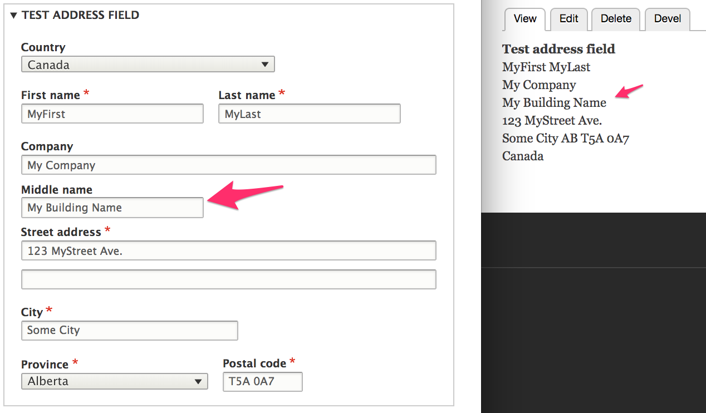

Each country has a different address format that tells us:

* Which fields are used in which order (Is there a state field? Does the zip code come before the city? After the state?)
* Which fields are required
* Which fields need to be uppercased for the actual mailing to facilitate automated sorting of mail
* The labels for the administrative area (state, province, parish, etc.), and the postal code (Postal code or ZIP code)
* Validation rules for postal codes, usually in the form of a regular expression.

In countries using a non-latin script (such as China, Taiwan, Korea), the order of fields varies based on the language/script used. Addresses written in latin script follow the minor-to-major order (start with the street, end with the country) while addresses written in the chinese script follow the major-to-minor order (start with the country, end with the street).

All this needs to be taken into account when generating and validating an address form. Selecting a different country requires re-rendering the address form using a different format.

Each address can have the following properties:

Given name (First name)
Additional name (Middle name / Patronymic)
Family name (Last name)
Organization
Address line 1
Address line 2
Postal code
Sorting code
Dependent Locality (Neighborhood / Suburb)
Locality (City)
Administrative area (State / Province)
Country
 - note: country code is limited to available countries*

Field settings:
- langcode_override: available for multilingual sites; use this setting to ensure that entered addresses are always formatted in the same language.

- field_overrides: see address-entry docs

### Repurpose unused field for a custom field
Suppose you need to have a *Building name* field. For any countries that include *Company* (Organization) in their address format, *Building name* should be included on the subsequent line.



We can't create an additional address field, but we can repurpose an existing one we don't need. In this example, we assume that we don't need to use the *Additional name* (middle name) field. Let's look at how we can repurpose this unused field for a custom, *Building name* field.

First, we'll implement an *EventSubscriber* for the `AddressEvents::ADDRESS_FORMAT` event, to customize the address formats for all countries. This example assumes that we have already created a custom module, named *mymodule*. Here is our event subscriber class, `BuildingNameEventSubscriber.php`:

```php
<?php

namespace Drupal\mymodule\EventSubscriber;

use Drupal\address\Event\AddressEvents;
use Drupal\address\Event\AddressFormatEvent;
use Symfony\Component\EventDispatcher\EventSubscriberInterface;

/**
 * Repurposes additional name field as building name.
 */
class BuildingNameEventSubscriber implements EventSubscriberInterface {

  public static function getSubscribedEvents() {
    $events[AddressEvents::ADDRESS_FORMAT][] = ['onAddressFormat'];
    return $events;
  }

  public function onAddressFormat(AddressFormatEvent $event) {
    $definition = $event->getDefinition();

    // Place %additionalName after %organization in the format.
    $format = $definition['format'];
    $format = str_replace('%additionalName', '', $format);
    $format = str_replace('%organization', "%organization\n%additionalName", $format);
    $definition['format'] = $format;

    $event->setDefinition($definition);
  }

}
```

Next, we need to add our custom event subscriber to the module's services YAML file, `mymodule.services.yml`:
```YAML
services:
  mymodule.subscriber:
    class: Drupal\mymodule\EventSubscriber\BuildingNameEventSubscriber
    tags:
      - {name: event_subscriber}
```

After rebuilding caches, the *Middle name* field now appears immediately after the *Company* field on both the address form and the displayed address:



Finally, we need to relabel *Middle name* as *Building name* and change its textfield size to match the *Company* textfield. We'll do this by modifying the `additional_name` address element field in an `#after_build` callback function.

```php
function mymodule_customize_address($element, $form_state) {
  $element['additional_name']['#title'] = t('Building name');
  $element['additional_name']['#size'] = 60;

  return $element;
}
```

See the [Altering address fields on forms section](../03.address-entry#altering-address-fields-on-forms) of the Address Entry documentation for complete code examples.


### Links and resources:
* [Addressing library README](https://github.com/commerceguys/addressing/blob/master/README.md)
