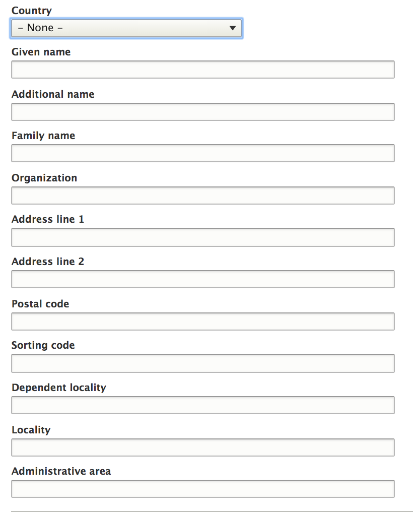
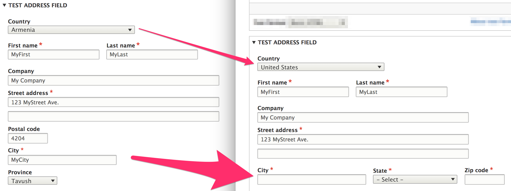

The *Address* module provides a custom *address* field that can have the following properties:

- Given name (First name)
- Additional name (Middle name / Patronymic)
- Family name (Last name)
- Organization
- Address line 1
- Address line 2
- Postal code
- Sorting code
- Dependent Locality (Neighborhood / Suburb)
- Locality (City)
- Administrative area (State / Province)
- Country (limited to pre-defined list of *available* countries)

### What is an *address format*?
Address formats are defined on a per-country basis. They make it possible to dynamically alter the form used to enter addresses based on the selected country. Without address formats, an address form might look something like this:



With address formats, we can have forms that dynamically change based on the selected country. Here, changing the selected country from *Armenia* to *United States* results in a change to the *Postal code*, *City*, and *Province* fields:



Each country has a different *address format* that tells us:

* Which fields are used in which order (Is there a state field? Does the zip code come before the city? After the state?)
* Which fields are required
* Which fields need to be uppercased for the actual mailing to facilitate automated sorting of mail
* The labels for the administrative area (state, province, parish, etc.), and the postal code (Postal code or ZIP code)
* Validation rules for postal codes, usually in the form of a regular expression.

In countries using a non-latin script (such as China, Taiwan, Korea), the order of fields varies based on the language/script used. Addresses written in latin script follow the minor-to-major order (start with the street, end with the country) while addresses written in the chinese script follow the major-to-minor order (start with the country, end with the street).

All this needs to be taken into account when generating and validating an address form. Selecting a different country requires re-rendering the address form using a different format.

#### Address format repository
The Commerce Guys *Addressing* library provides an address format repository with formats for over 200 countries. The formats are generated from [Google's Address Data Service]. For example, here are the instantiated address formats for *Armenia* (country code *AM*) and the *United States* (country code *US*).

```php
            'AM' => [
                'format' => "%givenName %familyName\n%organization\n%addressLine1\n%addressLine2\n%postalCode\n%locality\n%administrativeArea",
                'postal_code_pattern' => '(?:37)?\d{4}',
                'subdivision_depth' => 1,
            ],
            'US' => [
                'format' => "%givenName %familyName\n%organization\n%addressLine1\n%addressLine2\n%locality, %administrativeArea %postalCode",
                'required_fields' => [
                    'addressLine1', 'locality', 'administrativeArea', 'postalCode',
                ],
                'uppercase_fields' => [
                    'locality', 'administrativeArea',
                ],
                'administrative_area_type' => 'state',
                'postal_code_type' => 'zip',
                'postal_code_pattern' => '(\d{5})(?:[ \-](\d{4}))?',
                'subdivision_depth' => 1,
            ],
```

You can see how the `format` string matches up with the forms displayed in the above image. The postal code, locality, and administrative area (province) fields appear on separate lines for Armenia. For the United States, locality, administrative area (state), and postal code appear inline on a single line.

### What about address field X? Can I add another property to an address field?
No, not without great difficulty. But you can *repurpose* an unused property for a custom one. For example, suppose you need a *Building name* field. In this example, we'll assume that we don't need to use the *Additional name* (middle name) field. Let's look at how we can repurpose this unused field for a custom, *Building name* field.

For any countries that include *Company* (Organization) in their address format, we want *Building name* to be included on the subsequent line.


First, we'll implement an *EventSubscriber* for the `AddressEvents::ADDRESS_FORMAT` event, to customize the address formats for all countries. This example assumes that we have already created a custom module, named *mymodule*. Here is our event subscriber class, in which we insert the *additionalName* field after *organization* in our address format:

```php
<?php

namespace Drupal\mymodule\EventSubscriber;

use Drupal\address\Event\AddressEvents;
use Drupal\address\Event\AddressFormatEvent;
use Symfony\Component\EventDispatcher\EventSubscriberInterface;

/**
 * Repurposes additional name field as building name.
 */
class BuildingNameEventSubscriber implements EventSubscriberInterface {

  public static function getSubscribedEvents() {
    $events[AddressEvents::ADDRESS_FORMAT][] = ['onAddressFormat'];
    return $events;
  }

  public function onAddressFormat(AddressFormatEvent $event) {
    $definition = $event->getDefinition();

    // Place %additionalName after %organization in the format.
    $format = $definition['format'];
    $format = str_replace('%additionalName', '', $format);
    $format = str_replace('%organization', "%organization\n%additionalName", $format);
    $definition['format'] = $format;

    $event->setDefinition($definition);
  }

}
```

Next, we need to add our custom event subscriber to the module's services YAML file, `mymodule.services.yml`:
```YAML
services:
  mymodule.subscriber:
    class: Drupal\mymodule\EventSubscriber\BuildingNameEventSubscriber
    tags:
      - {name: event_subscriber}
```

After rebuilding caches, the *Middle name* field now appears immediately after the *Company* field on both the address form and the displayed address:


Next, we need to relabel *Middle name* as *Building name* and change its textfield size to match the *Company* textfield. We'll do this by modifying the `additional_name` address element field in an `#after_build` callback function.

```php
<?php

use Drupal\Core\Form\FormStateInterface;

function mymodule_form_alter(&$form, FormStateInterface $form_state, $form_id) {
  if (($form_id == 'profile_customer_edit_form') || ($form_id == 'profile_customer_add_form')) {
    $form['address']['widget'][0]['address']['#after_build'][] = 'mymodule_customize_address';
  }
}

function mymodule_customize_address($element, $form_state) {
  $element['additional_name']['#title'] = t('Building name');
  $element['additional_name']['#size'] = 60;

  return $element;
}
```

### Links and resources:
* For more information on the Commerce Guys Addressing library and its data model, see its [README file](https://github.com/commerceguys/addressing/blob/master/README.md)

[Google's Address Data Service]: https://chromium-i18n.appspot.com/ssl-address

