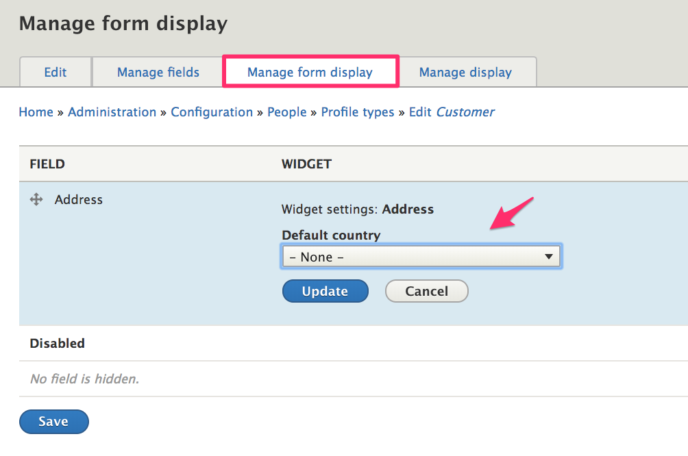
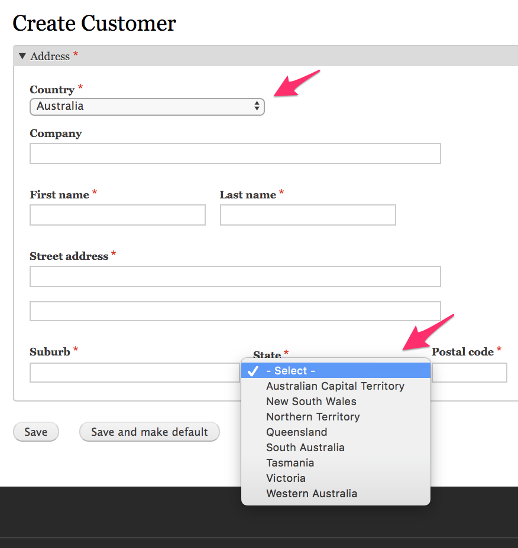
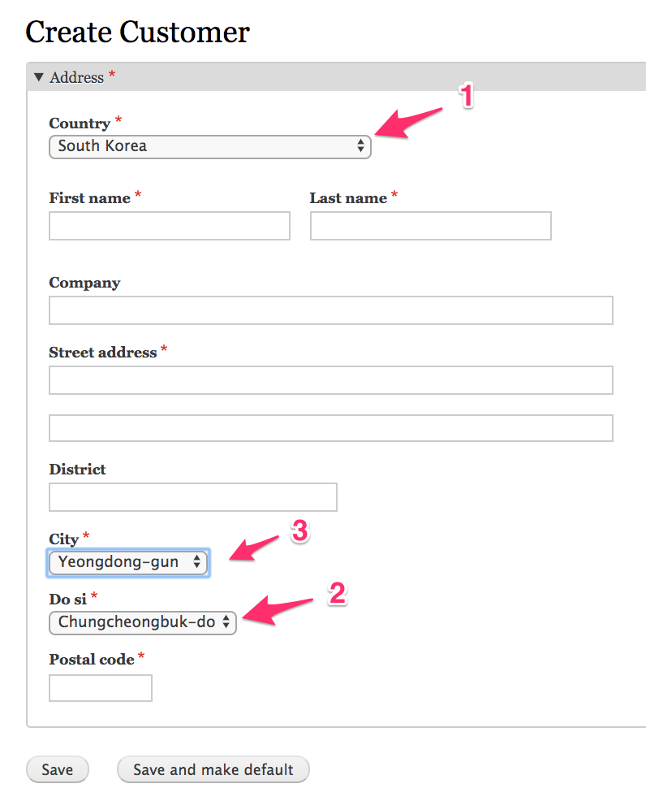
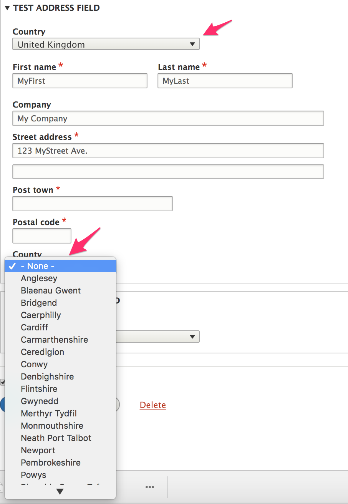
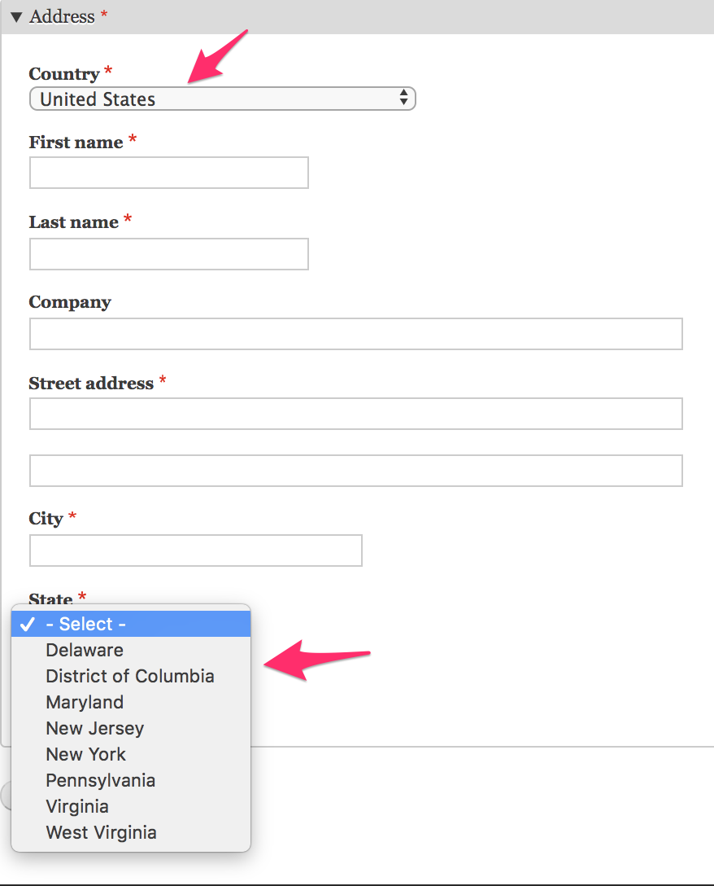

The Address module provides a custom *Country* field type along with a custom form element, default formatter, and default widget. Country data is stored internally using standard 2-letter codes. Country codes are limited to the list of available countries.

### What is the list of available countries and how can I change it?
The *Commerce Guys Addressing* library provides a list of countries with translations for over 250 locales. This library is a requirement for the Address module, which is part of why we strongly recommend using Composer to manage your Drupal Commerce project. The dataset is stored locally in JSON format. For the actual list, see the *CountryRepository* class: `commerceguys/addressing/src/Country/CountryRepository.php`.

You can alter the list of *available* countries for a select list by subscribing to the `AddressEvents::AVAILABLE_COUNTRIES` event. Here is a simple example of an event subscriber for the available countries event. It reduces the set of available countries to just 5: Australia, Brazil, Canada, Japan, and the United Kingdom.

```php
<?php

namespace Drupal\mymodule\EventSubscriber;

use Drupal\address\Event\AddressEvents;
use Drupal\address\Event\AvailableCountriesEvent;
use Symfony\Component\EventDispatcher\EventSubscriberInterface;

class LimitCountriesEventSubscriber implements EventSubscriberInterface {

  public static function getSubscribedEvents() {
    $events[AddressEvents::AVAILABLE_COUNTRIES][] = ['onAvailableCountries'];
    return $events;
  }

  public function onAvailableCountries(AvailableCountriesEvent $event) {
    $countries = ['AU' => 'AU', 'BR' => 'BR', 'CA' => 'CA', 'GB' => 'GB', 'JP' => 'JP'];
    $event->setAvailableCountries($countries);
  }

}
```

Don't forget to include this event subscriber in your custom module's `services.yml` file and rebuild caches.

#### How do I set the default country for customers?
*Default country* is a setting for the default *Address* widget. To set the default country for customers, you need to configure the *Form display* for the *Customer* profile type. This administration page is located at `/admin/config/people/profiles/manage/customer/form-display`. Click on the gear for the Address field to alter the setting:



### Country subdivisions
A country can have several levels of subdivisions that are used for addressing. In the United States that would be the state. In Brazil it would be the state and the municipality. In China it would be the province, the prefecture-level city, and the county. The *Address* module provides user-friendly address forms that provide dropdowns for these subdivisions, thus speeding up the data entry process and reducing mistakes.

Subdivision data is provided by the Commerce Guys addressing library. Subdivisions are hierarchcial, with up to 3 levels: Administrative area -> Locality -> Dependent locality. For each level, there is a set list of options that is used to populate form select lists (dropdown menus). For example, both Australia and the United States have a single level of subdivisions, called *States*. If *United States* is selected as the country, then its 50 states and additional territories appear as *State* options. If *Australia* is selected, then its 8 state/territory options are displayed:



South Korea is an example of a country with an additional level of subdivisions. Once an administrative area, labeled *Do si*, is selected, a list of locality (City) options appears:



The dataset is stored locally in JSON format. To view the actual data, see `commerceguys/addressing/resources/subdivision`.


#### Why is country X missing subdivisions?
The Commerce Guys addressing data set only includes subdivisions that are required for addressing.

#### How do I add or modify subdivisions for a country?
You can modify the subdivision data returned for a specific country by subscribing to the `AddressEvents::SUBDIVISIONS` event. The Address module includes an example *subdivisions* event subscriber in its test code. See `address/tests/modules/address_test/src/EventSubscriber/GreatBritainEventSubscriber.php`. In this example code, a county field and a predefined list of counties are added for the United Kingdom (country code *GB*).

When *United Kingdom* is selected as the country, a *County* select field appears with the list of options we've defined:



To start, we subscribe to the `AddressEvents::SUBDIVISIONS` event and implement its callback method: `onSubdivisions()`. We only include the Welsh countries here, for simplicity; a real subscriber would include the full list, sourced from the [CLDR "Territory Subdivisions" listing].

```php
  public static function getSubscribedEvents() {
    $events[AddressEvents::SUBDIVISIONS][] = ['onSubdivisions'];
    return $events;
  }

  public function onSubdivisions(SubdivisionsEvent $event) {
    // For administrative areas $parents is an array with just the country code.
    // Otherwise it also contains the parent subdivision codes. For example,
    // if we were defining cities in California, $parents would be ['US', 'CA'].
    $parents = $event->getParents();
    if ($event->getParents() != ['GB']) {
      return;
    }

    $definitions = [
      'country_code' => $parents[0],
      'parents' => $parents,
      'subdivisions' => [
        // Key by the subdivision code, which is the value that's displayed on
        // the formatted address. Could be an abbreviation (e.g 'CA' for
        // California) or a full name like below.
        // If it's an abbreviation, define a 'name' in the subarray, to be used
        // in the address widget dropdown.
        'Anglesey' => [],
        // You can optionally define an ISO 3166-2 code for each subdivision.
        'Blaenau Gwent' => [
          'iso_code' => 'GB-BGW',
        ],
        'Bridgend' => [],
        'Caerphilly' => [],
        'Cardiff' => [],
        'Carmarthenshire' => [],
        'Ceredigion' => [],
        'Conwy' => [],
        'Denbighshire' => [],
        'Flintshire' => [],
        'Gwynedd' => [],
        'Merthyr Tydfil' => [],
        'Monmouthshire' => [],
        'Neath Port Talbot' => [],
        'Newport' => [],
        'Pembrokeshire' => [],
        'Powys' => [],
        'Rhondda Cynon Taf' => [],
        'Swansea' => [],
        'Tarfaen' => [],
        'Vale of Glamorgan' => [],
        'Wrexham' => [],
      ],
    ];
    $event->setDefinitions($definitions);
  }

```

Next, we need to customize the *address format* defined for the United Kingdom by subscribing to the `AddressEvents::ADDRESS_FORMAT` event. We'll add that into the `getSubscribedEvents()` method:

```php
  public static function getSubscribedEvents() {
    $events[AddressEvents::ADDRESS_FORMAT][] = ['onAddressFormat'];
    $events[AddressEvents::SUBDIVISIONS][] = ['onSubdivisions'];
    return $events;
  }

   public function onAddressFormat(AddressFormatEvent $event) {
    $definition = $event->getDefinition();
    if ($definition['country_code'] == 'GB') {
      $definition['format'] = $definition['format'] . "\n%administrativeArea";
      $definition['administrative_area_type'] = AdministrativeAreaType::COUNTY;
      $definition['subdivision_depth'] = 1;
      $event->setDefinition($definition);
    }
  }
```

Don't forget to include the event subscriber in your custom module's `services.yml` file and rebuild caches!

#### How can I alter a subdivision list *without* affecting the stored address formats
In the previous example, we created new address format data. In some cases, you might want to just make a minor modification to existing data. Or perhaps you'd like to have different subdivision lists in different contexts. For example, suppose you'd like to have an address field that only displays a subset of *States* for addresses in the United States. In this example, we'll limit the options for *States* in the United States to just the Mid-Atlantic states:  New York, New Jersey, Pennsylvania, Delaware, Maryland, Washington, D.C., Virginia, and West Virginia.



The default address widget uses the custom *address* form element. As a result, you cannot use `hook_form_alter()` or `hook_field_widget_form_alter()` directly. Instead, we'll use `hook_form_alter()` in combination with a `#pre_render` callback, in a custom module named *mymodule*.

```php
function mymodule_form_alter(&$form, FormStateInterface $form_state, $form_id) {
  if (($form_id == 'profile_customer_edit_form') || ($form_id == 'profile_customer_add_form')) {
    $form['address']['widget'][0]['address']['#pre_render'][] = 'mymodule_prerender';
}

function mymodule_prerender($element) {
  if ($element['country_code']['#default_value'] == 'US') {
    $include_states = ['', 'NY', 'NJ', 'PA', 'DE', 'MD', 'DC', 'VA', 'WV'];
    $options = array_intersect_key($element['administrative_area']['#options'], array_flip($include_states));
    $element['administrative_area']['#options'] = $options;
  }
  return $element;
}
```

### Links and resources:
* [Wikipedia page on Administrative division (country subdivision)](https://en.wikipedia.org/wiki/Administrative_division)

[CLDR "Territory Subdivisions" listing]: http://cldr.unicode.org/index/downloads