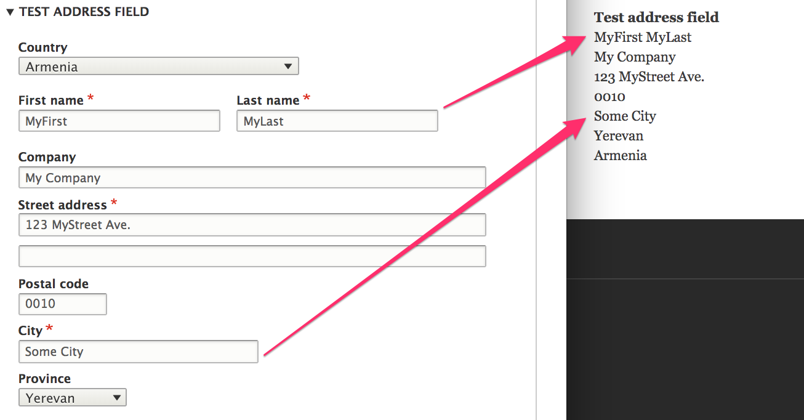
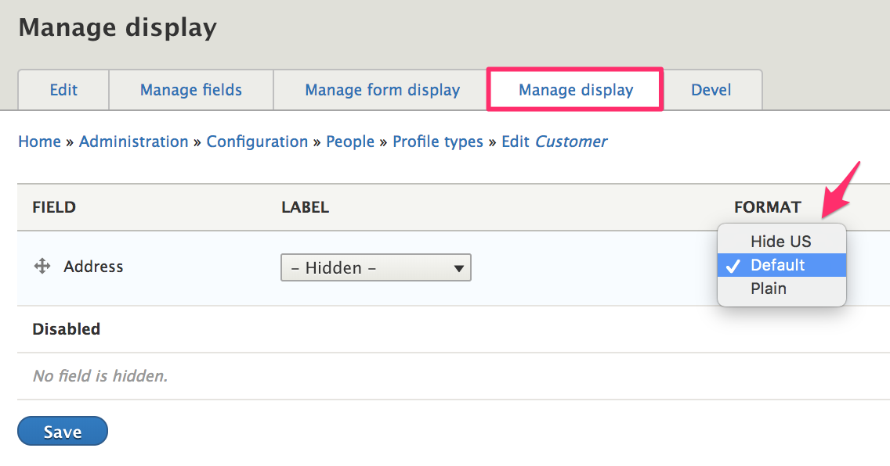
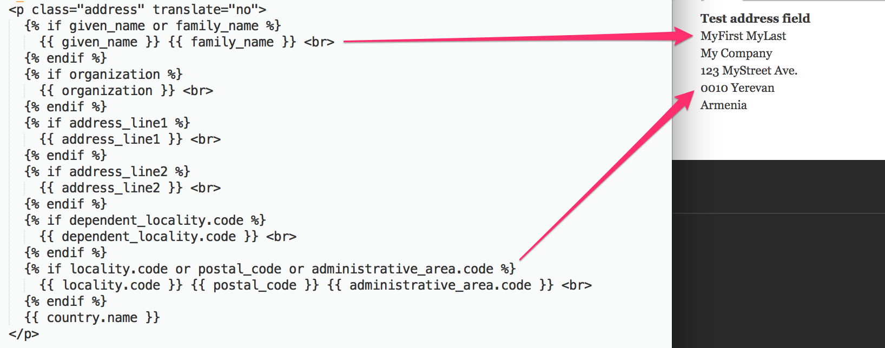
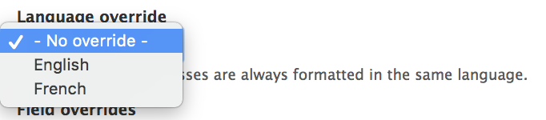

This documentation page describes how to customize how addresses are displayed. The Address module includes two formatters for displaying addresses: *Default* and *Plain*. If you require customizations that are not possible with either of these formatters, you can create your own custom field formatter plugin.

* Use the [*Default* address formatter](#the-default-address-formatter) to display addresses in country-specific formats.
* Use the [*Plain* address formatter](#the-plain-address-formatter) to provide custom theming for addresses.
* Use the [Postal Label Formatter Service](#postal-label-formatter-service) to use standards required for automated mail sorting.
* [Multilingual Considerations](#multilingual-considerations) decribes how to override the language used to format addresses.

### The *Default* address formatter
The Default formatter uses a repository of address format data (provided by the Commerce Guys Addressing Library) to format the display of an address. Google's [Address Data Service](https://chromium-i18n.appspot.com/ssl-address) is the data source for these address formats. The displayed format will closely match the ordering used on forms for entering the addresses. (*The Country field always appears first on forms, even if it is displayed last in the correctly formatted adddress.*)



If you want to customize how addresses are displayed by the *default* address formatter, you can create a custom event subscriber to alter the address formats provided by the `AddressFormatRepository`. The [Address formats documentation](../01.address-formats) provides an explanation of address formats and example event subscriber code.

#### How do I hide the *Country* for domestic addresses?
The *Default* address formatter will display the country for all addresses, regardless of whether the address is international or domestic. One way to alter this behavior is to create a custom address field formatter plugin that *extends* the Default address formatter. In this example, we'll create a custom formatter that will display the *Country* for addresses in all countries *except* the United States.

This example assumes that we have already created a custom module, named mymodule. Well create a custom formatter plugin named `AddressHideUSFormatter` like this:

```php
<?php

namespace Drupal\mymodule\Plugin\Field\FieldFormatter;

use Drupal\address\Plugin\Field\FieldFormatter\AddressDefaultFormatter;

/**
 * Plugin implementation of the 'address_us_default' formatter.
 *
 * @FieldFormatter(
 *   id = "address_us_default",
 *   label = @Translation("Hide US"),
 *   field_types = {
 *     "address",
 *   },
 * )
 */
class AddressHideUSFormatter extends AddressDefaultFormatter {

}

```
We give the field formatter plugin a unique id: *address_us_default* and descriptive label in the annotation. If you rebuild caches, you will see this new field formatter as an option for the Display of any address fields:



At this point, our custom formatter works exactly the same as the *Default* formatter. To customize its behavior, we'll override the `postRender()` method, since that is the method in which the *country* field gets added to the address format string. This is the relevant code:

```php
    if (Locale::matchCandidates($address_format->getLocale(), $locale)) {
      $format_string = '%country' . "\n" . $address_format->getLocalFormat();
    }
    else {
      $format_string = $address_format->getFormat() . "\n" . '%country';
    }
```

All we'll do is add an extra condition, to modify the functionality for *US* addresses:
```php
    if ($address_format->getCountryCode() == 'US') {
      $format_string = $address_format->getFormat();
    }
```

To make this work for domestic addresses in other countries, just change the *country code* in the added condition. Our full `postRender()` method now looks like this:

```php
  public static function postRender($content, array $element) {
    /** @var \CommerceGuys\Addressing\AddressFormat\AddressFormat $address_format */
    $address_format = $element['#address_format'];
    $locale = $element['#locale'];
    // Add the country to the bottom or the top of the format string,
    // depending on whether the format is minor-to-major or major-to-minor.
    if ($address_format->getCountryCode() == 'US') {
      $format_string = $address_format->getFormat();
    }
    elseif (Locale::matchCandidates($address_format->getLocale(), $locale)) {
      $format_string = '%country' . "\n" . $address_format->getLocalFormat();
    }
    else {
      $format_string = $address_format->getFormat() . "\n" . '%country';
    }

    $replacements = [];
    foreach (Element::getVisibleChildren($element) as $key) {
      $child = $element[$key];
      if (isset($child['#placeholder'])) {
        $replacements[$child['#placeholder']] = $child['#value'] ? $child['#markup'] : '';
      }
    }
    $content = self::replacePlaceholders($format_string, $replacements);
    $content = nl2br($content, FALSE);

    return $content;
  }
```

Lastly, we need to add two additional *use* statements for the `postRender()` method:
```php
use CommerceGuys\Addressing\Locale;
use Drupal\Core\Render\Element;
```

Now the *Hide US* address formatter will only show countries for non-US addresses.

### The *Plain* address formatter
The Plain formatter also relies on the addressing library data but only to get the subdivision code and name values, since the *Plain* formatter doesn't actually format the addresses; instead, the *Plain* formatter uses the `address-plain.html.twig` twig template for the actual address formatting.



As you can see, this default twig template does not do a very good job of properly formatting this particular address. The *City* field isn't even displayed! In most cases, you will want to use the *Default*formatter so that you can rely on the data in the Commerce Guys Addressing Library. However, if you want to precisely control the layout of your addresses, you can create your own twig template for the *Plain* address formatter as part of a custom theme. Theming is an advanced topic beyond the scope of this Drupal Commerce documentation guide. For an overview, please see the [Theming Drupal Guide] on Drupal.org.

#### Available theme variables
- **given_name**: Given name.
- **additional_name**: Additional name.
- **family_name**: Family name.
- **organization**: Organization.
- **address_line1**: First address line.
- **address_line2**: Second address line.
- **postal_code**: Postal code.
- **sorting_code**: Sorting code.
- **country.code**: Country code.
- **country.name**: Country name.

##### Subdivision field variables
For address fields that can be defined as part of a subdivision (administrative area, locality, and dependent locality), the theming is a little trickier. If one of these fields is *not* defined in the country's subdivision data, then you should use its basic variable:

- **dependent_locality**: The dependent locality.
- **locality**: The locality.
- **administrative_area**: The administrative area.

For the example above, to make the missing *City* field appear, we'd need to use `{{ locality }}` instead of `{{ locality.code }}` in our twig template.

If a subdivision was entered, the array will always have a code. If it's a predefined subdivision, it will also have a name. The code is always preferred. These subdivision variables are:

- **dependent_locality.code**: Dependent locality code.
- **dependent_locality.name**: Dependent locality name.
- **locality.code**: Locality code.
- **locality.name**: Locality name.
- **administrative_area.code**: Administrative area code.
- **administrative_area.name**: Administrative area name.


### Postal Label Formatter Service
In the [*Default* address formatter section](#the-default-address-formatter), we created a relatively simple custom address field formatter to remove the *country* field from domestic address displays. If you need a custom formatter with more complex functionality, perhaps for postal/shipping labels, you might want to take a look at the `PostalLabelFormatter` service, provided by the Commerce Guys Addressing library and included in the *Address* module.

The `PostalLabelFormatter` service is an address formatter that uses standards required for automated mail sorting. It takes care of uppercasing fields where required by the format and differentiating between domestic and international mail. In the case of domestic mail, the country name is not displayed at all. In the case of international mail, the postal code is prefixed with the destination's postal code prefix, and the country name is added to the address in both the current locale and English.

For a usage example of this service, see the `AddressToGeo` class in the [Geolocation Address Link module].

### Multilingual considerations
Some countries use separate address formats for the local language vs. other languages. For example, China uses major-to-minor ordering when the address is entered in Chinese, and minor-to-major when the address is entered in other languages. This means that the address must remember which language it was entered in, to ensure consistent formatting later on.

It is possible to override the used language via field settings, in case the language is always known (e.g. a field storing the "english address" on a chinese article). This option will appear on the *Settings* administrative page for the address field, on multilingual sites. Use this setting to ensure that entered addresses are always formatted in the same language.



### Links and resources
* [Drupal 8 documentation: Create a custom field formatter](https://www.drupal.org/docs/8/creating-custom-modules/create-a-custom-field-formatter)
* Discussion and example of a custom address formatter: [Pretty field formatter](https://www.drupal.org/project/address/issues/2912629)


[Theming Drupal Guide]: https://www.drupal.org/docs/8/theming
[Geolocation Address Link module]: https://www.drupal.org/project/geolocation_address_link
