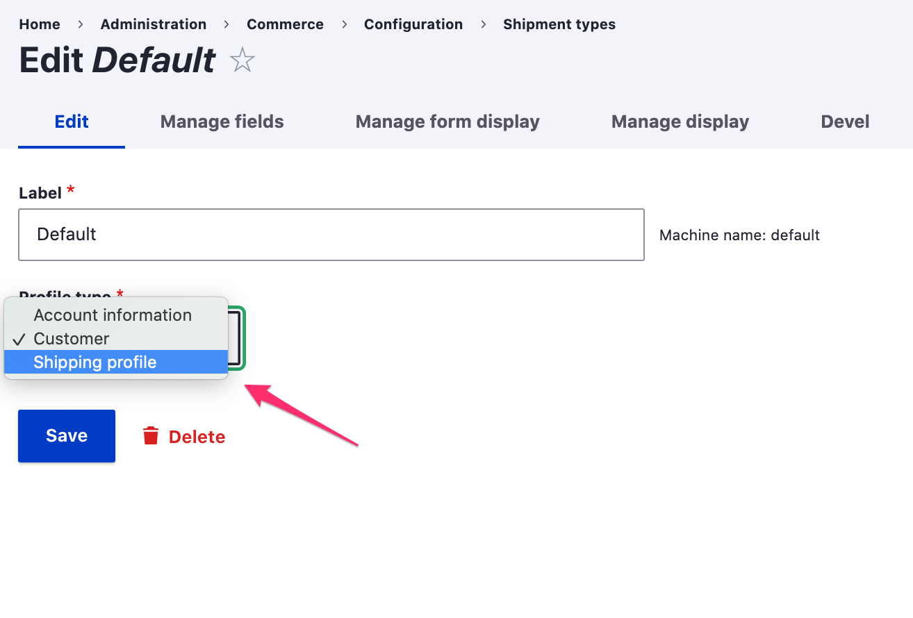

The [Profile module] is a contributed Drupal module that is required by Drupal Commerce yet maintained separately from the core Drupal Commerce module. When you manage your Drupal Commerce site using [Composer](../../../../01.getting-started/01.using-composer), the *Profile* module will be automatically added to your project.

*Profiles* are fieldable entities that represent a set of user information. The Drupal Commerce *Order* module provides one specific profile type, called the *Customer* profile. *Customer* profiles are used to collect customer information necessary for billing, payment, and shipping.

### Relationship to user accounts
*User accounts* are also fieldable entities that can be used to capture customer information. However, only a single instance of this data will exist, and it is not revisionable. Therefore, user accounts are best used for information that is likely to stay fixed for customers, like gender or date of birth. This information isn't likely to change on a per-order basis. In contrast, users can have multiple *profiles*, each with a distinct set of information. Each *Customer* profile has a single address and can optionally include other information like phone number or contact name.

Every profile belongs to a single user account, and if a user account is deleted, then all of its profiles are also deleted. Within Drupal Commerce, *copies* of customer profiles are assigned to orders so that they cannot be deleted by customers. Customers cannot access these profiles, and they are only deleted if their parent orders are deleted.

### Address book
The collection of all *Commerce customer* profiles owned by a customer is called his *Address book* and can be managed as part of his User account information. If multiple Commerce customer profile types are created, then they will be organized into separate groups within the customer's address book. For each profile type, there is one *default* profile per user.

For example, this customer named *Betty Smith* has her home address as her *default* customer profile and a second address that can be optionally selected for her payment/billing/shipping information during checkout. An additional "Account information" profile type has been created which may serve some other purpose.

### Profiles in the checkout process
In Drupal Commerce, each order has a *Billing profile*, which is set during the checkout process. By default, customers are asked for billing information right after they either log in or (optionally) choose to continue as a guest. The *Billing information* checkout pane appears as part of the *Order information* step.

If the Drupal Commerce *Payment* module is enabled, the *Payment information* checkout pane is used instead of the *Billing information* pane. These checkout panes allow the customer to set the *Billing profile* for the order. If the payment gateway for an available payment method allows checkout without billing information, then it is possible to allow customers to check out without setting a billing profile for the order.

Here is an example of the *Order Information* step, in which the default *Customer* profile form is presented to the customer. When more than one customer profile is available, the "Select an address" element is provided. Since the *Payment* module is enabled for this example site, the profile is labeled as *Payment information* rather than *Billing information*.

#### Shipping profiles
If the [Commerce Shipping module] is installed, then a *Shipping Information* pane will also be available to collect the *Shipping profile* for the order. Any *customer* profile type can be used for both *billing* and *shipping* profiles. Using a single bundle for both billing and shipping information is generally a best practice for many sites and solutions. This includes Amazon, Shopify, BigCommerce, Spree, etc. 

However, some merchants may require different fields for billing vs. shipping. For those merchants,  shipment types can  be configured to use a different customer profile type. For example, here a "Shipping profile" profile type has been created and assigned to the Default shipment type:

[Profile module]: https://www.drupal.org/project/profile
[Commerce Shipping module]: https://www.drupal.org/project/commerce_shipping
