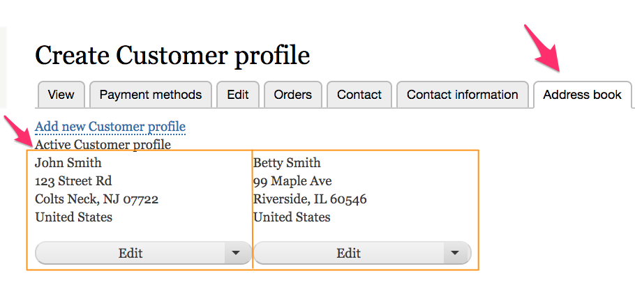
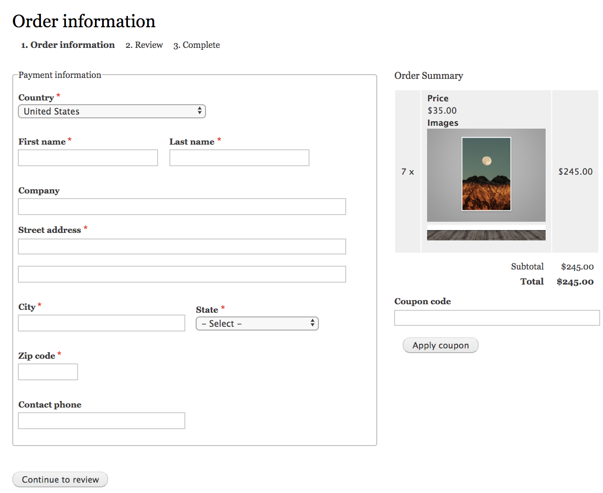

The [Profile module] is a contributed Drupal module that is required by Drupal Commerce yet maintained separately from the core Drupal Commerce module. When you manage your Drupal Commerce site using [Composer](../../../../01.getting-started/01.using-composer), the *Profile* module will be automatically added to your project.

*Profiles* are fieldable entities that represent a set of user information. The *Drupal Commerce* module provides one specific profile type, called the *Customer profile*. *Customer* profiles are used to collect customer information necessary for billing, payment, and shipping.

### Relationship to user accounts
*User accounts* are also fieldable entities that can be used to capture customer information. However, only a single instance of this data will exist, and it is not revisionable. Therefore, user accounts are best used for information that is likely to stay fixed for customers, like gender or date of birth. This information isn't likely to change on a per-order basis. In contrast, users can have multiple *profiles*, each with a distinct set of information. Each *Customer* profile has a single address and can optionally include other information like phone number or contact name.

Every profile belongs to exactly one user account, and if a user account is deleted, then all of its profiles are also deleted.

### Address book
A customer can have an *address book* of multiple stored addresses, which is actually just the collection of *Customer* profiles owned by that customer. One of these stored addresses is designated as the *default* profile. For each profile types, there is one *default* profile per user. For example, this customer named *John Smith* has his home address as his *default* customer profile and a second address, for a

### Profiles in the checkout process
In Drupal Commerce, each order has a *Billing profile*, which is set during the checkout process. By default, customers are asked for billing information right after they either log in or (optionally) choose to continue as a guest. The *Billing information* checkout pane appears as part of the *Order information* step. If the Drupal Commerce *Payment* module is enabled, the *Payment information* checkout pane is used instead of the *Billing information* pane. These checkout panes will set the *Billing profile* for the order.

Here is an example of the *Order Information* step, in which the *Customer* profile form is presented to the customer. The *Customer* profile has been extended to include a *Contact phone* field in addition to the address. Also, the *Payment* module is enabled for this site, so the profile is labeled as *Payment information* rather than *Billing information*.

If the [Commerce Shipping module] is installed, then a *Shipping Information* pane will also be available to collect the *Shipping profile* for the order. The *customer* profile type is used for both *billing* and *shipping* profiles
Within Drupal Commerce, the *Order* and *Payment* modules provide checkout panes that are used to collect billing information for orders.

[Profile module]: https://www.drupal.org/project/profile
[Commerce Shipping module]: https://www.drupal.org/project/commerce_shipping

