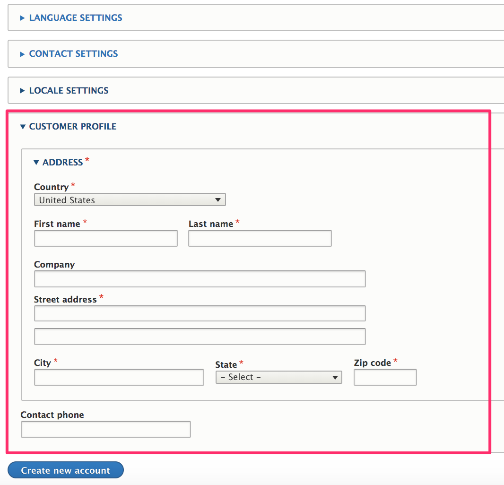

In a default Drupal Commerce installation, the *Customer profile* profile type is provided for you. You can access the administrative page for this profile type and any others you create at `/admin/config/people/profiles`.

### Customer profile fields
By default, profiles do not have any visible/editable fields; however, the *Customer profile* type includes an *Address* field. See the [Addresses documentation](../../02.addresses) section for information about *Address* fields. Each *Customer* profile has a single address. You can change the *Label* for the address field, as it's shown to customers, on the *Address settings* administrative page, located at `/admin/config/people/profiles/manage/customer/fields/profile.customer.address`.

You can add custom fields to a profile by navigating to its *Manage fields* administrative page. For *Customer* profiles, this page is located at `/admin/config/people/profiles/manage/customer/fields`. As an example, let's add a *Contact phone* field to our *Customer* profile type.

#### Customization example: *contact phone* field
##### Add the *contact phone* field
1. If the Drupal core [Telephone module] is not already installed, navigate to the *Extend* administrative page and install it: `/admin/modules`.
2. Navigate to the *Manage fields* administrative page for the *Customer* profile type and click the *Add field* button.
3. Select *Telephone number* as the field type.
4. Enter *Contact phone* for the field label.
5. Click the *Save and continue* button.

##### Configure the *contact phone* field
1. On the *Field settings* page, we'll leave the *Allowed number of values* set to 1.
2. Click the *Save field settings* button.
3. On the *settings* administrative page for *Contact phone*, select the [*This is a private field*](#the-private-field-setting) setting.
4. Click the *Save settings* button.

Next, you could use the *Manage form display* and *Manage display* administration pages for the profile to customize how the new field appears on data entry forms and in a customer's *Address book*.

#### Adding fields to the customer profile vs. creating new profile types
The *customer* profile should contain all the billing information needed to process an order. If you have physical products and use the *Commerce shipping* module, then *customer* profiles will also be used for the shipping information associated with orders. For simpler commerce sites, especially those that are B2C, the *address* field may be all you need for the *customer* profile. For additional information, you could create a separate profile type to manage information about your customer like name and phone number. With this architecture, your customers would only enter need to enter their contact information once, for that separate profile type. In contrast, if you added the contact name and phone number fields to the *customer* profile, your customers would need to repeatedly enter that information for every billing and shipping address added.

For other commerce sites, your customers may actually be purchasing agents who order on behalf of a number of end users. In that case, you might need a set of fields associated with *each* billing and shipping address, such as contact email, contact name, contact phone, a note field, reference to a customer organization, reference to an assigned sales representative, etc. So, you would add each of these fields to your *customer* profile type. Your customers would have the flexiblity to enter completely different sets of data for each of their *customer* profiles. Ultimately, you'll need to decide what information needs to be captured on a per-order basis vs. what customer information you need apart from that billing- and shipping-specific data.

### Create a profile type
To create a new profile type:
1. Navigate to the *Profile types* administrative page at `/admin/config/people/profiles`.
2. Click the *Add profile type* button.
3. Enter the name of the profile type for the *Label*. You can use the default settings for all other options, for now.
4. Click the *Save* button.

#### Profile type configuration options
##### Label
This is the name of the profile type. Change the label to change how it's displayed to customers.

##### Description
The description field is only used for administrative purposes. It is displayed in the *Profile types* listing at `/admin/config/people/profiles`. If your store will have many different profile types, entering a description for each can be helpful for profile management.

##### Include in user registration form
By default, the *Customer* profile type is included in the user registration form. If this option is enabled for a profile type, then its data entry form will be embedded at the end of the new user registration form. In this example, *Contact phone* has been added to the *Customer profile* profile type, so it also appears on the registration form.

##### Allow multiple profiles
This option is enabled for the *Customer* profile type, to allow customers to create and save multiple addresses in their [*Address book*](../01.overview#address-book). If a user should only have a single set of data for a profile type, leave this option unselected. For example, if you create a *Contact information* profile type, you may want to have only one set of contact information per user.

##### Allowed roles
By default, there are no roles selected for the *Customer* profile type, which means that all users can have this profile type. If you allow customers to check out anonymously (i.e., "guest checkout"), then you will need to allow *all* users to have *customer* profiles. Every order requires a *customer* profile for its *billing information* field. For other profile types, you may want to limit their usage to only certain, selected roles.

##### Create a new revision when a profile is modified
Profiles are revisionable. Select this option force a profile entity to be saved as a new revision whenever the profile is updated. This setting is important for data integrity with respect to existing orders. Normally, you will want to enable this setting for the *Customer* profile type. In order to reduce unnecessary data replication, orders store only a reference to a *Customer* profile, not a copy of an entire profile entity. So if a customer places multiple orders, all with the same billing address, only one billing address needs to be stored. However, if the customer changes his address at some point, creating a new revision for the profile entity ensures that the data associated with previous orders does not change. The *new* revision of the profile will be used as the billing address for the current and future orders while leaving the previous version of the billing address in place for past orders.

### Profile access and permissions
#### The *private field* setting
In the example above, we specified that our custom *contact phone* field should be a *private field*. If a profile field is set as private, then only the owner of the profile and administrative users with the *Administer profile entities* (`administer profile`) permission will be able to access the field.

#### Profile permissions
The profile module provides some general administraive permissions as well as a set of permissions specific to each profile type. On the *Permissions* administrative page, at `/admin/people/permissions`, you'll find profile-related permissions in the *Field UI* and *Profile* sections.

##### *Field UI* permissions
- *Profile*: Administer display
- *Profile*: Administer fields
- *Profile*: Administer form display

These permissions should only be granted to users with administrative access to the site, typically users that are site builders or developers.

##### *Profile* permissions
- Access the profile entities overview page
- Administer profile entities
- Andminister profile types
- View profile entities
- And a set of permissions for each profile type:
 - Create profile entities
 - Delete any profile
 - Delete own profile entities
 - Update any profile
 - Update own profile entities
 - View any profile
 - View own profile

 Typically, you will want to allow your *Authenticated Users* (customers) to create profile entities and delete/update/view their own *Customer* profile entities.

### Field permissions module
If you need to limit access to certain *fields* for the *customer* profile or any other type of profile, the [Field permissions] contrib module can provide that functionality. For example, suppose each of your customers is assigned to a specific regional sales representative. You would like customers to be able to *view* their sales representatives, but only administrative users should be allowed to make sales representative assignments. Also, you want to include the *sales representative* field with your order data so that it can be tracked in sales reports. So, we want this field to be part of the *Customer* profile.

#### Customization example: *sales representative* field
1. Add and install the *Field permissions* module. (See the [Extending documentation](../../../02.install-update/06.extending) for instructions.)
2. Add a *Sales representative* field to your *customer* profile type using the same approach we used above for the [*contact phone* field](#add-the-contact-phone-field).
3. Select `Reference > User` for the field type. We could create a new [Taxonomy] for our *sales representative* information, but for this example, let's just assume that we'll create a [User account] for each of our sales representatives.

4. On the *Field settings* administrative page, the default settings are fine.
5. On the *settings* administrative page for the *Sales representative* field, enable *Custom permissions*.
6. For the *Authenticated user* role, enable only the *View anyone's value for field field_sales_representative* permission.

Now, customers will be able to view their sales representatives but not select their own.

[Telephone module]: https://www.drupal.org/docs/8/core/modules/telephone/overview
[Field permissions]: https://www.drupal.org/project/field_permissions
[Taxonomy]: https://www.drupal.org/docs/user_guide/en/structure-taxonomy.html
[User account]: https://www.drupal.org/docs/user_guide/en/user-concept.html
